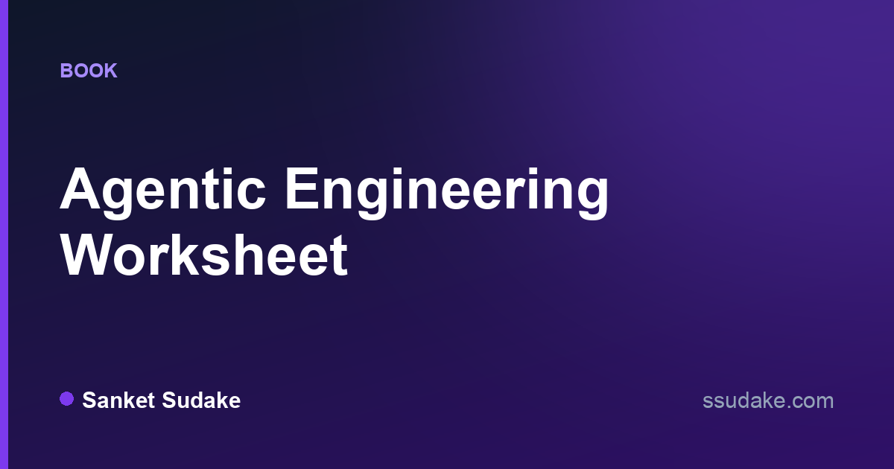

# agentic-engineering

**Agentic Engineering Worksheet** —
a trace-first handbook that skills engineers at every level,
from first agent loop to org-scale judgment:
build agents end to end,
operate coding agents well,
and prove it against labs and per-level exams.

**[Read online](https://ssudake.com/books/agentic-engineering/)** ·
**[Download the PDF](https://github.com/sanketsudake/agentic-engineering/releases/latest/download/agentic-engineering-worksheet.pdf)** ·
[candidate edition](https://github.com/sanketsudake/agentic-engineering/releases/latest/download/agentic-engineering-worksheet-candidate.pdf) (model answers stripped, for self-testing) ·
[all releases](https://github.com/sanketsudake/agentic-engineering/releases)

Labs and exam practicals run offline with zero API keys: `cd labs/lab03-tool-loop && uv sync && uv run pytest`.

## Chapters

**Part A — Foundations**

- [Chapter 1 — The Agent Loop: Big Picture](chapters/ch01.md)
- [Chapter 2 — Models & the API Surface](chapters/ch02.md)
- [Chapter 3 — Context Engineering](chapters/ch03.md)

**Part B — Capabilities**

- [Chapter 4 — Tool Design & MCP](chapters/ch04.md)
- [Chapter 5 — Memory & State](chapters/ch05.md)
- [Chapter 6 — Retrieval & RAG](chapters/ch06.md)

**Part C — Coding agents**

- [Chapter 7 — Inside a Coding-Agent Harness](chapters/ch07.md)
- [Chapter 8 — Operating Coding Agents: Workflows](chapters/ch08.md)

**Part D — Systems**

- [Chapter 9 — Multi-Agent Orchestration](chapters/ch09.md)
- [Chapter 10 — Evals](chapters/ch10.md)
- [Chapter 11 — Safety & Guardrails](chapters/ch11.md)
- [Chapter 12 — Production Ops, Cost & Latency](chapters/ch12.md)

**Part E — Judgment**

- [Chapter 13 — Architecture Judgment & Org Adoption](chapters/ch13.md)
- [Chapter 14 — Lineage, Frontier & Capstones](chapters/ch14.md)

**Reference**

- [The 35 traces](TRACES.md)
- Labs — hands-on, offline-first exercises in [labs/](labs/)
- Exams — per-level assessment in [exams/](exams/)

If the worksheet helps you build or operate agents, a ⭐ helps others find it —
and watching releases gets you new chapters as they land.

## Contributing

Read [CONTRIBUTING.md](CONTRIBUTING.md); the style contract is [STYLE.md](STYLE.md).
