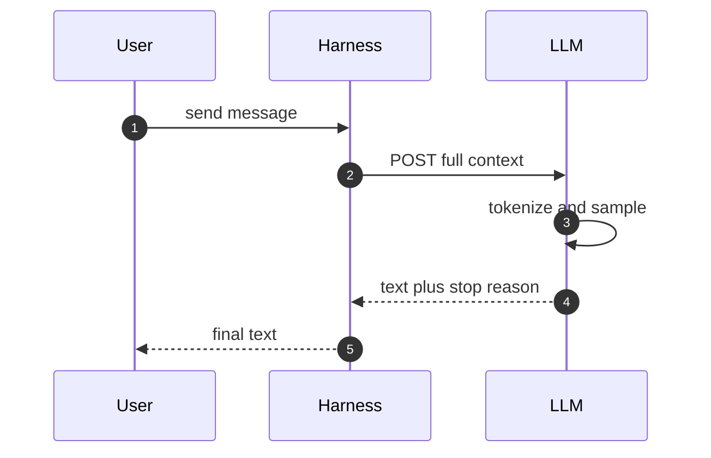
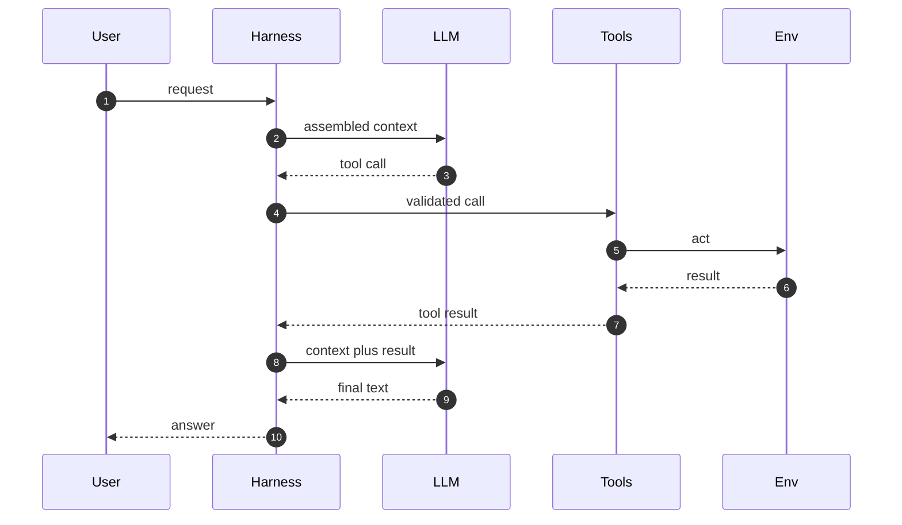

# Chapter 1 — The Agent Loop: Big Picture

## Why this chapter

Every agentic system is one loop: a model, a harness, tools, and a context window.
Engineers who can narrate that loop end to end can predict where any agent breaks.
This chapter builds the master trace (Trace 2) that every later chapter zooms into.
The model: the LLM proposes, the harness disposes — the harness owns everything the model cannot.
If you can narrate Trace 1 and Trace 2 without notes, most agent questions become easy.
Level emphasis: [L1]–[L2]; no (L3) sections in this chapter.

## Concepts

**Agent.** An agent is a model that calls tools in a loop to reach a goal (this book's fixed definition; see `notes/research-notes.md`).
A workflow is a fixed pipeline that may call models; the model does not choose the next step.
This distinction decides most architecture questions in Chapter 13.

**Harness.** The harness (the runtime that owns the loop, context assembly, and gating) is not the model.
It builds the prompt, validates tool calls, executes them, and decides when to stop.
Claude Code, an SDK executor, and a server-side runner are all harnesses.

**Context.** The context window is the model's only working memory for a turn.
Everything the model "knows" this turn was placed there by the harness (Chapter 3).

**Tools.** A tool is a schema plus an executor.
The model emits a call; the harness runs it and appends the result (Chapter 4).

### In other stacks

- **OpenAI Agents SDK:** the harness role is the `Runner`; tools are decorated functions; the loop is `Runner.run()`.
- **OpenAI Agents SDK:** handoffs make agent-to-agent transfer a first-class primitive (Chapter 9).
- **LangGraph:** the loop is an explicit state graph; you wire nodes and edges yourself.
- **LangGraph:** state persists via checkpointers, so a "turn" is a graph step, not a chat turn (Chapter 5).

## Traces

### Trace 1: What happens when you send one message to a model

You send "What is 2+2?" to a model API with no tools.

1. **User** sends a request with a system prompt and one message.
2. **Harness** serializes the request and posts it to the provider API.
3. **LLM** tokenizes the full context into input tokens.
4. **LLM** samples output tokens one at a time, each conditioned on all prior tokens.
5. **LLM** stops at an end token, a stop sequence, or the output limit.
6. **Harness** receives the response with a stop reason and token counts.
7. **User** sees the text.

*Figure 1.1 — the synchronous core: one request, one sampled response, no state on the provider side.*

**Where this can fail**

- **Symptom:** response cut off mid-sentence. **Cause:** output token limit reached. **Where to look:** the stop reason and output token count.
- **Symptom:** same prompt, different answers. **Cause:** sampling temperature above zero. **Where to look:** the request parameters.
- **Symptom:** slow first word, fast rest. **Cause:** long input; time-to-first-token scales with input size. **Where to look:** input token count.

### Trace 2: What happens when a user request becomes a finished task

You ask the agent to fix a failing test. This is the master trace; Chapters 2–12 each zoom into a segment of it.

1. **User** sends the request.
2. **Harness** assembles context: system prompt, memory, history, tool definitions.
3. **LLM** generates; it emits a tool call instead of an answer.
4. **Harness** validates the call and checks it against permission rules.
5. **Tools** execute the call in the environment.
6. **Harness** appends the tool result to the context.
7. **LLM** repeats steps 3–6 until it has what it needs.
8. **LLM** emits final text.
9. **Harness** post-processes: writes memory, fires hooks, records telemetry.
10. **User** sees the answer.

*Figure 1.2 — the anchor diagram: every arrow into the LLM is context the harness chose to send.*

**Where this can fail**

- **Symptom:** the loop never ends. **Cause:** no max-turn stop and a model that keeps calling tools. **Where to look:** the transcript turn count.
- **Symptom:** the agent "forgets" an earlier fact. **Cause:** context overflowed and early turns were dropped. **Where to look:** the token counts per turn.
- **Symptom:** the model claims a tool succeeded but nothing changed. **Cause:** the tool error was swallowed before reaching the context. **Where to look:** the raw tool result in the transcript.
- **Symptom:** the same action ran twice. **Cause:** a non-idempotent tool retried after a timeout. **Where to look:** the tool executor logs.

> **Lab 3 — Build the tool loop.** `labs/lab03-tool-loop/` · [L1] · ~45 min · offline.
> You implement `run_agent()` against a scripted model; the tests define done.

## Questions

### Tier 1 — Explain

**Q 1.1 — What is the difference between an agent and a workflow?**

**Answer.** An agent is a model calling tools in a loop, choosing its own next step.
A workflow is a fixed pipeline where the code chooses the steps and may call models inside them.
The test: who decides what happens next, the model or your code?

*Strong answers also mention:* most production systems are hybrids, and the choice is per-decision, not per-system.

**Q 1.2 — Name the responsibilities the harness owns that the model cannot.**

**Answer.** Context assembly, tool execution, permission gating, stop conditions, memory persistence, and telemetry.
The model only maps context to output tokens; everything stateful or effectful is the harness.

*Strong answers also mention:* this is why "the agent did X" usually means "the harness let X through".

**Q 1.3 — Why does the model see a tool result as text in the next turn?**

**Answer.** The API is stateless per call.
The harness appends the result to the message list and resends the whole context.
The model never "runs" anything; it reads what the harness placed in context.

*Strong answers also mention:* this is why tool results must be budgeted and truncated (Chapter 3).

### Tier 2 — Reason

**Q 1.4 — A team says "the model keeps looping". What harness settings do you check first, and why?**

**Answer.** Max turns and stop conditions first; the loop belongs to the harness, not the model.
Then tool error surfacing: models re-call tools whose failures they never see.
Then context: a compacted transcript can erase the evidence that a step already ran.

*Strong answers also mention:* a turn budget is a safety net, not a fix; the fix is usually in tool results.

**Q 1.5 — Why does adding a tool change model behavior even when the tool is never called?**

**Answer.** Tool definitions live in the context window.
They consume tokens and shift what the model attends to.
A large or vague schema can also pull the model toward wrong calls.

*Strong answers also mention:* tool descriptions are prompts and deserve prompt-level review (Chapter 4).

**Q 1.6 — When does a workflow beat an agent?**

**Answer.** When the steps are known, the cost of variance is high, and no runtime decision needs the model.
Fixed pipelines are cheaper, faster, and testable.
Use an agent where the path genuinely depends on what earlier steps discover.

*Strong answers also mention:* start as a workflow and promote steps to agentic only where variance pays.

### Tier 3 — Design & Debug

**Q 1.7 — An agent completes a task correctly but takes 40 loop turns. Walk your diagnosis.**

**Answer.** Read the transcript before touching settings.
Count wasted turns by class: re-reading unchanged files, retrying failing calls, and re-deriving known facts.
Re-reads point at missing context or memory; retries point at swallowed errors; re-derivation points at compaction losses.
Fix the largest class first, then re-measure turns on the same task.

*Strong answers also mention:* a task suite with turn-count tracking (Chapter 10) so the fix is provable.

**Q 1.8 — Design the stop conditions for an unattended agent run.**

**Answer.** Layer them: a max-turn cap, a wall-clock budget, a token budget, and a no-progress detector.
Each guards a different failure: loops, hangs, cost blowups, and thrashing.
On any stop, persist the transcript and surface a resumable state, not a silent exit.

*Strong answers also mention:* stop conditions are safety nets; alert on how often each fires.

## Common mistakes & red flags

- **"The model executed the command."** The harness executed it; the model emitted text. The distinction decides where every control goes.
- **"We need multi-agent for this."** One agent with good tools beats N coordinating agents for most tasks (Chapter 9).
- **"The agent has memory."** It has a context window the harness fills; persistent memory is a harness feature (Chapter 5).
- **"Tool errors are handled."** Handled where? If the model never sees the error text, it will retry or hallucinate success.
- **"We set temperature to zero, so it is deterministic."** Providers do not guarantee bit-level determinism, and tool results still vary run to run.
