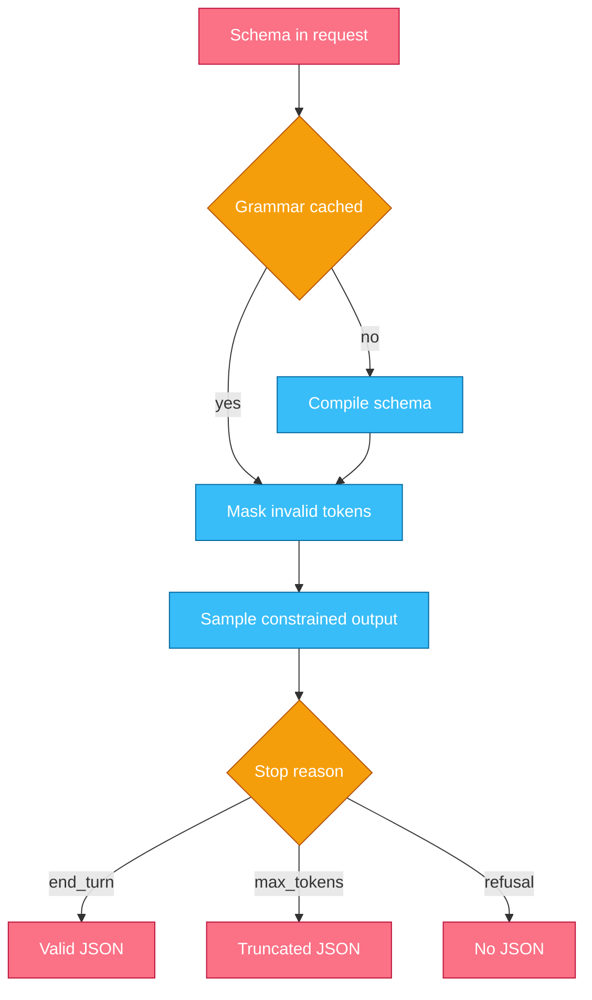
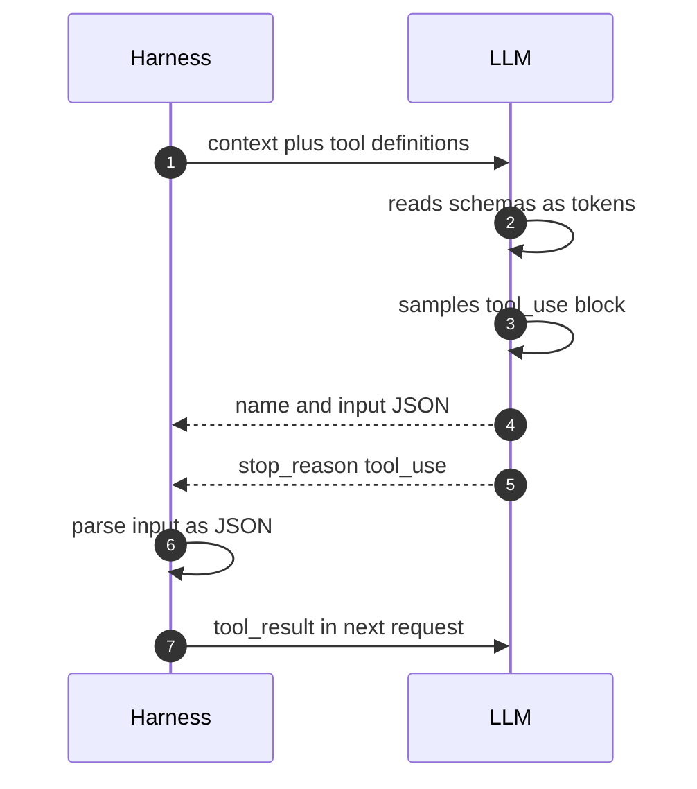
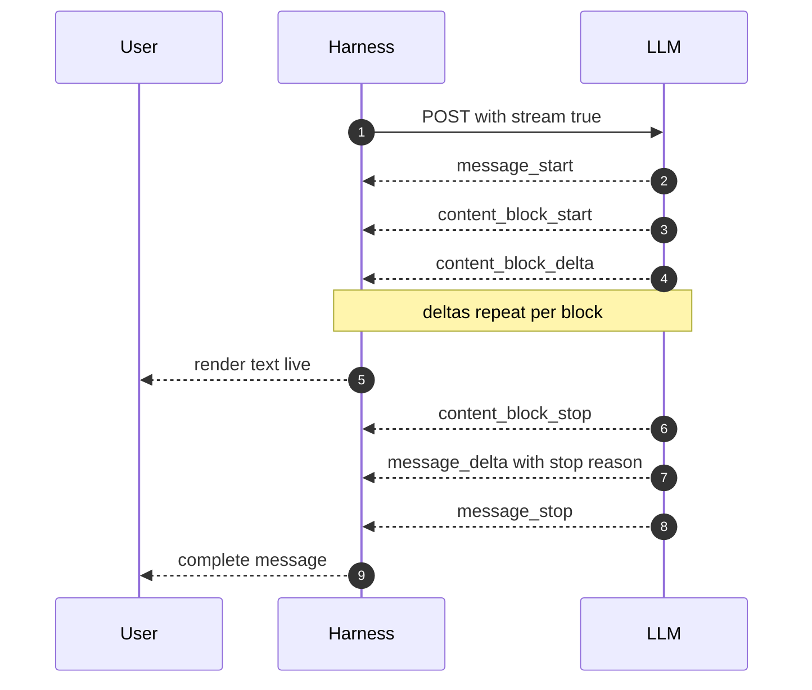
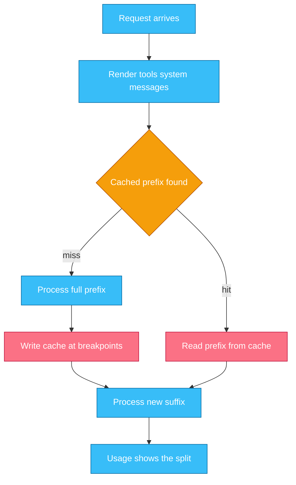

# Chapter 2 — Models & the API Surface

## Why this chapter

Every agent turn bottoms out in one API call: the full context goes in, sampled tokens come out.
This chapter zooms into step 3 of Trace 2 — the model call itself.
The mental model: the API is stateless, and the stop reason is the control signal the loop branches on.
Structured output, tool calls, streaming, and caching are all behaviors of this one call.
An engineer who can read a raw request and response can tell a model problem from a harness problem.
Level emphasis: [L1]–[L2]; no (L3) sections in this chapter.

## Concepts

**Tokens.** A token is the model's unit of text: a subword chunk, typically a few characters.
The tokenizer (the fixed mapping between text and tokens) belongs to the model and differs across model generations.
Everything on the API is measured in tokens: cost, context limits, output limits.
`POST /v1/messages/count_tokens` returns the exact count for a given model; never estimate when the number matters.

**Sampling.** The model computes a probability distribution over the next token, picks one, and repeats.
Temperature is the classic knob: low settings concentrate on likely tokens, high settings spread the choice.
No setting guarantees bit-level determinism; the same prompt can produce different outputs run to run.
Treat variance as a property of the system and measure over many runs (Chapter 10).

**The Messages API shape.** One endpoint carries everything: `POST /v1/messages`.
Each call is stateless — the provider keeps no conversation between calls (Q 1.3).
A request carries the model name, `max_tokens`, an optional system prompt, the `messages` list, and optional `tools`.
A "conversation" is the harness resending the entire message list every turn, one turn longer each time.
That is why input tokens grow every turn (Chapter 3), and why caching pays (Trace 6).
Tool use and structured output are features of this endpoint, not separate APIs.

**Stop reasons are control signals.** Every response says why generation ended.
The loop must branch on `stop_reason`, never on whether the output "looks finished".

| `stop_reason` | Meaning | What the harness does |
|---|---|---|
| `end_turn` | the model finished | return the answer |
| `tool_use` | the model requests tool calls | execute, append results, resend (Trace 4) |
| `max_tokens` | the output limit hit | treat as truncated; never parse as complete |
| `stop_sequence` | a caller-defined string appeared | apply the caller's protocol |
| `pause_turn` | a server-tool turn paused | resend to resume |
| `refusal` | the model declined | read `stop_details`; surface, do not blind-retry |
| `model_context_window_exceeded` | the window is full | trim or compact context, then retry |

**Output limits.** `max_tokens` is a hard cap on everything the model emits in one response: thinking (the model's internal reasoning tokens) plus visible text.
The model cannot see the cap and does not pace against it; generation just stops, mid-sentence or mid-JSON.
Per-model output limits live in Appendix A.
The SDKs require streaming for large `max_tokens` values, because a long silent request hits HTTP timeouts (Trace 5).

**System prompts versus user turns.** The system prompt is a separate request field, set by the harness, stable across turns.
It carries the standing frame: role, rules, environment, output conventions.
User turns carry the task of the moment and any data the task needs.
Keep the split clean.
Stable framing caches well (Trace 6); per-turn data belongs in user messages, after the stable prefix.

**Model selection is a routing decision.** Providers ship tiers: small, fast, cheap models and large, capable, expensive ones.
Which model serves a call is a per-call decision, not a per-product one.
Route mechanical steps — classification, extraction, summarizing tool output — to a cheap tier; route planning and judgment to a capable one.
`GET /v1/models` reports each model's limits and capabilities, so a harness can discover facts instead of hardcoding them.
For non-interactive volume, the Batch API trades latency for cost: half price, results within 24 hours, keyed by `custom_id` (arrival order not guaranteed).
Chapter 12 covers routing in production; Appendix A holds the dated model snapshot.

### In other stacks

- **OpenAI:** the chat-completions and responses request shapes differ in field names and roles, but each call still resends the full conversation — the stateless model is universal.
- **OpenAI:** `finish_reason` plays the stop-reason role; a production loop branches on it the same way.
- **OpenAI Agents SDK:** `Runner.run()` hides the resend loop, but the wire calls underneath are the same shape, with an enforced `max_turns`.
- **LangGraph:** a model node sends the graph state's message list — the full context — on every call; checkpointers persist state in your infrastructure, never on the provider.
- **All stacks:** structured output through schema-constrained decoding exists across providers; treat "schema in, valid JSON out" as a pattern, not one vendor's feature.

## Traces

### Trace 3: What happens when you demand output matching a schema

You ask the model to extract invoice fields and demand JSON matching a schema.

1. **Harness** puts the JSON Schema in the request: `output_config.format` with `type: "json_schema"`.
2. **LLM** compiles the schema into a grammar the sampler can enforce.
   - The first request with a new schema pays compilation latency; the compiled grammar is cached for reuse.
3. **LLM** samples under constrained decoding: at each step, tokens that would break the schema are masked out.
4. **LLM** finishes; on a clean stop (`end_turn`) the output is guaranteed schema-valid JSON.
5. **Harness** checks the stop reason before parsing.
   - `max_tokens` means a truncated — invalid — prefix; `refusal` means no JSON at all (read `stop_details`).
6. **Harness** parses and moves on; validation effort now goes to meaning, not shape.

The portable alternative is validate-and-retry: instruct the model, parse the reply, and on failure resend with the error text.
It works on any provider, but it costs retry turns and never converges by guarantee.
Use constrained decoding where available; keep validate-and-retry for schemas the constraint engine rejects.

*Figure 2.1 — constrained decoding guarantees shape only on a clean stop; two stop reasons escape the schema.*

**Where this can fail**

- **Symptom:** invalid JSON despite structured output. **Cause:** output hit `max_tokens`; a valid prefix was cut. **Where to look:** the stop reason and the output token count.
- **Symptom:** prose instead of JSON. **Cause:** a refusal escapes the schema. **Where to look:** `stop_reason: "refusal"` and `stop_details`.
- **Symptom:** the first call with a new schema is slow; the rest are fast. **Cause:** schema compilation on first use. **Where to look:** latency per request against schema changes.
- **Symptom:** the request is rejected outright. **Cause:** the schema uses features the constraint engine does not support. **Where to look:** the API error message.

> **Lab 1 — First model call and structured output.** `labs/lab01-first-call/` · [L1] · ~30 min · offline.
> You call an Anthropic-shaped API through a local mock server and validate schema-constrained output.

### Trace 4: What happens when the model decides to call a tool

The context carries a `run_tests` tool; the model needs test output before it can answer.

1. **Harness** sends the request with tool definitions in the `tools` field.
2. **LLM** reads the definitions as ordinary input tokens — a schema is a prompt (Chapter 4).
3. **LLM** decides mid-generation that it needs the tool; nothing switches modes.
4. **LLM** samples a `tool_use` content block token by token: an id, the tool name, and the input.
   - The input is model-generated text shaped like JSON — not an object the API built for you.
5. **LLM** stops with `stop_reason: "tool_use"` — a request to the harness, not an action.
6. **Harness** parses the input as JSON; field order, whitespace, and escaping vary run to run, so string matching is never safe.
7. **Harness** executes and answers with a `tool_result` block in the next request (Trace 9 walks that pipeline).

*Figure 2.2 — the tool call is sampled text plus a stop reason; everything after arrow 5 is harness work.*

**Where this can fail**

- **Symptom:** the tool input does not parse. **Cause:** free-form generation drifted from the schema. **Where to look:** the raw block; `strict: true` on the definition makes inputs schema-guaranteed via constrained decoding.
- **Symptom:** the loop returns text while a tool call sits unhandled. **Cause:** the harness branched on "is there text" instead of on `stop_reason`. **Where to look:** the loop's branch condition against the response blocks.
- **Symptom:** extraction breaks after a model upgrade. **Cause:** regexes over generated text; formatting shifted. **Where to look:** the parsing code — replace string matching with JSON parsing.
- **Symptom:** several `tool_use` blocks in one response. **Cause:** not a failure — parallel calls; all results must return in one user message (Chapter 4).

### Trace 5: What happens when a response streams

The harness streams the response so the user sees text as it is generated.

1. **Harness** sends the request with `stream: true`; the connection stays open for server-sent events.
2. **LLM** sends `message_start`: message id, model, and input-token usage.
3. **LLM** opens a content block with `content_block_start`.
4. **LLM** sends `content_block_delta` events; the block's content arrives in fragments.
   - A tool call's input arrives as partial JSON fragments; it parses only once complete.
5. **Harness** renders text deltas immediately, but buffers tool-input deltas until the block closes.
6. **LLM** closes the block with `content_block_stop`; more blocks may follow.
7. **LLM** sends `message_delta`, carrying the stop reason and final usage counts.
8. **LLM** sends `message_stop`; the harness now assembles the same message a non-streaming call returns.

*Figure 2.3 — the stop reason and usage arrive in message_delta, near the end; a loop that reads only deltas misses its control signal.*

**Where this can fail**

- **Symptom:** the stream dies mid-answer. **Cause:** an error event mid-stream, after the HTTP 200 already arrived. **Where to look:** the last event received; partial content must be discarded or retried, never shown as complete.
- **Symptom:** JSON parse errors during tool calls. **Cause:** the harness parsed input deltas before `content_block_stop`. **Where to look:** where the accumulator hands off to the parser.
- **Symptom:** the loop never sees a stop reason. **Cause:** the handler consumed text deltas and ignored `message_delta`. **Where to look:** the event handler's coverage of the sequence.
- **Symptom:** long generations fail with timeouts. **Cause:** a non-streaming call held one HTTP request open too long; the SDKs require streaming for large `max_tokens`. **Where to look:** the request's stream flag and the SDK error.

### Trace 6: What happens when a prompt cache hits — and misses

The harness marks its long, stable prompt prefix for caching and runs a two-turn session.

1. **Harness** adds `cache_control: {type: "ephemeral"}` to the last stable block (up to 4 breakpoints).
2. **LLM** renders the request in fixed order: tools, then system, then messages.
3. **LLM** looks up the longest cached prefix ending at a breakpoint; turn one misses.
4. **LLM** processes the full prefix and writes cache entries at the breakpoints.
   - Writes cost more than plain input: 1.25× for the default 5-minute TTL, 2× for the 1-hour option.
5. **Harness** sends turn two: the same prefix, plus new messages appended at the end.
6. **LLM** hits: the cached prefix is read at roughly 0.1× the input price; only the suffix is processed in full.
7. **LLM** reports the split in `usage`; a nonzero `cache_read_input_tokens` is the proof a hit happened.
8. **Harness** watches for the cliff: any byte changed inside the prefix invalidates everything after that byte.

*Figure 2.4 — the cache is a prefix match over the rendered request; append-only prompts hit, edited ones miss.*

**Where this can fail**

- **Symptom:** `cache_read_input_tokens` is zero on every repeat. **Cause:** a silent invalidator early in the prefix — a timestamp in the system prompt, a reordered tool list, a per-request id. **Where to look:** two rendered requests, diffed byte by byte.
- **Symptom:** caching does nothing for a short prompt. **Cause:** the prefix is below the minimum cacheable size (model-dependent, 512–4096 tokens); caching silently no-ops. **Where to look:** the prefix token count against the model's minimum.
- **Symptom:** hits stop after a pause. **Cause:** the TTL expired — 5 minutes by default. **Where to look:** the gap between requests; consider `ttl: "1h"`.
- **Symptom:** the bill went up after enabling caching. **Cause:** every call writes and nothing reads — the prefix changes each call, so you pay the write premium with no read discount. **Where to look:** the `usage` write and read fields over a day of traffic.

## Questions

### Tier 1 — Explain

**Q 2.1 — What is a token, and why can the same prompt produce different outputs?**

**Answer.** A token is the model's unit of text: a subword chunk mapped by the model-specific tokenizer.
The model generates by sampling from a probability distribution over the next token, one token at a time.
Sampling is random by design; temperature scales how far the choice spreads from the most likely token.
No setting guarantees bit-level determinism, so identical prompts can diverge.

*Strong answers also mention:* token counts differ across model generations; use the count-tokens endpoint, not an estimate.

**Q 2.2 — Name the stop reasons a production loop must handle, and what each one signals.**

**Answer.** Seven: `end_turn` (done — return the answer), `tool_use` (execute tools and resend), `max_tokens` (output truncated — never parse as complete), `stop_sequence` (a caller-defined string fired), `pause_turn` (resend to resume a server-tool turn), `refusal` (read `stop_details` and surface), and `model_context_window_exceeded` (trim or compact, then retry).
The loop branches on this field, never on whether the text looks finished.
A loop that handles only `end_turn` and `tool_use` fails quietly on truncation and refusals.

*Strong answers also mention:* in streaming, the stop reason arrives in `message_delta`, near the end of the event sequence.

**Q 2.3 — What does `max_tokens` cap, and what happens when generation hits it?**

**Answer.** It is a hard cap on everything the model emits in one response: thinking tokens plus visible text.
The model cannot see the cap and does not pace against it; output just stops, mid-sentence or mid-JSON.
The response reports `stop_reason: "max_tokens"`, and the harness must treat the content as truncated.
Even schema-constrained output becomes invalid this way — a valid prefix is not valid JSON.

*Strong answers also mention:* large caps require streaming in the SDKs, because a long silent request hits HTTP timeouts.

**Q 2.4 — What belongs in the system prompt, and what belongs in user turns?**

**Answer.** The system prompt carries the standing frame: role, rules, environment, output conventions.
It is a separate request field the harness owns, stable across turns.
User turns carry the task of the moment and its data.
The split matters twice: the model treats the system frame as standing policy, and a stable prefix is what makes caching hit (Trace 6).

*Strong answers also mention:* user-turn content is untrusted input; standing rules do not belong where task data can rewrite them (Chapter 11).

### Tier 2 — Reason

**Q 2.5 — When do you choose constrained decoding, and when validate-and-retry?**

**Answer.** Constrained decoding wherever the provider supports your schema: shape errors go to zero, with no retry turns.
Validate-and-retry remains for schemas the constraint engine rejects, and as the portable pattern across providers.
Neither removes semantic validation: a schema-valid field can still hold a wrong value.
And constrained decoding still requires checking the stop reason — truncation and refusal both escape the schema (Trace 3).

*Strong answers also mention:* schema compilation makes the first request slower; keep schemas stable so the compiled grammar is reused.

**Q 2.6 — Why must the harness parse tool input as JSON instead of matching strings?**

**Answer.** The input is model-generated text: the model sampled it token by token.
Field order, whitespace, escaping, and formatting are all free to vary run to run and across model versions.
A regex that works today is coupled to formatting the provider never promised.
Parse the JSON, validate against the schema, and use `strict: true` where the shape must be guaranteed by constrained decoding.

*Strong answers also mention:* `strict: true` needs `additionalProperties: false` and a `required` list, and it removes syntactic — not semantic — failures.

**Q 2.7 — In a streaming handler, why buffer tool-call input until the block stops, and which event carries the stop reason?**

**Answer.** A tool call's input arrives as partial JSON fragments spread across delta events.
Any prefix of a JSON document is invalid JSON, so parsing early fails — or half-succeeds, which is worse.
Buffer until `content_block_stop`, then parse once.
The stop reason and final usage arrive in `message_delta`, just before `message_stop`; a handler that only reads content deltas misses the loop's control signal.

*Strong answers also mention:* mid-stream error events can arrive after HTTP 200; partial content must never be shown as complete.

**Q 2.8 — Your prompt has tools, a system prompt, and history. What breaks the cache, and how do you order content?**

**Answer.** The cache is a prefix match over the rendered request, in fixed order: tools, then system, then messages.
Any changed byte invalidates everything after it — so a tool-list edit invalidates the system prompt and all history behind it.
Order content by stability: tool definitions and system prompt stable, dynamic content appended at the end of messages.
Never put timestamps, request ids, or per-user values early in the prefix.
Verify with `usage.cache_read_input_tokens`; zero across repeats means a silent invalidator.

*Strong answers also mention:* writes cost 1.25–2× input; a prefix that changes every call makes caching a net loss.

### Tier 3 — Design & Debug

**Q 2.9 — A team enabled prompt caching and the bill went up. Walk your diagnosis.**

**Answer.** Pull the `usage` fields for a day of traffic first: cache reads versus writes.
The signature of this failure is writes on every call and reads near zero — paying the 1.25–2× write premium with no 0.1× reads.
Then find the invalidator: render two "identical" requests and diff them byte by byte.
Usual suspects: a timestamp or session id in the system prompt, a tool list built from an unordered set, per-request content injected before history.
Also check size: a prefix under the model's minimum cacheable size (512–4096 tokens) silently never caches.
Fix the prefix, then re-verify that `cache_read_input_tokens` is nonzero on repeats.

*Strong answers also mention:* alerting on the cache-read ratio in production, so regressions surface as a metric, not a bill (Chapter 12).

**Q 2.10 — Design model selection for an agent that triages support tickets and drafts replies.**

**Answer.** Split the pipeline by decision weight, and route per call.
Classification and field extraction are mechanical: a cheap tier handles them, with structured output making results checkable.
Drafting a reply and deciding escalation need judgment: a capable tier earns its cost there.
Non-interactive volume — nightly re-triage, eval runs — goes through the Batch API at half price, keyed by `custom_id`.
Wire routing as a harness decision with per-call model names, and hold quality with an eval suite per tier (Chapter 10).
Chapter 12 covers routing under real traffic; Appendix A holds the dated tier snapshot.

*Strong answers also mention:* if a wrong cheap-tier answer is easy to detect, route cheap and verify; if it fails silently, pay for the stronger model up front.

## Common mistakes & red flags

- **"The API remembers our conversation."** It is stateless per call; the harness resends everything. "The model forgot" almost always means the harness dropped it.
- **"Structured outputs means we can skip validation."** Truncation (`max_tokens`) and refusals escape the schema. Check the stop reason before parsing, and validate meaning after.
- **"We extract tool calls with a regex."** Tool input is model-generated JSON; formatting varies run to run. Parse it; `strict: true` guarantees shape, a regex never does.
- **"`max_tokens` caps the visible text."** It caps thinking plus text, and the model cannot see or pace against it. A truncated response says so only in the stop reason.
- **"We enabled caching, so we save money."** Caching is a prefix match; one early byte change invalidates everything after it. Verify hits in `usage.cache_read_input_tokens`.
- **"Streaming is cosmetic."** The SDKs require it for large outputs, and streaming is where partial tool inputs and mid-stream errors must be handled.
- **"We standardized on one model."** Model choice is a per-call routing decision. Mechanical steps route cheap; judgment routes capable (Chapter 12).
