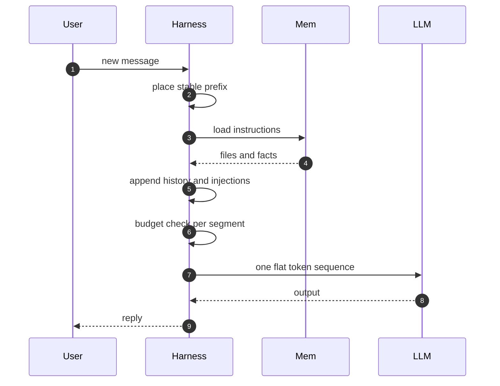
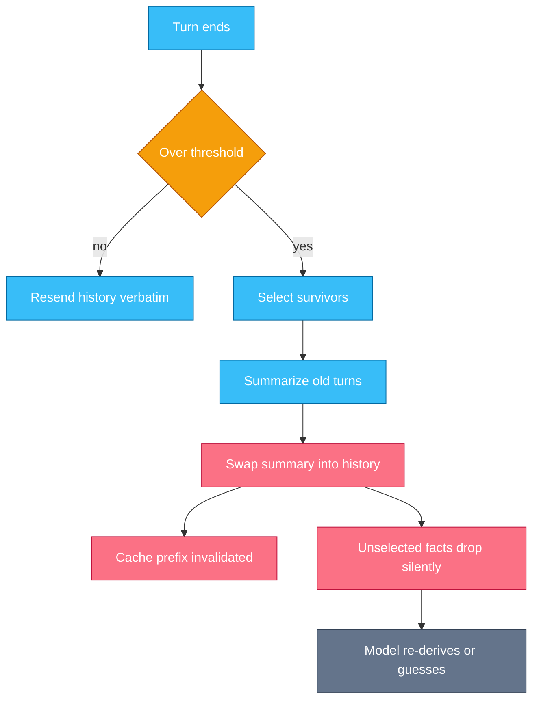

# Chapter 3 — Context Engineering

## Why this chapter

The context window is the model's entire world for a turn, and the harness decides what fills it.
This chapter zooms into steps 2 and 6 of Trace 2: assembly in, results in.
The mental model: context is a budget, not a bag.
Every token you place competes with every token you might need later.
Engineers who account for context per segment can explain most cost, latency, and "forgetting" bugs before opening a debugger.
Level emphasis: [L1]–[L3]; the (L3) section is optional on first read.

## Concepts

**Context engineering.** Context engineering is deciding what enters the context window each turn.
It supersedes "prompt engineering" as the umbrella term: the prompt is one segment; the discipline covers all of them.
The unit of work is the turn, because the window is rebuilt every turn (Trace 7).

**Anatomy of the window.** An agent turn carries six segments.
The system prompt holds identity and standing rules.
Tool definitions carry every schema and description (Chapter 4).
Memory and instructions bring project files and stored facts (Chapter 5).
History holds every prior message and tool result.
Injected content adds retrieved documents, hook output, and reminders.
The current turn ends it: the newest user message or tool result.
The segments are a harness fiction.
The model receives one flat token sequence with no boundaries; nothing marks where instructions end and data begins.
That flatness is why injection works (Chapter 11) and why ordering matters (below).

**Per-turn assembly.** The provider API is stateless per call.
The harness rebuilds the full request — all six segments — and resends everything, every turn.
A 40-turn session is 40 growing requests, not 40 small ones.
This is why input tokens dominate agent cost, and why prompt caching exists.

**Budgets and token math.** Treat the window as a budget with per-segment accounting.
In agent sessions, tool results and tool definitions dominate.
Results accumulate in history: fifty tool calls returning 2,000 tokens each add 100,000 tokens to every later request.
Definitions are constant but wide: thirty rich schemas cost thousands of tokens before any work starts.
The system prompt and user messages are usually the smallest lines.
Measure with the provider's token-counting endpoint; counts are model-specific.
A segment you cannot measure is a segment you cannot control.

**Stability ordering.** Prompt caching matches a prefix: any changed byte invalidates everything after it (Trace 6).
So order content stable-first, volatile-last.
Providers render tool definitions, then the system prompt, then messages — so the expensive front of the request repeats cheaply across turns.
Until something mutates it.
A timestamp in the system prompt or a reordered tool list silently zeroes cache reads.
Verify with the usage fields: zero cache reads across repeated turns means a silent invalidator.

**Compaction and summarization.** When history approaches the window limit, the harness compacts.
It replaces old turns with a summary and keeps recent turns verbatim (Trace 8).
Some providers offer server-side compaction in beta; most harnesses implement their own.
Treat it as a harness pattern, not a product feature.
The engineering question is never "does it compact" but "what survives".
The task, decisions, and current state must; everything else may silently drop.

**Context rot and poisoning.** Context only accumulates; nothing in the window expires.
A fact that was true at turn 3 — a file's contents, a test result — persists after turn 30 changed it.
The model weighs stale evidence like fresh evidence.
Poisoning is the adversarial case: injected content in a web page or tool result reads as instructions, because the sequence is flat.
Detection and gating form the judgment layer of Chapter 11; this chapter's job is knowing the exposure exists.

**Just-in-time loading.** Pre-loading puts everything potentially useful in the window up front.
Just-in-time loading gives the model a pointer and a tool to fetch content on demand.
Progressive disclosure is the compromise that scales: always carry the one-line description, load the body on use.
Skills work exactly this way (Chapter 7).
Prefer just-in-time when content is large, rarely needed, or volatile; pre-load only what every turn needs.

### Sub-context isolation across subagents (L3)

A subagent runs in a fresh context window (Trace 22, Chapter 9).
What transfers is only what the parent writes into the task prompt.
What returns is only the subagent's final report.
Everything in between — files read, dead ends, intermediate reasoning — is lost on both sides.
That is the point: a search that reads forty files costs the parent one paragraph.
But it cuts both ways.
A parent that under-specifies the task gets a confident answer to the wrong question, and cannot audit reasoning it never saw.
Design the boundary like an API: the task prompt is the request schema, the report is the response schema.

### In other stacks

- **LangGraph:** context is an explicit state object; nodes read and write typed channels, so "what the model sees" is code you wrote, not harness defaults.
- **LangGraph:** checkpointers persist that state across runs, so a resumed thread brings its old context back — trimming it is still your job.
- **OpenAI Agents SDK:** sessions store history and apply trimming or summarizing strategies — the compaction pattern under another name.
- **Everywhere:** each framework re-exposes the same budget problem; renaming the window does not enlarge it.

## Traces

### Trace 7: What happens when the context for a turn is assembled

You send a follow-up message deep in a long session.

1. **User** sends the message.
2. **Harness** starts a fresh request; the provider kept nothing from the last call.
3. **Harness** places the stable prefix: tool definitions render first, then the system prompt.
4. **Mem** returns instruction files and stored facts; the harness appends them after the system prompt.
5. **Harness** appends the full history, oldest first: every message, tool call, and tool result.
6. **Harness** injects per-turn content next: hook output, retrieved documents, reminders.
7. **Harness** appends the new user message last, in the volatile tail.
8. **Harness** counts tokens per segment and trims any segment over its budget.
   - A common rule: cap any single tool result and mark the cut with a truncation notice.
9. **Harness** posts the request; the LLM reads one flat token sequence with no segment boundaries.
10. **LLM** returns output; the harness discards this assembly and rebuilds everything next turn.

*Figure 3.1 — assembly is total: everything the model sees this turn was rebuilt from scratch this turn.*

**Where this can fail**

- **Symptom:** cost grows every turn even when messages are short. **Cause:** the full history resends each turn; input tokens compound. **Where to look:** input token counts per turn.
- **Symptom:** cache reads are zero on every turn. **Cause:** a volatile byte in the stable prefix — a timestamp, a reordered tool list. **Where to look:** the usage cache fields and a diff of two consecutive requests.
- **Symptom:** the model ignores a rule that is "in the prompt". **Cause:** the rule sits behind 100K tokens of tool results; attention degrades. **Where to look:** where the rule sits in the assembled request.
- **Symptom:** the model follows instructions nobody wrote. **Cause:** injected content — a fetched page, a tool result — reads as instructions in the flat sequence. **Where to look:** the injected segments in the transcript (Chapter 11).
- **Symptom:** the model missed detail a tool actually returned. **Cause:** the per-segment cap truncated the result. **Where to look:** truncation markers in the transcript.

### Trace 8: What happens when the context window fills

A long refactoring session approaches the model's window limit mid-task.

1. **Harness** counts total tokens after each turn against a threshold set below the hard limit.
2. **Harness** crosses the threshold and schedules compaction before the next model call.
3. **Harness** selects survivors: the task statement, decisions made, current state, open questions.
4. **LLM** writes a summary of the old turns from a dedicated summarization prompt.
   - Some providers run this step server-side as a beta; the pattern is identical.
5. **Harness** replaces the old turns with the summary; the most recent turns stay verbatim.
6. **Harness** accepts the side effect: the cached prefix changed, so the next call rewrites the cache.
7. **LLM** continues the task from the summary plus the recent turns.
8. **LLM** needs a fact that did not survive — a file path, a failed approach — and cannot recall it.
9. **LLM** re-derives: it re-reads files and re-runs commands, spending turns to recover dropped facts.
   - The worst case is silent: the model guesses instead of re-deriving, and states the guess confidently.

*Figure 3.2 — compaction trades tokens for facts: everything not selected drops with no error raised.*

**Where this can fail**

- **Symptom:** the agent "forgets" mid-task and repeats finished work. **Cause:** compaction dropped the evidence that a step already ran. **Where to look:** the transcript around the compaction point; compare summary to original turns.
- **Symptom:** the agent asserts something false about earlier work. **Cause:** re-derivation's silent twin — the model guessed a dropped fact. **Where to look:** the summary text versus the original turns.
- **Symptom:** cost spikes right after compaction. **Cause:** the prefix changed, so cache reads dropped to zero for one rewrite. **Where to look:** cache read and write counts around the compaction turn.
- **Symptom:** the session still dies with a context-exceeded stop. **Cause:** no threshold, or one tool result larger than the remaining headroom. **Where to look:** the stop reason and the size of the last tool result.
- **Symptom:** compaction loops — the window refills immediately. **Cause:** the survivors include bulky raw content instead of references to it. **Where to look:** the summary's own token count.

> **Lab 4 — Context truncation and compaction.** `labs/lab04-context-budget/` · [L2] · ~45 min · offline.
> You implement a budgeter that trims history without losing the task; the tests replay a session that must survive it.

## Questions

### Tier 1 — Explain

**Q 3.1 — Name the six segments of an agent's context window.**

**Answer.** System prompt, tool definitions, memory and instructions, history, injected content, and the current turn.
The boundaries exist only in the harness.
The model receives one flat token sequence and cannot tell instructions from data by position alone.

*Strong answers also mention:* providers render tools, then system, then messages — that fixed order defines the cacheable prefix.

**Q 3.2 — Why does the harness resend the entire context every turn?**

**Answer.** The provider API is stateless per call; nothing persists server-side between requests.
The model can only condition on tokens in the current request.
So the harness rebuilds all segments and resends them, and the request grows every turn.
Prompt caching makes the repeated prefix cheap; it does not make it free or optional.

*Strong answers also mention:* input tokens therefore dominate agent cost, making per-turn token counts the first debugging telemetry.

**Q 3.3 — Which segments dominate token spend in an agent session, and why?**

**Answer.** Tool results, then tool definitions.
Results accumulate in history and resend every turn; fifty 2,000-token results is 100K tokens per request.
Definitions are constant but wide: every schema and description rides in every call.
System prompts and user messages are usually minor lines in the accounting.

*Strong answers also mention:* truncating tool results at the executor, before they enter history at all (Chapter 4).

**Q 3.4 — What is the difference between pre-loading and just-in-time loading?**

**Answer.** Pre-loading places content in context up front, before the model asks.
Just-in-time loading gives the model a pointer and a tool; it fetches content when needed.
Progressive disclosure combines them: always carry a one-line description, load the body on use.
Skills use exactly this pattern (Chapter 7).

*Strong answers also mention:* the trade — pre-loading spends tokens on maybes; just-in-time spends a turn and a tool call.

### Tier 2 — Reason

**Q 3.5 — Cache reads dropped to zero after a "harmless" deploy. What do you look for?**

**Answer.** A byte-level diff of two consecutive requests, front to back.
Caching matches a prefix; the first changed byte invalidates everything after it.
Usual suspects: a timestamp or dynamic value in the system prompt, a reordered or reworded tool list, a changed model.
Confirm with the usage fields: cache reads return once the mutating byte is pinned.

*Strong answers also mention:* stability ordering as the design fix — volatile content belongs at the back (Trace 6).

**Q 3.6 — Why can an agent confidently act on a stale fact from thirty turns ago?**

**Answer.** Context does not expire; every turn stays in the window until compaction removes it.
The model weighs a turn-3 file listing like a turn-30 one; recency is weak evidence, not a rule.
Nothing marks the old fact as superseded unless the harness or a later result says so.
The fix is hygiene: re-read before acting on old state, or inject explicit "this changed" markers.

*Strong answers also mention:* rot scales with session length; long sessions need re-verification habits or a restart policy.

**Q 3.7 — Your harness compacts at a threshold. What must the summary preserve, and what may drop?**

**Answer.** Must survive: the task statement, constraints, decisions made and why, current state, and open questions.
May drop: raw tool output, dead-end exploration, and verbatim file contents that can be re-read.
The test: can the model resume the task from summary plus recent turns without guessing?
Preserve references — file paths, command names — so dropped content stays cheaply re-derivable.

*Strong answers also mention:* replaying compacted sessions in an eval suite (Chapter 10) to catch summaries that lose the task.

### Tier 3 — Design & Debug

**Q 3.8 — An agent performs well for 20 turns, then quality degrades sharply. Walk your diagnosis.**

**Answer.** Get the transcript and the per-turn token counts first.
Check for a compaction event near the cliff: degradation at compaction means the summary drops task-critical facts.
No compaction? Check total size: degradation with a huge intact window means attention dilution — the rules sit behind 100K tokens of results.
Then check for rot: stale facts contradicted by later turns steering late decisions.
Fix the confirmed cause: better survivor selection, tighter tool-result truncation, or re-verification prompts, in that order.

*Strong answers also mention:* reproducing the cliff on a fixed task suite (Chapter 10), so the fix is measurable, not anecdotal.

**Q 3.9 — Design the context budget for an agent with 30 tools and long tool outputs.**

**Answer.** Set per-segment caps and measure against them every turn.
Cut tool definitions first: pre-load the few always-needed tools; expose the rest through just-in-time discovery.
Cap each tool result at the executor; store full output outside context and return a path plus an excerpt.
Set the compaction threshold with headroom for the largest single result you allow.
Alert on segment-cap hits and on zero cache reads; both fail silently otherwise.

*Strong answers also mention:* the token-counting endpoint for model-specific measurement, since tokenizers differ across model generations.

**Q 3.10 — When would you restart a session instead of compacting it?**

**Answer.** When state is externalized: the plan, notes, and code live in files, not in conversation history.
A restart re-assembles from durable artifacts and gets a clean, rot-free window.
Compaction preserves conversational nuance but carries rot forward and risks a lossy summary.
Prefer restarts at natural boundaries — a subtask done, a plan written; prefer compaction mid-flight.

*Strong answers also mention:* sub-context isolation is the same idea sideways — a subagent is a restart you run in parallel (Chapter 9).

## Common mistakes & red flags

- **"The prompt is fine, we tested it."** The prompt is one segment. The model sees it behind tool definitions, memory, and 100K tokens of history — test assembled context, not prompts.
- **"We'll just use a bigger window."** A bigger window raises the ceiling, not attention quality; cost and rot scale with what you put in it.
- **"Compaction is lossless — it's a summary."** Selection is the loss. Everything unselected drops silently, and the model later guesses or re-derives it.
- **"Caching is automatic; it will save us."** Caching matches a byte-exact prefix. One volatile byte up front zeroes it, and nothing errors — watch the usage fields.
- **"The model forgot."** A model never forgets what is in the window. The harness dropped, truncated, or compacted it — find which, in the transcript.
- **"Add it to the system prompt."** The default answer to every behavior gap bloats the stable prefix; most content belongs in just-in-time loads or memory (Chapter 5).
