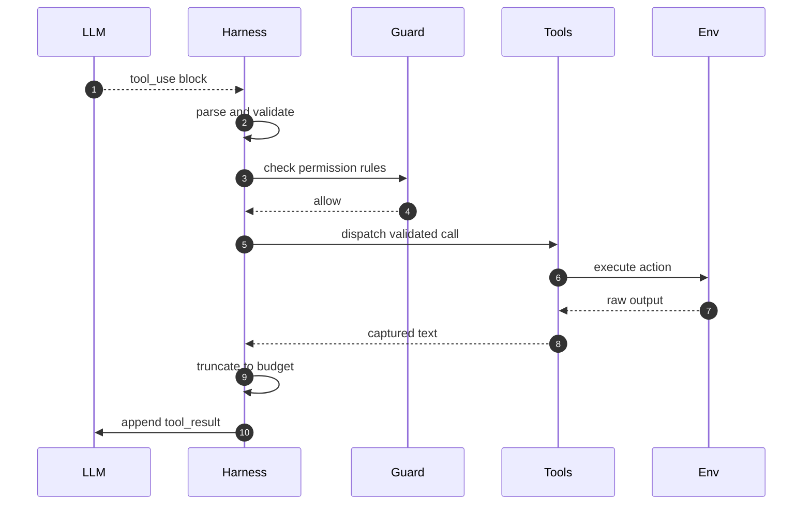
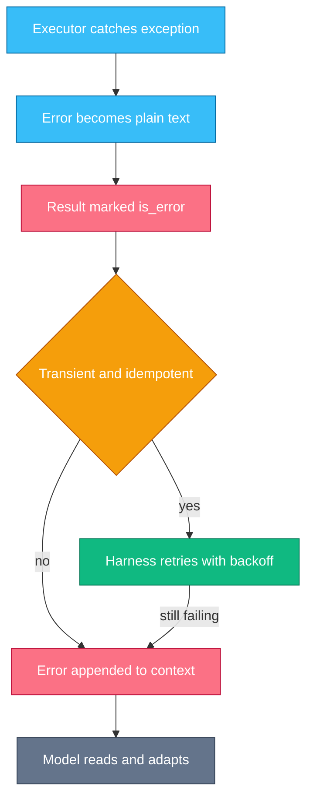
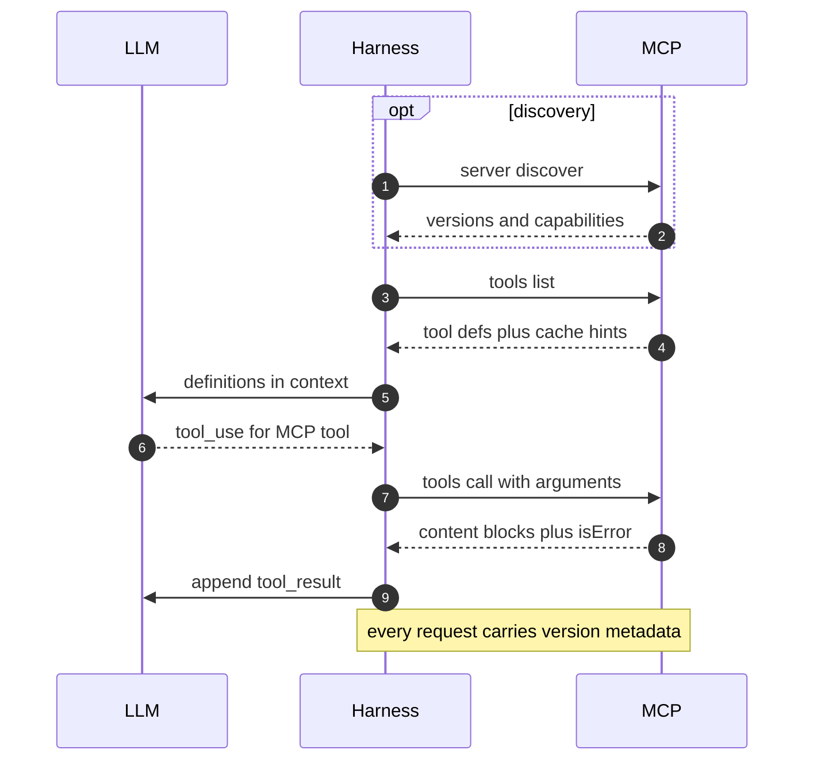

# Chapter 4 — Tool Design & MCP

## Why this chapter

Tools are where an agent stops talking and starts acting.
This chapter zooms into steps 4–6 of Trace 2: the model emits a call, the harness executes it, and the result comes back as context.
The mental model: a tool is a schema plus an executor — the schema is a prompt the model reads, the executor is production code you own.
Most agent failures live on this boundary: vague descriptions, flooded results, swallowed errors, duplicated side effects.
MCP standardizes the boundary so tools can live outside your process.
Level emphasis: [L1]–[L3]; the (L3) section is optional on first read.

## Concepts

**Tool schemas and descriptions are prompts.** A tool is declared as `{name, description, input_schema}`, where the schema is JSON Schema.
The harness sends these definitions in the context every turn.
The model reads them to decide when to call, which tool to call, and with what arguments.
No other channel informs that decision.
So a description must say when to use the tool — and when not to — not only what it does.
Each parameter needs its own description; a vague schema produces wrong calls.
Review tool descriptions like prompts, because they are (see Q 1.5: adding a tool changes behavior even when it is never called).

**Schema strictness.** `strict: true` on a tool definition makes the provider guarantee schema-valid inputs through constrained decoding.
It requires `additionalProperties: false` and a `required` list.
Strictness removes syntactic validation failures, not semantic ones: a well-formed path can still point at nothing.

**The call-and-result shape.** The model returns `tool_use` content blocks and stops with `stop_reason: "tool_use"`.
One assistant message may carry several `tool_use` blocks — parallel calls.
The harness executes them and replies with `tool_result` blocks, each matching a `tool_use_id`, all inside one user message.
A failed tool returns a `tool_result` with `is_error: true`; a result is never dropped.

> **Lab 2 — Define and dispatch tools.** `labs/lab02-define-tools/` · [L1] · ~30 min · offline.
> You write the schemas and a dispatcher that turns every failure into text the model can read.

**Execution end to end.** Between the model's block and the next turn sits a pipeline the harness owns: parse, validate, gate, dispatch, capture, truncate, append.
Trace 9 walks it step by step.
Every stage can corrupt what the model reads next, so every stage is a debugging checkpoint.

**Errors, idempotency, retries.** The model can only fix what it can see.
A tool error must return as text in the `tool_result`, marked `is_error: true`.
An idempotent tool (one that leaves the same state when run twice) is safe to retry; reading a file is idempotent, sending an invoice is not.
The harness may auto-retry a transient failure only when the tool is idempotent.
Everything else surfaces to the model as an error.
Trace 10 walks the failure path, including the worst class: silent success.

**Tool-result budgets.** A tool result becomes context the model carries for the rest of the session (Chapter 3).
The harness caps each result: cut at a per-tool budget, add an explicit marker ("truncated: showing 10,000 of 91,000 chars"), and offer a way to get the rest (an offset or a narrower query).
Never truncate silently — the model must know it saw a slice.

**Sandboxing mechanics.** Two mechanical layers contain a tool.
The permission gate runs before dispatch and decides allow, deny, or ask for each call.
The blast radius bounds what the executor can touch even when the gate is wrong: a container, a read-only mount, no network, scoped credentials.
Which policy is right for which deployment is a judgment question; that layer is Chapter 11.
This chapter covers only the machinery.

**Tool classes.** Four classes recur.
Search tools are read-only and cheap to retry; their risk is result size.
Code execution (a shell, an interpreter) gives maximum breadth and maximum blast radius.
Computer use (screenshots plus clicks) is slow, and every action deserves a gate.
External APIs carry side effects; idempotency and auth are their design problems.

**MCP: what it standardizes.** The Model Context Protocol (MCP) is an open protocol that puts tools behind a standard client-server interface, so one server can serve any harness.
It standardizes three server primitives — tools (`tools/list`, `tools/call`), resources (`resources/list`, `resources/read`), and prompts (`prompts/list`, `prompts/get`) — plus two transports: stdio for local subprocess servers and Streamable HTTP for remote ones.
The current revision (2026-07-28) is stateless: there is no handshake.
Every request carries the protocol version, client info, and client capabilities in `params._meta`, and the server accepts or rejects per request.
Servers must implement `server/discover`, an RPC the client may call up front for supported versions, capabilities, and server info.
Tool results return `content[]` blocks, optional `structuredContent` validated against an `outputSchema`, and `isError: true` for execution errors.
Note the spelling: MCP's `isError` and the provider API's `is_error` are different fields at different layers.
Auth for HTTP transports is OAuth 2.1; stdio servers use environment credentials.

**The legacy handshake.** Revisions up to 2025-11-25 open with a stateful handshake: the client sends `initialize` with its version and capabilities, the server answers with its own, and the client confirms with `notifications/initialized`.
Many deployed servers still speak this, so the spec defines a legacy-modern compatibility matrix, and clients commonly support both eras.
Trace 11 traces the current stateless flow.

### Tool-surface design: bash breadth versus dedicated tools (L3)

One `bash` tool covers everything a shell can do; a dedicated tool gives a typed schema, a narrow gate, and a cleanly capped result.
Breadth is cheap to build and hard to gate: the permission gate must then parse arbitrary shell text.
Dedicated tools invert the costs: each is easy to gate and budget, but you must predict what the agent needs, and every definition spends context tokens each turn.
The working rule: breadth for exploration inside a strong sandbox; dedicated tools for side effects that need gating.
Description quality then decides whether the model picks the right one.

### In other stacks

- **OpenAI Agents SDK:** tools are decorated Python functions attached to an agent; `Runner.run()` owns the execute-and-append loop, with an enforced `max_turns` limit.
- **OpenAI Agents SDK:** guardrails validate input and output at the loop boundary, so the gate is a first-class primitive.
- **LangGraph:** tool execution is a graph node you wire yourself; the call-tools-then-loop edge is explicit, so retry and truncation policy live in your node code.
- **Both:** the schema-is-a-prompt rule holds in every stack; the model sees only the name, description, and schema your code declares.

## Traces

### Trace 9: What happens when a tool call executes end to end

The model asks to run the test suite: one `tool_use` block, name `run_tests`, input `{"path": "tests/"}`.

1. **LLM** emits the `tool_use` block — id, name, input — and stops with `stop_reason: "tool_use"`.
2. **Harness** parses the block and looks the name up in its tool registry.
   - An unknown name becomes an error result, not a crash; models sometimes hallucinate tools.
3. **Harness** validates the input against the schema: missing, unknown, or mistyped arguments.
4. **Guard** checks the call against permission rules: allow, deny, or ask the user.
5. **Tools** dispatches: the executor function runs with the validated input.
6. **Env** does the work — the process runs, the file changes, the API responds.
7. **Tools** captures everything as text: stdout, stderr, exit code, return value, or exception.
8. **Harness** truncates the captured text to the result budget, with an explicit marker.
9. **Harness** appends a `tool_result` block with the matching `tool_use_id` and resends the context.
10. **LLM** reads the result as ordinary input tokens and plans the next step.



*Figure 4.1 — every stage between the model's call and its next turn belongs to the harness.*

**Where this can fail**

- **Symptom:** the model calls a tool that does not exist. **Cause:** a hallucinated name, often invited by a description that implies extra capability. **Where to look:** the tool definitions and the unknown-tool error result.
- **Symptom:** a sensible-looking call is rejected. **Cause:** schema mismatch — a string where the schema wants an integer, an argument the schema forbids. **Where to look:** the validation error text in the transcript.
- **Symptom:** the agent stalls mid-task. **Cause:** the gate is waiting on a human "ask" nobody answered. **Where to look:** the harness's pending-approval state.
- **Symptom:** the next model turn is enormous. **Cause:** step 8 missing, or the budget set far too high. **Where to look:** the token counts per message.
- **Symptom:** the provider rejects the follow-up request. **Cause:** parallel calls answered across several messages, or one result missing. **Where to look:** the message structure — one user message must carry all results.

### Trace 10: What happens when a tool call fails

The agent calls `send_invoice`; the network drops the response after five seconds.

1. **Tools** runs the executor; the HTTP call times out and raises.
2. **Tools** catches the exception — nothing propagates, because the loop must survive any tool.
3. **Tools** converts it to plain text: exception type, message, and any partial output.
4. **Harness** marks the result `is_error: true`, keeping the failure model-visible.
5. **Harness** consults its retry policy: retry only a transient failure of an idempotent tool.
   - `send_invoice` is not idempotent, and a timeout does not prove the invoice was not created.
6. **Harness** therefore surfaces: it appends the error result and resends the context.
7. **LLM** reads the error and adapts — here, it lists invoices to verify state before re-sending.
8. **Harness** counts consecutive failures; repeated identical errors trigger a stop or an escalation.



*Figure 4.2 — the retry gate: only transient failures of idempotent tools bypass the model.*

The bug class to fear here is silent success: an executor that catches an exception and returns an empty string or "done".
The model reads success, reports the task complete, and the failure ships.
Every step above exists to prevent that: a failure must become text the model reads.

**Where this can fail**

- **Symptom:** the model claims success but nothing changed. **Cause:** a swallowed error — the executor returned empty or "ok" text. **Where to look:** the raw tool result in the transcript versus the executor logs.
- **Symptom:** the same invoice or email went out twice. **Cause:** the harness retried a non-idempotent tool after a timeout. **Where to look:** executor logs — two attempts against one model call.
- **Symptom:** the model retries the identical failing call forever. **Cause:** error text with no actionable detail ("error"). **Where to look:** the error strings in the transcript.
- **Symptom:** the whole loop crashes on one bad call. **Cause:** an executor exception escaped the dispatcher's catch. **Where to look:** the harness stack trace.

> **Lab 5 — Debug a broken agent.** `labs/lab05-debug-agent/` · [L2] · ~45 min · offline.
> Three planted bugs — a context flood, a double-fired tool, a swallowed error — and the tests that catch them.

### Trace 11: What happens when the agent calls an MCP server

The harness is configured with a remote MCP server that exposes a `search_docs` tool (current revision, 2026-07-28).

1. **Harness** may call `server/discover` first: supported versions, capabilities, server info. Servers must implement it; clients choose whether to call it.
2. **Harness** sends `tools/list`; like every request, it carries the protocol version, client info, and capabilities in `params._meta`.
   - No handshake exists in this revision; each request stands alone. A rejected version returns error -32022 with the versions the server supports.
3. **MCP** returns the tool definitions, plus caching hints (`ttlMs`, `cacheScope`) that say how long the list may be reused.
4. **Harness** merges the MCP tools into the model's tool list, alongside local tools.
5. **LLM** emits a `tool_use` block naming the MCP-backed tool; it cannot tell MCP tools from local ones.
6. **Harness** routes the call to the server: `tools/call` with the tool name and arguments.
7. **MCP** executes and returns `content[]` blocks, optional `structuredContent`, and `resultType: "complete"`.
   - A tool-execution failure sets `isError: true` in the result — model-visible, like `is_error` in Trace 10. A protocol error (unknown tool, malformed request) returns a JSON-RPC error to the harness instead.
8. **Harness** appends the content as an ordinary `tool_result` and resends the context.



*Figure 4.3 — the stateless flow: no handshake; version and identity travel with each request.*

**Where this can fail**

- **Symptom:** every request rejected with error -32022. **Cause:** client and server share no protocol revision. **Where to look:** the error's supported-versions list; `server/discover`.
- **Symptom:** the model calls a tool the server no longer has. **Cause:** `tools/list` cached beyond its `ttlMs`. **Where to look:** the cache hints versus the harness's cache age.
- **Symptom:** the harness logs a JSON-RPC error but the model saw nothing. **Cause:** a protocol error was treated as a tool error and nothing was appended. **Where to look:** the harness MCP logs against the transcript.
- **Symptom:** works locally over stdio, fails once deployed over HTTP. **Cause:** auth — HTTP transports require OAuth 2.1; stdio ran on environment credentials. **Where to look:** 401 responses and the protected-resource metadata.
- **Symptom:** an older server errors on the first request. **Cause:** it expects the legacy `initialize` handshake. **Where to look:** the server's supported revisions and the compatibility matrix.

## Code-reading exercises

The loop shape is correct in all three snippets; the bugs are elsewhere.
Each snippet builds on the Lab 3 loop.
Read for what the model will see in its context, not for syntax.

### Exercise 1 — The generous result

```python
def read_logs(path: str, pattern: str = "") -> str:
    """Return matching lines from a log file."""
    lines = open(path).read().splitlines()
    if pattern:
        lines = [l for l in lines if pattern in l]
    return "\n".join(lines)

def run_agent(model, tools, user_msg, max_turns=8):
    transcript = [{"role": "user", "content": user_msg}]
    for _ in range(max_turns):
        resp = model.complete(transcript, tools)
        transcript.append({"role": "assistant", "content": resp.text,
                           "tool_calls": [{"id": c.id, "name": c.name,
                                           "input": c.input}
                                          for c in resp.tool_calls]})
        if not resp.tool_calls:
            return resp.text
        for call in resp.tool_calls:
            fn = tools[call.name]
            try:
                content = str(fn(**call.input))
            except Exception as exc:
                content = f"error: {exc}"
            transcript.append({"role": "tool", "tool_call_id": call.id,
                               "content": content})
    return ""
```

**What's wrong?**

Two bugs.
(1) No result budget: `read_logs` with an empty pattern returns the whole file.
A 200 MB log becomes one tool message; Trace 9 step 8 never happens.
Every later turn re-pays those tokens, earlier facts get buried, and one result can overflow the window outright — the next response then stops with `model_context_window_exceeded`.
(2) `tools[call.name]` sits outside the `try`: a hallucinated tool name raises `KeyError` and crashes the loop, instead of returning an error the model could correct (Trace 9 step 2).

**Fix.**
Cap every result before appending: cut at a per-tool character budget, add an explicit truncation marker, and tell the model how to get more (a narrower `pattern`, an offset parameter).
Move the lookup inside the error path: `fn = tools.get(call.name)`, and return "error: unknown tool" as the result.
Lab 2's dispatcher does both.

### Exercise 2 — The helpful retry

```python
import requests

API = "https://billing.internal"

def send_invoice(customer_id: str, amount_cents: int) -> str:
    """Create and send an invoice. Returns the invoice id."""
    resp = requests.post(f"{API}/invoices",
                         json={"customer": customer_id,
                               "amount_cents": amount_cents},
                         timeout=5)
    resp.raise_for_status()
    return resp.json()["invoice_id"]

def dispatch(call, tools, attempts=3):
    """Run one tool call; retry to smooth over flaky networks."""
    fn = tools.get(call.name)
    if fn is None:
        return f"error: unknown tool {call.name}"
    for _ in range(attempts):
        try:
            return str(fn(**call.input))
        except requests.Timeout:
            continue  # transient - try again
        except Exception as exc:
            return f"error: {exc}"
    return "error: timed out after 3 attempts"
```

**What's wrong?**

One bug, an expensive one.
The dispatcher retries every tool on timeout, but a timeout is not proof of failure — it proves only that no response arrived.
The POST may have committed before the response was lost.
`send_invoice` is not idempotent, so this loop can bill a customer up to three times, and the transcript shows a single clean call.
Retry policy must be per-tool, not global (Trace 10 step 5): a blanket `continue` treats "safe to run twice" as a property of networks instead of a property of tools.

**Fix.**
Mark each tool idempotent or not at registration; the dispatcher retries timeouts only for idempotent tools.
For side-effecting tools, surface the timeout as an error result that says "state unknown — verify before retrying", and give the model a way to verify (a `list_invoices` tool).
Better still, make the tool idempotent: send an idempotency key with the POST so the server deduplicates retries.

### Exercise 3 — The quiet failure

```python
import logging

log = logging.getLogger("agent")

def dispatch(call, tools):
    fn = tools.get(call.name)
    if fn is None:
        return ""
    try:
        result = fn(**call.input)
    except Exception:
        log.warning("tool %s failed", call.name)
        result = None
    return str(result or "")

def handle_calls(resp, tools, transcript):
    for call in resp.tool_calls:
        content = dispatch(call, tools)
        transcript.append({"role": "tool",
                           "tool_call_id": call.id,
                           "content": content or "done"})
```

**What's wrong?**

Three bugs, all one class: the model reads success where none happened.
(1) Exceptions are logged for the operator and hidden from the model; `result = None` becomes `""`, which `handle_calls` rewrites to "done".
The model reports the task complete — the silent-success bug from Trace 10, and the hardest to spot because the transcript looks healthy.
(2) An unknown tool returns `""`, which also becomes "done"; a hallucinated call now reads as a completed action.
(3) `str(result or "")` erases falsy legitimate results: a tool that correctly returns `0` or `False` also reads as "done".
The log line helps nobody who matters here: the model can only fix what is in its context.

**Fix.**
Every failure becomes text: return the exception type and message ("error: FileNotFoundError: ..."), and mark the result `is_error: true` where the API supports it.
Unknown tools return an explicit error string.
Drop the coalescing: `str(result)` preserves `0` and `False`.
Keep logging as telemetry, not as the error channel — the transcript is what the model reads.

## Questions

### Tier 1 — Explain

**Q 4.1 — Why do we say a tool schema is a prompt?**

**Answer.** The harness sends tool definitions into the context every turn.
The model reads the name, description, and parameter schema to decide when and how to call.
No other channel informs that decision, so a wrong description produces wrong calls exactly like a wrong instruction.
That is why descriptions get prompt-level review, and why adding a tool changes behavior even when it is never called (Q 1.5).

*Strong answers also mention:* per-parameter descriptions and "when NOT to use this" guidance are the highest-leverage lines.

**Q 4.2 — Walk the path from the model emitting a tool call to the model seeing the result.**

**Answer.** Parse, validate, gate, dispatch, capture, truncate, append (Trace 9).
The harness parses the `tool_use` block and validates the input against the schema.
A permission gate allows, denies, or asks.
The executor runs; output, errors, and exit codes are captured as text.
The harness truncates to a budget, appends a `tool_result` with the matching `tool_use_id`, and resends the whole context.
The model reads the result as ordinary input tokens.

*Strong answers also mention:* each stage is a debugging checkpoint; the transcript shows exactly what the model saw.

**Q 4.3 — What does MCP standardize, and what does it not?**

**Answer.** MCP standardizes the interface between a harness (the client) and a tool provider (the server): three server primitives — tools, resources, prompts — plus transports (stdio, Streamable HTTP), discovery, and the result format (`content[]`, `structuredContent`, `isError`).
It does not standardize what tools do, how they are sandboxed, how results are budgeted, or which model runs.
Those stay harness decisions.

*Strong answers also mention:* the current revision (2026-07-28) is stateless — version and capabilities travel with each request, and `server/discover` replaces the legacy handshake.

**Q 4.4 — How does a failed tool call reach the model?**

**Answer.** As text, in a `tool_result` block with `is_error: true`, matched to the call by `tool_use_id`.
The executor catches the exception, converts it to a readable message, and never drops it.
The model can only correct what it can see; an error that reaches only a log file produces retries or hallucinated success.
MCP's equivalent flag is `isError` on the tool result.

*Strong answers also mention:* error text quality matters — "error" teaches nothing; "file not found: app.log; directory contains app.log.1" teaches the fix.

### Tier 2 — Reason

**Q 4.5 — When should the harness retry a failed tool call, and when should it surface the error?**

**Answer.** Retry only when both hold: the failure is transient (timeout, rate limit, connection reset) and the tool is idempotent.
Reading a file twice is safe; sending an invoice twice is a billing incident.
A timeout on a non-idempotent tool proves nothing about server state, so a retry may duplicate the action.
Everything else surfaces to the model as an error result; the model can verify state and choose the next step.
Cap retries with backoff, and stop or escalate after repeated identical failures.

*Strong answers also mention:* idempotency keys make side-effecting tools safely retryable at the server.

**Q 4.6 — Why cap tool results, and how do you pick the cap?**

**Answer.** A result becomes context the model carries every later turn (Chapter 3).
An unbounded result buries earlier facts and can overflow the window outright.
Cap per result, mark the truncation explicitly, and give a retrieval path: an offset, pagination, a narrower query.
Pick the cap top-down from the window budget: results share the window with the system prompt, history, and tool definitions, and the turns ahead need headroom.
Silent truncation is worse than a small cap — the model must know it saw a slice.

*Strong answers also mention:* per-tool budgets; a failing test's output earns more space than a search result list.

**Q 4.7 — The model emits three tool calls in one assistant message. What must the harness do, and what breaks if it splits them?**

**Answer.** Execute all three and return all three `tool_result` blocks in one user message, each matched by `tool_use_id`.
The API requires every `tool_use` in the previous assistant message to be answered before the conversation continues.
Splitting the results across messages, or dropping one, makes the follow-up request invalid.
Parallel calls also raise an execution question: run them concurrently only when the tools share no state.

*Strong answers also mention:* a failed member of the batch still returns a result — `is_error: true`, never dropped.

**Q 4.8 — Your harness caches an MCP server's tool list. What can go stale, and what does the spec give you?**

**Answer.** The tool set and every schema can change server-side.
A stale cache makes the model call tools that vanished, or send arguments in an old shape.
List results carry caching hints — `ttlMs` and `cacheScope` — that say how long and how broadly the list may be reused; honor them.
Because the current spec is stateless, there is no session to invalidate: refresh on TTL expiry and on unknown-tool protocol errors.
Discovery stays cheap — `tools/list` is one request.

*Strong answers also mention:* a changed tool list also shifts the model's behavior and invalidates any prompt-cache prefix containing the definitions (Chapter 2).

### Tier 3 — Design & Debug

**Q 4.9 — A support agent occasionally sends the same refund twice. Walk your diagnosis and fix.**

**Answer.** Read the transcript around a duplicated refund first.
Two candidate mechanisms: the harness retried a timed-out `send_refund` (executor logs show two attempts against one model call), or the model re-called after reading an error that was actually a success (the transcript shows two `tool_use` blocks).
The first is a retry-policy bug: the tool is non-idempotent, so timeouts must surface, not retry (Trace 10; Exercise 2).
The second is an error-quality bug: the timeout text implied failure, so the model "tried again".
Fix both ends: an idempotency key on the refund API makes any retry safe, and the timeout text should say "state unknown — verify first", backed by a `get_refund_status` tool.

*Strong answers also mention:* an eval that replays the timeout and asserts exactly one refund (Chapter 10).

**Q 4.10 — Design the tool surface for an agent that investigates production incidents but must never change anything.**

**Answer.** Start from blast radius, not convenience: read-only credentials at the infrastructure layer, so no tool can mutate even if the model tries.
Prefer dedicated read tools — query logs, fetch metrics, describe deploys — over one bash tool: typed schemas gate cleanly and their results budget cleanly.
If exploration needs breadth, add bash inside a sandbox with a read-only mount and no production credentials (the L3 trade in Concepts).
Gate the boundary cases, like an exec-into-pod tool, behind ask rules.
Cap every result — logs and metrics are the classic context flooders — and offer pagination parameters instead of bigger caps.

*Strong answers also mention:* the deny-by-default gate is mechanical; choosing what belongs on the allow list is the Chapter 11 judgment layer.

## Common mistakes & red flags

- **"The description barely matters; the model will figure it out."** The description is all the model reads before calling. Vague descriptions are the top cause of wrong tool choice.
- **"We validate inputs, so tool use is safe."** Validation checks shape, not consequence. A schema-valid destructive command still needs a gate and a blast-radius boundary.
- **"Errors are handled — we log them."** Logs face operators; the model reads only its context. An error that never becomes a `tool_result` is a silent success (Exercise 3).
- **"Timeouts are transient; retry them."** A timeout means state unknown. Retrying a non-idempotent tool duplicates the side effect (Exercise 2).
- **"Return everything; more context helps the model."** Unbounded results bury what mattered and can overflow the window. Cap, mark, paginate (Exercise 1).
- **"MCP makes our tools good."** MCP standardizes the interface, not the quality. A vague description or an unbounded result is just as bad over any protocol.
- **"`is_error` and `isError` are the same field."** Same idea, different layers: `is_error` on provider `tool_result` blocks, `isError` on MCP results. Confusing the layers hides where a failure was dropped.
