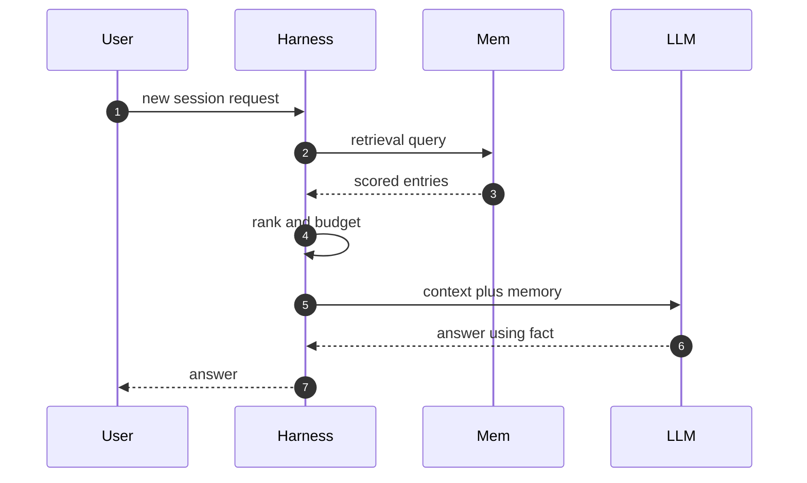
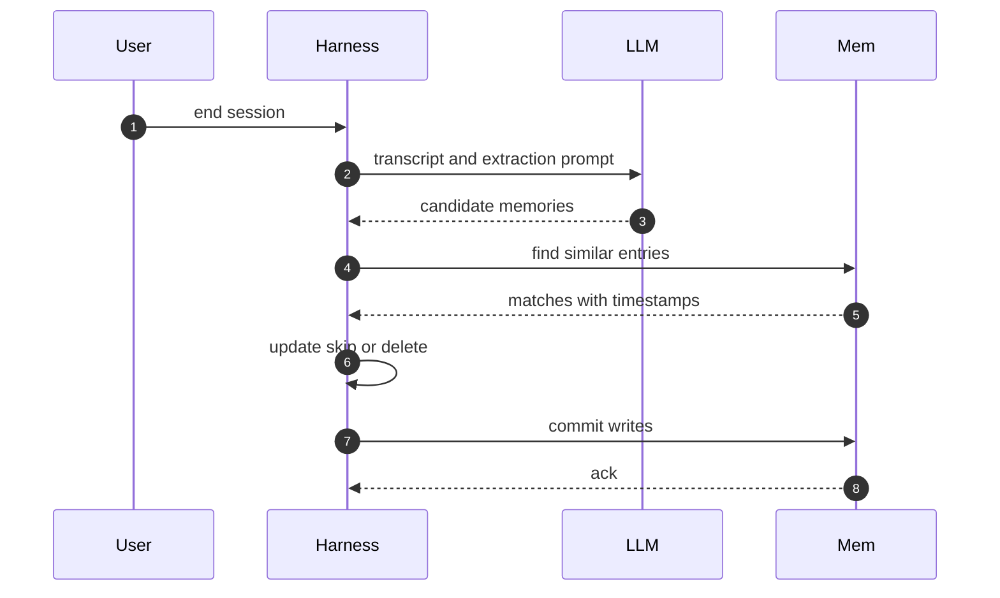

# Chapter 5 — Memory & State

## Why this chapter

The model is stateless: every API call starts from the context alone.
So "the agent remembers" always means the harness stored something and later re-injected it.
This chapter zooms into steps 2 and 9 of Trace 2 — recall at context assembly, and the memory write at post-processing.
The mental model: memory is a read at turn start and a write at session end; everything in between is session state.
Engineers who hold that model can debug every "it forgot" and "it remembers wrong" report.
Level emphasis: [L2]; no (L3) sections in this chapter.

## Concepts

**Short-term vs long-term memory.** Short-term memory is what the harness holds for the current session: the context window plus session state.
It dies when the session ends.
Long-term memory is anything the harness persists and can re-inject into a later session.
The model itself holds neither (Trace 1).

**Session state.** Session state is the harness-side record of the run: the transcript, tool results, the current plan, and scratch data.
It is complete and session-scoped.
Memory is the opposite: distilled and cross-session.
Confusing the two produces stores full of transcripts nobody can recall from.

**Files as memory.** The simplest long-term store is a file.
The harness prepends an instruction file (project conventions, environment facts) at session start, and the agent edits it with ordinary file tools.
Files are inspectable, diffable, and versioned, and the read and write paths are plain tool calls.
The limit: a file is all-or-nothing injection with no relevance ranking, so it must stay small.

**Recall.** At context assembly (Trace 2, step 2), the harness queries the memory store and injects matching entries into the system segment.
Two signals rank candidates: relevance (does the entry bear on this request) and recency (is it still likely true).
Relevance selects; recency orders versions of the same fact and flags stale ones.
Trace 12 walks this read.

**Memory write and consolidation.** At post-processing (Trace 2, step 9), the harness extracts candidate memories from the transcript, then consolidates.
Consolidation compares each candidate against existing entries and picks one of three moves: update the entry, skip the duplicate, or delete the obsolete one.
A write path without consolidation grows a store that contradicts itself.
Trace 13 walks this write.

**Persist vs recompute.** Persist facts that are stable and expensive to rediscover: environment quirks, user preferences, decisions and their reasons.
Recompute anything cheap to derive or quick to change: file contents, test results, branch state.
Stale memory misleads with confidence, so data that is wrong-when-stale defaults to recompute.

**State stores across runtimes.** Framework runtimes converge on one pattern: a state store keyed by a session or thread identifier.
The runtime saves state at defined points and reloads it on resume.
That turns crash recovery and multi-day tasks into a data problem, not a code problem.

### In other stacks

- **OpenAI Agents SDK:** sessions store conversation history across runs, so short-term memory can survive a process boundary.
- **OpenAI Agents SDK:** the loop still starts stateless per run; what a session replays is transcript, not distilled memory.
- **LangGraph:** checkpointers persist graph state at every superstep; a `thread_id` in the invocation config resumes prior state.
- **LangGraph:** persistence is a graph feature, not a chat feature — session state is the graph state (Lab 7 exercises this).
- **Both stacks:** extraction, consolidation, and long-term recall (Traces 12 and 13) remain yours to build.

## Traces

### Trace 12: What happens when an agent recalls a fact from memory

You open a fresh session and ask the agent to deploy; a session last month learned the staging URL.

1. **User** sends a request in a fresh session.
2. **Harness** begins context assembly (Trace 2, step 2) with an empty transcript.
3. **Harness** derives a retrieval query from the request and the user or project identity.
4. **Mem** searches stored entries and returns candidates with scores and timestamps.
5. **Harness** ranks candidates: relevance selects, recency breaks ties and flags stale entries.
6. **Harness** applies a token budget and drops candidates below the cut.
7. **Harness** injects the survivors into the system segment, labeled as recalled memory.
   - The label matters: the model should read a memory as the harness's claim, not as the user's words.
8. **LLM** generates, reading memory exactly like any other context.
9. **User** sees an answer that uses the stored fact without re-asking.

*Figure 5.1 — recall is a read at assembly time: the model sees a memory only because the harness injected it.*

**Where this can fail**

- **Symptom:** the agent states a fact that stopped being true. **Cause:** recency never invalidates; old entries rank on relevance alone. **Where to look:** the recalled entries' timestamps in the store.
- **Symptom:** a stored fact is never used. **Cause:** the retrieval query misses it, or the token budget cut it. **Where to look:** the retrieval scores and the assembled system segment in the transcript.
- **Symptom:** turn-one context grows every week. **Cause:** no injection budget; recall returns more as the store grows. **Where to look:** the token counts of the first turn across sessions.
- **Symptom:** the model cites a "memory" nobody wrote. **Cause:** hallucination, or unlabeled injection the model rephrased. **Where to look:** diff the system segment against the store's entries.

### Trace 13: What happens when a session ends and memory is written

The Trace 2 session ends; the harness runs post-processing (step 9) before closing.

1. **User** ends the session, or a stop condition fires.
2. **Harness** starts post-processing with the full transcript in hand.
3. **Harness** sends the transcript to the LLM with an extraction prompt.
4. **LLM** returns candidate memories: facts, preferences, and corrections.
5. **Harness** filters candidates for durability; session-local detail is dropped.
6. **Harness** queries Mem for existing entries similar to each survivor.
7. **Mem** returns matches with timestamps and provenance.
8. **Harness** resolves each conflict: update the entry, skip the duplicate, or delete the obsolete one.
   - A contradiction is an update, not a second entry — two versions of one fact poison later recall.
9. **Mem** commits the writes with timestamps and provenance.
10. **Harness** records telemetry and closes the session.

*Figure 5.2 — consolidation runs before commit: every candidate is checked against what the store already holds.*

**Where this can fail**

- **Symptom:** the store grows without bound and fills with near-duplicates. **Cause:** no similarity check before commit. **Where to look:** entry counts and overlap in the store over time.
- **Symptom:** two contradictory facts both get recalled later. **Cause:** a contradiction was stored as a new entry instead of an update. **Where to look:** the matching entries and their timestamps.
- **Symptom:** session-local junk persists, like "the test failed today". **Cause:** the extraction prompt has no durability filter. **Where to look:** the candidate list versus the committed entries.
- **Symptom:** a secret appears in memory. **Cause:** extraction copied tool output verbatim into an entry. **Where to look:** entry contents and their provenance.
- **Symptom:** a crashed session loses everything it learned. **Cause:** memory writes happen only at a clean session end. **Where to look:** whether the write step appears in telemetry for the crashed run.

> **Lab 7 — Stateful graph agent with checkpointing.** `labs/lab07-graph-checkpointing/` · [L2] · ~60 min · offline.
> You build a LangGraph agent whose state survives process restarts; the tests kill and resume it.

## Questions

### Tier 1 — Explain

**Q 5.1 — What is the difference between short-term and long-term memory in an agent?**

**Answer.** Short-term memory is the context window plus session state; it dies with the session.
Long-term memory is whatever the harness persists and re-injects into later sessions.
The model holds neither: every call starts from the context the harness assembled.
The boundary is the session end: anything that must survive it needs an explicit write (Trace 13).
Each layer also fails differently: short-term overflows, long-term goes stale.

*Strong answers also mention:* session state is complete and session-scoped; memory is distilled and cross-session.

**Q 5.2 — Why is memory a harness feature and not a model feature?**

**Answer.** The API is stateless per call; the model cannot write anything that outlives its response.
Persistence needs storage, and the harness owns everything stateful (Chapter 1).
The harness also owns the two moments memory happens: assembly at step 2 and post-processing at step 9.
"The agent remembered" always decodes to: the harness wrote at step 9 and re-injected at step 2.
So memory bugs are harness bugs: you debug the store and the injection, not the model.

*Strong answers also mention:* provider-hosted "built-in memory" is still a harness — one the provider runs for you.

**Q 5.3 — What does "files as memory" mean, and why is it so common?**

**Answer.** The harness loads an instruction file into context at session start, and the agent edits it with normal file tools.
Files are inspectable, diffable, and versioned, and they need no extra infrastructure.
The read and write paths are ordinary tool calls, so no new mechanism can fail.
The cost: injection is all-or-nothing with no ranking, so the file must stay small.
Coding-agent harnesses ship this pattern as project instruction files loaded at session start (Chapter 7).

*Strong answers also mention:* file memory shares the repo's review process — memory changes appear in diffs.

### Tier 2 — Reason

**Q 5.4 — During recall, when does relevance win and when does recency win?**

**Answer.** Relevance decides what enters the shortlist; recency orders and invalidates within it.
A highly relevant entry from last year beats an irrelevant one from yesterday.
But between two versions of the same fact, the newer wins and should supersede the older.
Trace 12, step 5 shows the split: relevance builds the shortlist, recency judges inside it.
Recency as the primary rank turns memory into an echo of the last session.

*Strong answers also mention:* timestamps are an invalidation signal, not just a sort key; some entry classes deserve a TTL.

**Q 5.5 — How do you decide what to persist versus what to recompute?**

**Answer.** Persist what is stable and expensive to rediscover: environment quirks, preferences, decisions with their reasons.
Recompute what is cheap to derive or quick to change: file contents, test results, branch state.
The tiebreaker is the cost of staleness: stale memory misleads with confidence, while recomputing only costs a tool call.
Every persisted fact also needs a consolidation path (Trace 13); a recomputed fact needs none.
When in doubt, recompute.

*Strong answers also mention:* persisting the pointer ("tests live under tests/") instead of the volatile value.

**Q 5.6 — Why consolidate memory at session end instead of writing every turn?**

**Answer.** Session end gives the write hindsight: a fact falsified mid-session never persists.
One pass can also dedupe and resolve conflicts as a batch (Trace 13, steps 6–8).
Per-turn writes commit unverified facts and multiply conflicts.
Extraction also reads better with the full arc: the fix that closed the session outweighs its dead ends.
The trade-off is crash loss, so long sessions add periodic state checkpoints — a separate mechanism from memory.

*Strong answers also mention:* checkpointing saves complete session state for resume; memory writes save distilled facts for reuse.

### Tier 3 — Design & Debug

**Q 5.7 — After an API migration, the agent keeps calling the old endpoint in every new session. Walk your diagnosis.**

**Answer.** Read the first turn's assembled context: is the old endpoint injected from memory?
If yes, inspect the store: expect either two conflicting entries or one stale one that no session ever superseded.
Two entries points at the write path — the contradiction was stored as new instead of an update (Trace 13, step 8).
One stale entry points at extraction — no session judged the migration durable enough to write.
Fix the entry, then verify the next session's turn-one context, not just the store.

*Strong answers also mention:* the durable fix is a conflict policy plus a recall eval that replays known-superseded facts.

**Q 5.8 — Design the memory write policy for a coding agent shared by a whole team.**

**Answer.** Split stores by scope: personal preferences per user, project facts shared, org policy read-only.
Give every entry provenance (session, evidence), a timestamp, and a class that sets its TTL.
Route shared-store writes through a gate: a human or reviewer approves before commit.
Resolve contradictions by update; make deletes soft so history survives.
At recall, budget tokens per scope so no store crowds out the others.

*Strong answers also mention:* shared memory is an injection surface — one poisoned entry reaches every teammate's context (Chapter 11).

## Common mistakes & red flags

- **"The agent remembers our last conversation."** Only if the harness wrote at session end and re-injected at assembly; verify both halves (Traces 12 and 13).
- **"Store everything — storage is cheap."** Recall is the expensive side: more entries mean worse ranking, staler facts, and fatter first turns (Trace 12).
- **"Rank memories by recency."** Relevance selects; recency orders versions and invalidates. Recency-first replays the last session at everyone (Trace 12, step 5).
- **"Just append the new fact."** A contradiction stored as a new entry means both versions get recalled later; consolidation must update or delete (Trace 13, step 8).
- **"We persist the transcript as memory."** That is session state, not memory; without extraction and consolidation, recall drowns in it (Trace 13).
- **"Memory needs a vector database."** Files and key-value stores carry most production memory; a retrieval index earns its place at corpus scale (Chapter 6).
