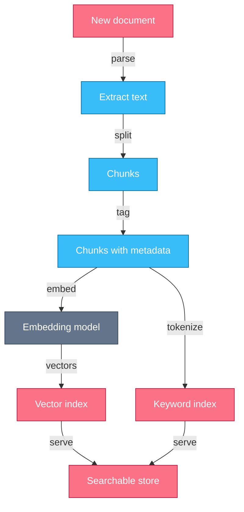
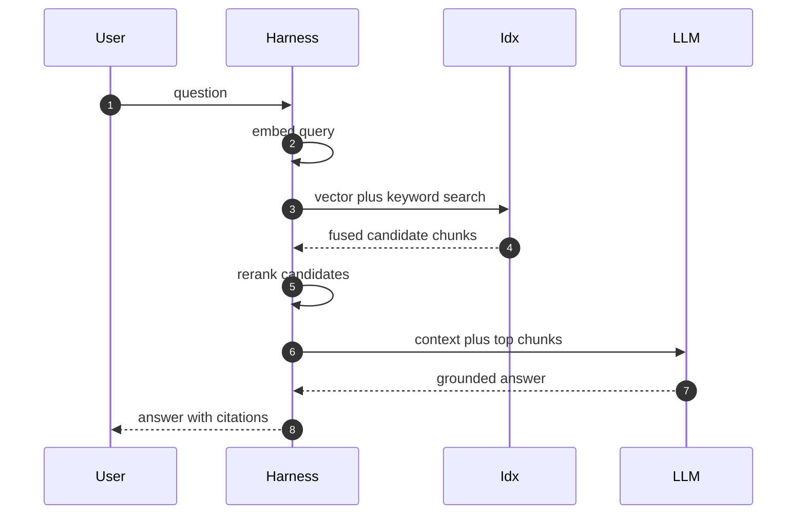
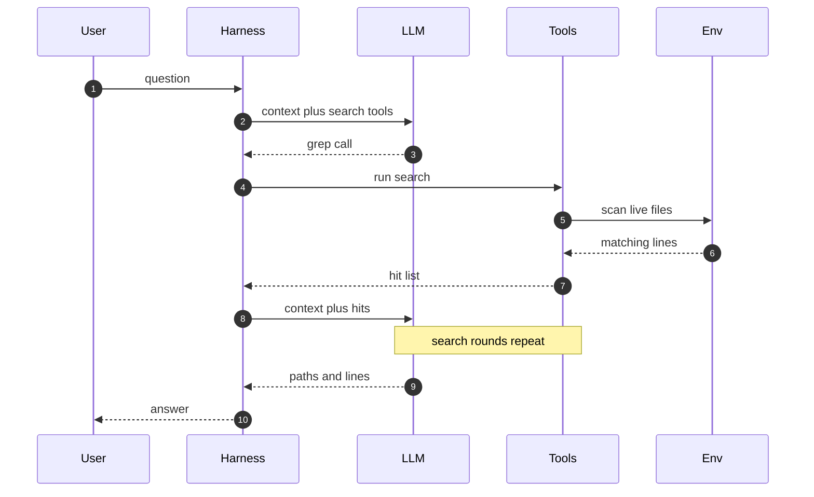

# Chapter 6 — Retrieval & RAG

## Why this chapter

An agent's knowledge is whatever the harness puts in the context window this turn.
Retrieval is how knowledge that lives outside the window gets in.
This chapter zooms into steps 2 and 5 of Trace 2:
retrieved context enters assembly, and search tools execute.
The mental model: retrieval is a supply chain — every ingest choice (chunking, embedding, indexing) sets a cost you pay at query time.
Engineers who can trace a wrong answer back to the exact failed stage fix retrieval; everyone else re-tunes prompts.
Level emphasis: [L1]–[L2]; no (L3) sections in this chapter.

## Concepts

**Retrieval.** Retrieval is fetching relevant external content into the context window at the moment it is needed.
It exists because corpora are larger than context windows, and because tokens cost money and attention.

**RAG.** Retrieval-augmented generation (RAG) is the pattern where the harness searches an index, injects the top results into the context, and the model generates from them.
The model never queries the index; the harness does, before or between model calls.
This is step 2 of Trace 2: retrieved chunks are part of context assembly.

**The ingest pipeline.** Before anything is searchable, an offline pipeline runs: extract, chunk, embed, index.
Each choice here is cheap now and expensive later.

- *Chunking* splits documents into pieces small enough to embed and inject.
  Small chunks match queries precisely but lose surrounding meaning.
  Large chunks keep meaning but blur the embedding and eat the token budget at injection time.
  A split that cuts a thought in half makes both halves unfindable.
- *Embedding* maps each chunk to a vector so similar meanings land near each other.
  The embedding model becomes part of the index: queries must use the same model, so changing it forces a full reindex.
- *Indexing* stores vectors in a structure built for approximate nearest-neighbor search, alongside the chunk text and metadata.
  Metadata (source, section, timestamp) is what makes filtering and citations possible later.
  Skip it at ingest and no query-time cleverness gets it back.

Ingest is not a one-time build.
Documents change, so the pipeline needs re-ingest triggers and deletes, or the index quietly serves stale truth.

**Query-time RAG.** At query time the harness runs four steps: embed the query, search the index, rerank the candidates, inject the winners.
Search is tuned for recall: return a broad candidate set fast.
Reranking is tuned for precision: a stronger scorer (a cross-encoder or an LLM) reorders the candidates against the actual query.
Injection then takes the top few, with source labels, into the context.
The model only ever sees what survives all four steps.

**Hybrid search.** Vector search matches meaning; it is weak on exact strings such as error codes, SKUs, and function names, because embeddings blur rare tokens.
Keyword search (BM25, a lexical ranking function over exact terms) is the mirror image: strong on identifiers, blind to paraphrase.
Hybrid search runs both and fuses the ranked lists, often with reciprocal rank fusion.
Production systems default to hybrid because real query mixes contain both kinds.

**Agentic search.** The alternative to a pre-built index is giving the model search tools and letting it drive.
The model emits grep, list, and read calls; reads the results; and issues sharper queries each round.
This is step 5 of Trace 2: search tools executing inside the loop.
It needs no ingest pipeline, always reads live data, and adapts the query mid-search.
It pays for that with turns: every round is a full model call, so latency and token cost scale with search depth.
Coding agents lean agentic because code is already greppable and changes constantly.

**When long context beats retrieval.** If the whole corpus fits in the context window with room to work, the simplest retrieval is none: put it all in.
The model then sees every passage, so recall failures disappear.
Prompt caching makes this affordable when the same corpus is queried repeatedly, because the cached prefix reprices to a fraction of input cost (Chapter 2).
Retrieval earns its complexity when the corpus outgrows the window, when only slivers are relevant per query, or when per-turn token cost dominates.

| Approach | Freshness | Cost per query | Best when |
|---|---|---|---|
| One-shot RAG | as fresh as the index | low, one model call | large corpus, known query shape |
| Agentic search | live | high, many turns | greppable data, exploratory questions |
| Long context | as fresh as the prompt | high without caching | corpus fits, repeated queries |

**Retrieval quality.** The core metric intuition is recall@k: of the chunks that should have been found for a query, how many appear in the top k?
Low recall@k means the answer never reaches the model, and no prompt fixes that.
Its partner is precision: how much of what you inject is actually relevant, because irrelevant chunks dilute attention.
Measuring these properly — building gold query sets, grading retrievals, tracking drift — is eval methodology, and that belongs to Chapter 10.
Here, hold the intuition: when a RAG answer is wrong, first ask whether the right chunk was even in the top k.

### In other stacks

- **LangChain:** retrieval hides behind a common retriever interface; any vector store exposes `as_retriever()`, and chains inject the returned documents as context.
- **LangGraph:** retrieval is an explicit graph node; agentic-RAG patterns (grade the results, rewrite the query, re-retrieve) are wired as conditional edges you own.
- **OpenAI Agents SDK:** file search is a hosted tool backed by provider-managed vector stores; chunking and embedding happen server-side, trading control for zero pipeline ops.
- **Framework-neutral:** many stacks expose an index through a plain search tool, so the model-facing surface is identical to agentic search — only the backend differs.

## Traces

### Trace 14: What happens when a document becomes searchable

You add a product manual to the agent's knowledge base.

1. **User** adds the manual to the knowledge source.
2. **Harness** extracts plain text plus structure: title, headings, timestamps.
3. **Harness** splits the text into chunks along semantic boundaries.
   - Chunk size is the precision-versus-meaning trade described in Concepts; it is fixed here, at ingest.
4. **Harness** attaches metadata to every chunk: source ID, section, position.
5. **Harness** sends each chunk to the embedding model and receives a vector per chunk.
6. **Idx** stores each vector next to its chunk text and metadata.
7. **Idx** updates the keyword index over the same chunks for hybrid search.
8. **Idx** commits; the manual is now searchable by meaning and by exact term.

*Figure 6.1 — every downstream search quality is decided here: chunk boundaries, embedding model, and metadata are fixed at ingest.*

**Where this can fail**

- **Symptom:** a passage you can see in the document never comes back in search. **Cause:** the chunker split it mid-thought, so neither half matches the query. **Where to look:** the stored chunk text around that passage.
- **Symptom:** search finds the right document but cites the wrong section. **Cause:** headings and structure were lost at extraction, so chunks carry no section metadata. **Where to look:** the metadata fields on the returned chunks.
- **Symptom:** results degrade sharply after an upgrade. **Cause:** queries embed with a new model while the corpus keeps old vectors. **Where to look:** the embedding model recorded in the index build versus the query path.
- **Symptom:** last week's edits never appear in answers. **Cause:** no re-ingest trigger; the index serves the old version. **Where to look:** index commit timestamps versus source timestamps.

### Trace 15: What happens when a RAG query runs

The user asks the agent a question the product manual answers.

1. **User** sends the question.
2. **Harness** embeds the query using the same embedding model as ingest.
3. **Harness** sends the query vector and the query text to the index.
4. **Idx** runs vector and keyword search and returns a fused candidate list.
5. **Harness** reranks the candidates with a stronger scorer against the query.
6. **Harness** injects the top chunks into the context, each with a source label.
7. **LLM** generates an answer grounded in the injected chunks.
8. **Harness** returns the answer with citations built from chunk metadata.

*Figure 6.2 — the model appears once, at the end; every retrieval decision is the harness's, made before the model sees anything.*

**Where this can fail**

- **Symptom:** confident answer, wrong facts. **Cause:** retrieval missed and the model answered from its weights. **Where to look:** the injected chunks in the transcript — is the needed fact there at all?
- **Symptom:** the right chunk was retrieved but the answer ignores it. **Cause:** it ranked low and sat buried under weaker chunks at injection. **Where to look:** chunk order and count in the assembled context.
- **Symptom:** queries with exact identifiers fail while paraphrase queries work. **Cause:** the keyword leg is missing or ignored in fusion; embeddings blur rare tokens. **Where to look:** the candidate list before rerank.
- **Symptom:** answer latency spikes under load. **Cause:** the reranker scores hundreds of candidates per query. **Where to look:** the trace spans for the rerank step.

### Trace 16: What happens when the agent searches instead

You ask a coding agent where the retry logic lives; there is no index, only search tools.

1. **User** asks where the retry logic lives.
2. **Harness** assembles context with search tools defined: grep, list, read.
3. **LLM** emits a grep call for a likely term.
4. **Tools** run the search against the live files in the environment.
5. **Harness** appends the hit list to the context.
6. **LLM** reads the hits and emits a read call for the strongest match.
7. **Tools** return the file contents; the harness appends them.
8. **LLM** repeats steps 3–7, sharpening each query with what it just read.
   - This is the contrast with Trace 15: the model steers the search, one full turn per round.
9. **LLM** answers with file paths and line references.
10. **Harness** returns the answer.

*Figure 6.3 — each search round is a full model turn: adaptive and always fresh, paid for in latency and tokens.*

**Where this can fail**

- **Symptom:** correct answer, but slow and expensive. **Cause:** broad first queries; every round is a full model call. **Where to look:** the transcript turn count and per-turn token totals.
- **Symptom:** the agent loses the goal mid-search. **Cause:** one grep returned thousands of lines and flooded the context. **Where to look:** tool result sizes per turn.
- **Symptom:** the agent concludes the code does not exist. **Cause:** query drift — it searched literal strings for a concept the code names differently. **Where to look:** the sequence of search strings across turns.
- **Symptom:** the right file was read but the answer misses the point. **Cause:** the read was windowed and the relevant lines fell outside it. **Where to look:** the offset and limit on the read call.

## Questions

### Tier 1 — Explain

**Q 6.1 — Name the stages of the ingest pipeline and what each one fixes for later.**

**Answer.** Extract, chunk, embed, index.
Extraction fixes what text and structure exist at all; lost headings never return.
Chunking fixes retrieval granularity: what a "hit" can be.
Embedding fixes the similarity space and locks the model choice into the index.
Indexing fixes what you can filter and cite, via the metadata stored with each chunk.
Every query-time behavior is downstream of these choices.

*Strong answers also mention:* ingest is an operated pipeline with re-ingest and deletes, not a one-time build.

**Q 6.2 — Walk the four query-time steps of RAG.**

**Answer.** Embed the query with the same model used at ingest.
Search the index for a broad candidate set — this step is tuned for recall.
Rerank the candidates with a stronger scorer — this step is tuned for precision.
Inject the top chunks into the context with source labels; the model generates from them.
The model sees only what survives all four steps; it never touches the index.

*Strong answers also mention:* the recall-then-precision split exists because the precise scorer is too slow to run over the whole corpus.

**Q 6.3 — Why do vector-only systems miss exact identifiers, and what is the fix?**

**Answer.** Embeddings compress meaning; rare tokens like error codes and SKUs carry little shared meaning, so they blur.
Two different codes can land near each other in vector space.
Keyword search (BM25) matches exact terms and has the opposite blind spot: paraphrase.
The fix is hybrid search: run both, fuse the ranked lists, and serve the fused set to the reranker.

*Strong answers also mention:* reciprocal rank fusion as a common fusion method, and that real query mixes always contain both kinds.

### Tier 2 — Reason

**Q 6.4 — Why does changing the embedding model force a full reindex?**

**Answer.** Similarity search compares the query vector to stored vectors in one shared space.
Different embedding models define different spaces; distances across them are meaningless.
A query embedded with the new model scored against old vectors returns noise, often silently.
So the corpus must be re-embedded and re-indexed before the query path switches.

*Strong answers also mention:* running old and new indexes side by side during migration, and comparing recall on the same query set (Chapter 10).

**Q 6.5 — When does agentic search beat one-shot RAG, and what does it cost?**

**Answer.** When the data is already searchable in place, changes faster than you can re-ingest, or the question needs iterative narrowing.
A coding agent grepping a live repo needs no pipeline and never reads stale chunks.
It can also recover from a bad first query; one-shot RAG cannot.
The cost is turns: each search round is a full model call, so latency and tokens scale with depth.
One-shot RAG amortizes its cost into the ingest pipeline; agentic search pays at query time.

*Strong answers also mention:* the hybrid pattern — RAG for the first broad pass, agentic tools to verify and refine.

**Q 6.6 — When does long context beat retrieval entirely?**

**Answer.** When the corpus fits in the window with room to work, and the query pattern reuses it.
Putting everything in removes recall failures: the model sees every passage.
Prompt caching makes repeated queries over the same corpus affordable, since the cached prefix reprices far below input cost.
Retrieval wins back when the corpus outgrows the window, when relevance per query is sparse, or when latency budgets rule out huge prompts.

*Strong answers also mention:* long context still has attention limits — being in the window is necessary, not sufficient (Chapter 3).

### Tier 3 — Design & Debug

**Q 6.7 — Users report the RAG assistant answers confidently but wrongly about a policy updated last week. Walk your diagnosis.**

**Answer.** Read one failing transcript before touching anything.
Check the injected chunks first: is the updated policy text in the context at all?
If the old text is there, the index is stale — check ingest triggers and index timestamps against the source (Trace 14 failure modes).
If no relevant chunk is there, it is a recall miss — run the query against the index by hand and inspect the top k.
If the right chunk is present but ignored, check its injected rank and what sits above it.
Each branch has a different fix: re-ingest, chunking or hybrid tuning, or rerank and injection order.

*Strong answers also mention:* adding the failing query to a gold set so the fix is measured, not asserted (Chapter 10).

**Q 6.8 — Design retrieval for an agent over a large internal wiki that serves both exact lookups and broad questions.**

**Answer.** The corpus outgrows the window, so retrieval is required; the query mix decides the shape.
Ingest: chunk on heading boundaries, keep section and timestamp metadata, and wire re-ingest to wiki edits.
Query time: hybrid search — the keyword leg carries exact lookups, the vector leg carries broad questions — then a reranker over the fused set.
Give the agent a search tool over the same index, so it can re-query when the first injection is not enough.
Define recall@k on a gold query set drawn from both query types before tuning anything.

*Strong answers also mention:* citations from chunk metadata so users can verify, and monitoring index freshness as an operational metric.

## Common mistakes & red flags

- **"We added RAG, so hallucinations are solved."** Retrieval misses, and the model then answers from its weights, fluently. Grounding must be verified per answer, not assumed.
- **"Bigger chunks give the model more context."** They blur the embedding and dilute injection. The chunk is the unit of finding; keep it findable and let metadata carry the surroundings.
- **"Vector search understands the query, keywords are legacy."** Embeddings blur exact identifiers. Hybrid is the production default, not a fallback.
- **"We tested retrieval by trying a few queries."** That measures nothing. Recall needs a gold query set and a harness — Chapter 10 owns the method.
- **"The index is built; retrieval is done."** Ingest is an operated pipeline. Without re-ingest and deletes, the index drifts from the truth silently.
- **"Reranking is optional polish."** Injection order and cutoff decide what the model sees. A right answer at rank 40 is a wrong answer.
- **"Always retrieve — context is expensive."** If the corpus fits and queries repeat, long context plus caching is simpler and misses nothing.
