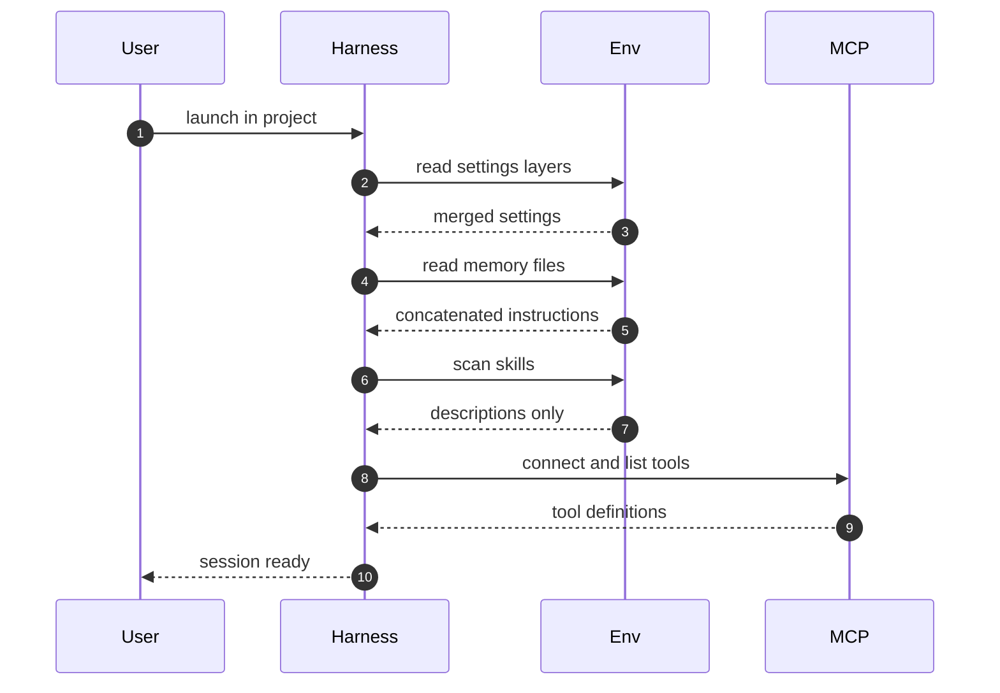
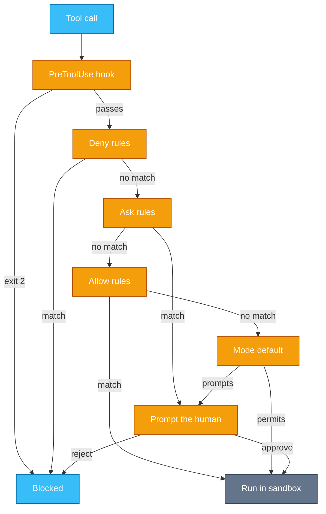
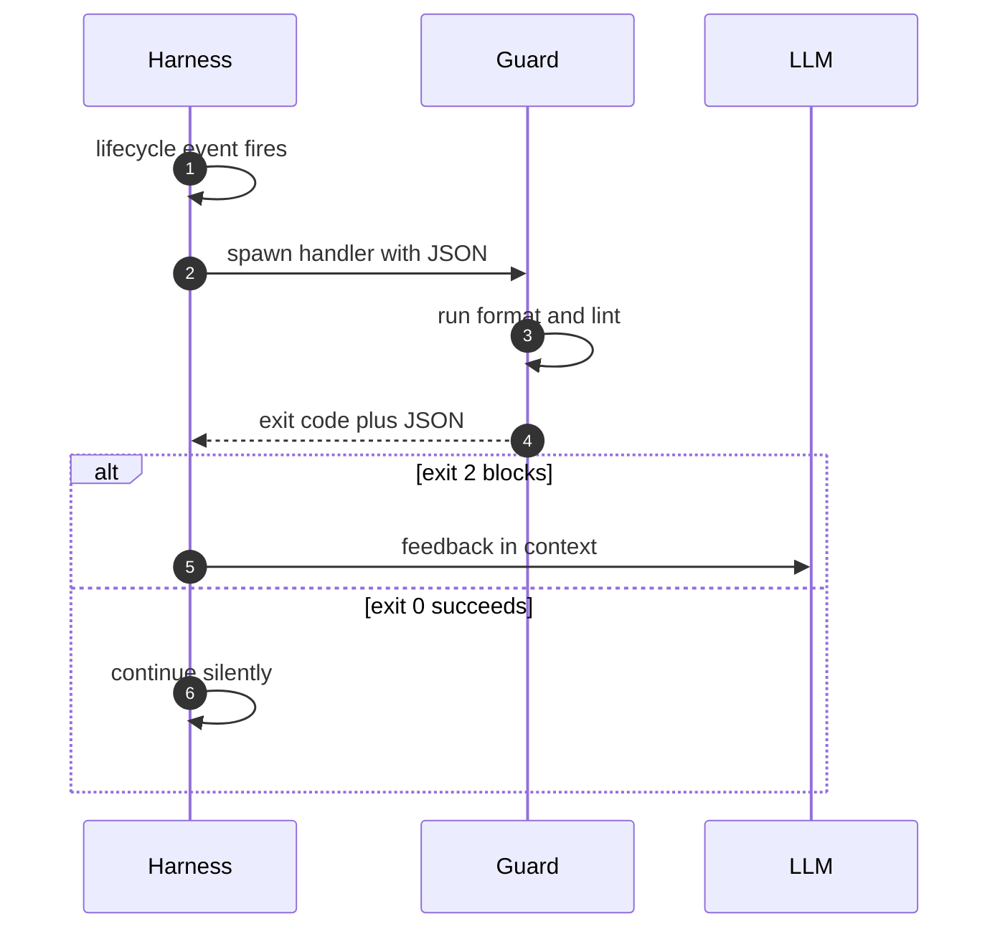
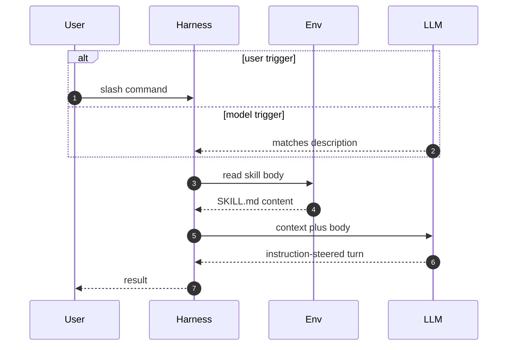

# Chapter 7 — Inside a Coding-Agent Harness

## Why this chapter

A coding agent's behavior is mostly decided before the model generates a single token.
Settings, instruction files, permission rules, hooks, and skills shape every turn,
and the engineer who knows where each lives can change agent behavior without touching a prompt.
This chapter zooms into steps 1, 4, and 9 of Trace 2:
what the harness builds at session start, how it gates a tool call, and what it fires after one.
The mental model: the harness is a policy engine wrapped around the loop —
configuration in, gated actions out.
Claude Code is the worked example throughout; the mechanisms are general.
Level emphasis: [L1]–[L2]; no (L3) sections in this chapter.

## Concepts

### The session startup surface

Two kinds of files configure a coding agent, and they merge differently.
**Settings** (machine-readable policy: permissions, hooks, environment) resolve by *precedence*:
a higher layer overrides a lower one, key by key.
In Claude Code the order is
managed policy → CLI arguments → `.claude/settings.local.json` → `.claude/settings.json` → `~/.claude/settings.json`.
The pattern generalizes: org policy beats invocation, invocation beats project, project beats user.

**Instruction files** (natural-language memory the model reads) *concatenate* — they never override-replace.
Claude Code loads CLAUDE.md files broadest-first:
managed → user `~/.claude/CLAUDE.md` → project `./CLAUDE.md` → `./CLAUDE.local.md`.
All of them enter the context together;
a project file cannot delete a user instruction, only add to it.
`@path` imports pull in other files, up to a depth of 4.
Subdirectory CLAUDE.md files load on demand, when the agent works in that directory.

The distinction matters for debugging.
A wrong permission means a settings layer you forgot;
a contradictory behavior means two instruction files that both apply.
Trace 17 walks the full startup sequence.

### The permission model

The harness decides which tool calls run.
The decision has three inputs, evaluated in a fixed order.

**Rules** name a tool, or a tool with a specifier, such as `Bash(rm *)`.
They live in three lists: `deny`, `ask`, and `allow`.
Evaluation is deny → ask → allow: first match wins, and specificity is irrelevant.
A broad deny beats a precise allow, because deny is checked first.

**Modes** supply the default when no rule matches.
Claude Code ships six:
`default` (reads run, everything else asks), `acceptEdits` (file edits auto-approve),
`plan` (read-only planning), `auto` (a classifier gates each call),
`dontAsk` (unmatched calls are auto-denied rather than prompted), and `bypassPermissions` (everything not denied runs).
Deny and explicit ask rules apply in every mode, including `bypassPermissions`.
A mode is a stance for the session; rules are policy that outlives it.

**Hooks** sit *before* rule evaluation.
A PreToolUse hook that exits 2 blocks the call even when an allow rule matches.
A hook that answers "allow" cannot override a deny or ask rule.
So the full order is: hook, then deny, then ask, then allow, then mode default.
Trace 18 walks a dangerous call through all five.

### Hooks: the extension seam

A hook is a handler — a shell command, HTTP call, or MCP tool —
bound to a lifecycle event in settings, with a matcher that filters which occurrences fire it.
Claude Code exposes around thirty events;
the core set to know is
`SessionStart`, `UserPromptSubmit`, `PreToolUse`, `PostToolUse`, `Stop`, `SubagentStop`, `PreCompact`, and `SessionEnd`.
Learn the shape, not the list: something is about to happen, or just happened, and your process gets a say.

The handler's exit code carries the decision.
Exit 0 means success;
stdout enters the context only for prompt and session events.
Exit 2 means block: the action stops, and this wins over everything, including allow rules.
A handler can also return JSON —
`permissionDecision: allow|deny|escalate` on PreToolUse, or `continue: false` to end the turn.
Hooks are deterministic code at the seams of a stochastic loop:
formatters after edits, audits before commands, notifications on stop.
Trace 19 walks one firing.

### Skills and slash commands

A skill is an instruction file the harness loads on demand.
In Claude Code it is `<dir>/skills/<name>/SKILL.md` with YAML frontmatter:
`name`, `description`, `when_to_use`, optional `allowed-tools`, and more.
Discovery is layered like everything else: enterprise, then personal `~/.claude/skills`, then project `.claude/skills`.

The key mechanism is **progressive disclosure**.
Only each skill's name and description sit in context at all times.
The body loads when the skill is invoked — by the user typing a slash command,
or by the model matching the task against a description —
and then persists for the rest of the session.
Sidecar files load later still, only when the instructions call for them.
This keeps hundreds of skills affordable: you pay a sentence each until one is used.

Slash commands (`.claude/commands/<name>.md`) are unified with skills.
`$ARGUMENTS` and `$N` placeholders substitute what the user typed,
and a `` !`cmd` `` line injects shell output into the loaded body.
Trace 20 walks an invocation.

### Sandbox boundaries

Permission gating controls *which* calls run.
It cannot control what a running process does:
an approved script can still read any file the OS lets it read.
That second boundary belongs to the operating system —
containers, restricted filesystems, network egress rules, or a dedicated sandbox around the shell.

Treat the two layers as answering different questions.
The harness gate answers "should this intent proceed?" and can ask a human.
The OS sandbox answers "what can this process touch?" and asks nobody.
A safe setup layers both:
rules and hooks catch bad intent cheaply,
and the sandbox bounds the blast radius when intent-level checks miss.
Chapter 11 builds on this split for adversarial inputs, where the model itself may be steered.

### In other stacks

- **Claude Agent SDK:** Claude Code's loop as an in-process library — the same context management, hooks, subagents, MCP, permissions, and skills, embeddable in your own service.
- **OpenAI Agents SDK:** no full coding harness ships; guardrails (input/output validation) cover part of the gate role that rules and PreToolUse hooks play here.
- **LangGraph:** no harness either; you wire gates and lifecycle logic yourself as graph nodes and conditional edges around the tool-executing node.
- **LangGraph:** session startup is graph re-entry — a checkpointer plus `thread_id` restores state, where a harness re-reads settings and memory files.

## Traces

### Trace 17: What happens when a coding-agent session starts

You run the agent CLI in a project directory; before you type anything, the harness builds its world.

1. **User** launches the harness in the project directory.
2. **Harness** resolves settings by precedence: managed policy, CLI arguments, local project settings, project settings, user settings.
   - Each key takes its value from the highest layer that sets it.
3. **Harness** reads instruction files broadest-first and concatenates them: managed, user, project, then local.
   - `@path` imports resolve to a maximum depth of 4; subdirectory files wait until needed.
4. **Harness** scans the skill directories and loads only each skill's name and description into context.
5. **Harness** connects the configured MCP servers and lists their tools (Trace 11).
   - A project-scope `.mcp.json` requires interactive approval before its servers run.
6. **Harness** fires the `SessionStart` hooks; their stdout can enter the context.
7. **Harness** assembles the system prompt: base instructions, concatenated memory, tool definitions, skill descriptions.
8. **User** sends the first message, and Trace 2 begins on top of all this.

*Figure 7.1 — everything the model will "know" at turn one is gathered here, before any request.*

**Where this can fail**

- **Symptom:** a permission works on your machine and not a teammate's. **Cause:** the rule lives in `settings.local.json` or user settings, not the committed project file. **Where to look:** each settings layer, highest precedence first.
- **Symptom:** the agent follows an instruction nobody remembers writing. **Cause:** memory files concatenate; a user-level or imported file still applies. **Where to look:** every CLAUDE.md on the path, plus its imports.
- **Symptom:** MCP tools are missing from the session. **Cause:** the project `.mcp.json` was never interactively approved, or a same-named server at another scope shadows it. **Where to look:** the MCP config scopes and the approval state.
- **Symptom:** slow session start. **Cause:** many MCP servers connecting, or deep import chains. **Where to look:** startup timing per server and the import tree.

### Trace 18: What happens when the harness gates a dangerous action

The model proposes `rm -rf` on a build directory; the harness decides whether it runs.

1. **LLM** emits a tool call: a shell command that deletes files.
2. **Harness** runs any matching PreToolUse hook first, before any rule.
   - A hook exit 2 blocks the call here, even if an allow rule would match later.
3. **Guard** (the hook) permits the call to continue to rule evaluation.
4. **Harness** checks the deny list; a match blocks the call outright.
5. **Harness** checks the ask list; a match forces a human prompt.
6. **Harness** checks the allow list; a match lets the call run.
7. **Harness** falls back to the permission mode's default when no rule matches — in `default` mode, a write prompts.
8. **User** approves or rejects the prompted call.
9. **Harness** executes the approved call inside the sandbox, which bounds what the process can touch.
10. **Harness** appends the result — or the denial text — to the context, so the model knows what happened.

*Figure 7.2 — the gate order: hook, deny, ask, allow, mode default; first match wins, and the sandbox backstops whatever runs.*

**Where this can fail**

- **Symptom:** a precise allow rule never fires. **Cause:** a broader deny or ask rule matches first; order beats specificity. **Where to look:** all three rule lists across every settings layer.
- **Symptom:** a "blocked" command still ran. **Cause:** no deny rule actually matched it — `bypassPermissions` mode ran the unmatched call, or the model reached the same effect through a different tool. **Where to look:** the deny patterns, the session mode, and the full tool-call transcript.
- **Symptom:** the agent prompts constantly and users start approving blindly. **Cause:** no allow rules for routine safe calls, so the mode default prompts for everything. **Where to look:** the prompt frequency by rule pattern; add allows for the common safe cases.
- **Symptom:** an approved script exfiltrated a file. **Cause:** the gate checks intent, not process behavior; no OS-level sandbox bounded it. **Where to look:** the sandbox configuration and network egress rules (Chapter 11).

### Trace 19: What happens when a hook fires

The agent edits a Python file; a PostToolUse hook formats it.

1. **Harness** completes a file-edit tool call and reaches the `PostToolUse` lifecycle event.
2. **Harness** tests the event's configured matchers against the tool name; one matches the edit tool.
3. **Harness** spawns the handler as a process and writes the event payload — tool name, inputs, result — as JSON to its stdin.
4. **Guard** (the handler) runs the formatter and a lint pass over the edited file.
5. **Guard** exits: 0 for success, 2 to block the action's outcome.
   - On exit 0, stdout enters context only for prompt and session events; tool events stay silent.
6. **Harness** reads any JSON the handler printed — a `permissionDecision` on PreToolUse, or `continue: false` to stop the turn.
7. **Harness** appends blocking feedback to the context on exit 2, so the model sees why and can adjust.
8. **LLM** reads the outcome next turn; an advisory pass changes nothing it sees.

*Figure 7.3 — a hook is your process inside the loop: the exit code decides block versus advisory.*

**Where this can fail**

- **Symptom:** the hook "does nothing". **Cause:** the matcher never matches the tool name, or the settings file holding it is not present on this machine. **Where to look:** the merged settings and the hook execution log.
- **Symptom:** every tool call fails mysteriously. **Cause:** a handler crashes with exit 2 on all inputs — a bug reads as a universal block. **Where to look:** the handler's stderr for the failing event payload.
- **Symptom:** hook output never reaches the model. **Cause:** exit-0 stdout enters context only for prompt and session events, not tool events. **Where to look:** which event the hook binds to; use exit 2 or JSON when the model must see it.
- **Symptom:** sessions feel slow after edits. **Cause:** a synchronous handler runs an expensive check on every edit. **Where to look:** handler wall-clock time per event.

### Trace 20: What happens when a skill or slash command is invoked

You type `/review-pr 412`, and a dormant instruction file takes over the turn.

1. **Harness** has carried every skill's name and description in context since session start (Trace 17).
2. **User** types the slash command — or, on a plain request, the **LLM** matches the task against a skill description.
3. **Harness** resolves the name through the discovery layers: enterprise, then personal, then project.
4. **Harness** loads the SKILL.md body from disk into the context.
   - `$ARGUMENTS` substitutes "412"; any `` !`cmd` `` line injects shell output into the body.
5. **LLM** reads the body and follows its instructions: which files to fetch, what checklist to apply, what format to answer in.
6. **Harness** loads sidecar files only if the instructions direct the model to read them.
7. **Harness** keeps the loaded body in context for the rest of the session; later turns reuse it for free.

*Figure 7.4 — progressive disclosure: only the description costs tokens until the body is actually needed.*

**Where this can fail**

- **Symptom:** the model never picks the skill on its own. **Cause:** the description does not name the triggers users actually say. **Where to look:** the description text against real request phrasings.
- **Symptom:** the wrong skill loads for a name. **Cause:** a same-named skill at a higher discovery layer shadows the project one. **Where to look:** enterprise and personal skill directories for the colliding name.
- **Symptom:** context bloats as the session ages. **Cause:** invoked skill bodies persist; several large ones accumulate. **Where to look:** token counts per turn after each invocation (Chapter 3).
- **Symptom:** the skill behaves differently between machines. **Cause:** a `` !`cmd` `` injection depends on local tools or state. **Where to look:** the injected command's output on each machine.

## Questions

### Tier 1 — Explain

**Q 7.1 — Settings and instruction files both configure the harness. How do they merge differently?**

**Answer.** Settings resolve by precedence: the highest layer that sets a key wins, key by key.
Instruction files concatenate broadest-first: every applicable file enters the context together.
So a project setting can override a user setting, but a project CLAUDE.md cannot cancel a user CLAUDE.md — it can only add.

*Strong answers also mention:* this is why contradictory agent behavior usually means two instruction files, not a bug.

**Q 7.2 — In what order are permission rules evaluated, and why does specificity not matter?**

**Answer.** Deny, then ask, then allow; the first match wins.
Specificity is irrelevant because the lists are checked as tiers, not weighed against each other.
A broad deny beats the most precise allow, since deny is simply checked first.

*Strong answers also mention:* the mode default only applies when no rule in any list matches.

**Q 7.3 — What is progressive disclosure in the skills mechanism?**

**Answer.** Only each skill's name and description stay in context at all times.
The body loads on invocation — a slash command or a model match on the description — and then persists for the session.
Sidecar files load later still, on demand.
The result: many skills cost roughly a sentence each until one is used.

*Strong answers also mention:* the description is therefore a prompt; retrieval quality depends on it naming real trigger phrases.

**Q 7.4 — What do hook exit codes 0 and 2 mean, and where does stdout go?**

**Answer.** Exit 0 is success; exit 2 blocks the action, and that block wins over everything, including allow rules.
On exit 0, stdout enters the context only for prompt and session events; tool events stay silent.
A handler can also emit JSON: a `permissionDecision` on PreToolUse, or `continue: false` to end the turn.

*Strong answers also mention:* on a block, the feedback is appended to context so the model can adjust, not just fail.

### Tier 2 — Reason

**Q 7.5 — A PreToolUse hook returns an "allow" decision, but the harness still prompts the user. Why?**

**Answer.** A hook allow cannot override a deny or ask rule.
Hooks run first and can block anything, but their permissive answers rank below the rule lists.
Here an ask rule (or deny) matches the call, so the prompt fires regardless of the hook.
The asymmetry is deliberate: extensions may tighten policy, never loosen it.

*Strong answers also mention:* the full order — hook, deny, ask, allow, mode default — and that exit 2 is the hook's strong verb, not "allow".

**Q 7.6 — Why load a skill body on demand instead of keeping every skill fully in context?**

**Answer.** Context is a budget (Chapter 3).
Full bodies for dozens of skills would crowd out the task, and unused instructions still shift model attention.
Descriptions alone give the model enough signal to choose; the body arrives only when chosen.
Persistence after invocation avoids re-loading on every later turn.

*Strong answers also mention:* the same pattern appears elsewhere — tool search, subdirectory memory files — disclosure scales where flat loading cannot.

**Q 7.7 — Where does the harness's permission gate stop, and what must the OS sandbox cover?**

**Answer.** The gate evaluates intent: it sees a proposed call and decides run, ask, or deny.
Once a process runs, the gate is blind — the process inherits whatever the OS grants.
The sandbox must therefore bound behavior: filesystem scope, network egress, resource limits.
Gate without sandbox means one approved script can do anything; sandbox without gate means constant silent damage inside the walls.

*Strong answers also mention:* the layers fail differently — gates can be talked around via injection (Chapter 11); sandboxes cannot be prompted.

**Q 7.8 — A team commits an allow rule to the project settings, but one developer's agent still prompts for those calls. What layers do you check?**

**Answer.** Rule evaluation spans all settings layers, so look for a higher-precedence match.
Check managed policy and CLI arguments first — an org-level ask or deny beats the project allow.
Then the developer's `settings.local.json` and user settings for a shadowing rule.
Also confirm the rule matches the call as issued — different arguments or a different tool path defeat the specifier.

*Strong answers also mention:* reproducing with the merged effective settings, not by reading files one at a time.

### Tier 3 — Design & Debug

**Q 7.9 — A deny rule protects a secrets file, yet a transcript shows the agent read it. Walk your diagnosis.**

**Answer.** Start from the transcript: find the exact call that returned the file contents.
Check which tool did it — a deny on one tool does not cover another path to the same bytes (a shell `cat`, an MCP file server, a script the agent wrote).
Deny rules apply in every mode, so a read that ran means the rule never matched or never loaded.
Check the settings layer holding the deny — a local file that never shipped protects nobody else.
Fix at the strongest layer: deny every read path, and add an OS-level control, since rules only gate intent.

*Strong answers also mention:* a PreToolUse hook that inspects arguments across all tools catches path variants that pattern rules miss.

**Q 7.10 — Design the gating setup for an unattended agent run in CI, where nobody can answer prompts.**

**Answer.** No human means ask must never fire: every needed call gets an explicit allow, and the rest is denied — `dontAsk` mode auto-denies the unmatched remainder instead of hanging.
Keep the allow list narrow: the build, test, and VCS commands the job actually needs.
Add PreToolUse hooks for audit logging and argument checks, since exit 2 blocks without a prompt.
Run the whole job in a container with no credentials beyond the task and egress limited to required hosts.
Alert on every denial: in CI a denied call is a signal, not an interruption.

*Strong answers also mention:* denials should fail the run loudly with the transcript attached; silent auto-deny hides broken policy.

## Common mistakes & red flags

- **"Our project CLAUDE.md overrides the user's."** Instruction files concatenate; both apply. Only settings override by precedence.
- **"The allow rule is more specific, so it wins."** Order wins: deny, then ask, then allow. Specificity is never consulted.
- **"The hook approved it, so it runs."** A hook allow cannot override deny or ask rules; only its exit 2 outranks everything.
- **"The permission gate makes the agent safe."** The gate checks intent before a process starts. What the process does after belongs to the OS sandbox.
- **"Add all our skills to the system prompt."** That defeats progressive disclosure; descriptions stay resident, bodies load on demand for a reason.
- **"The hook printed a warning, so the model saw it."** Exit-0 stdout reaches the context only for prompt and session events. For tool events, use exit 2 or JSON.
- **"bypassPermissions is fine on my machine."** It auto-approves everything your deny and ask rules do not name; every prompt that would have caught a mistake is gone.
