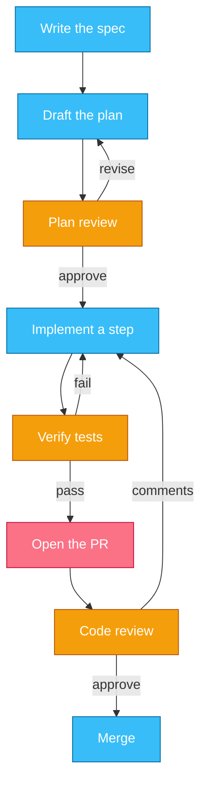
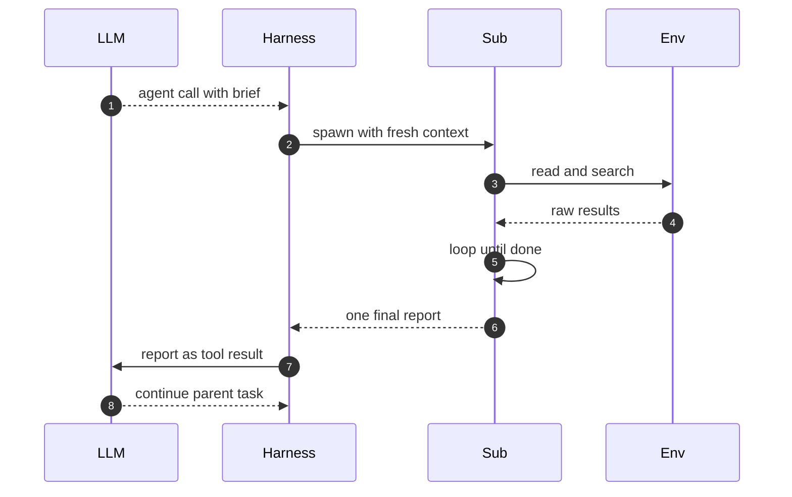
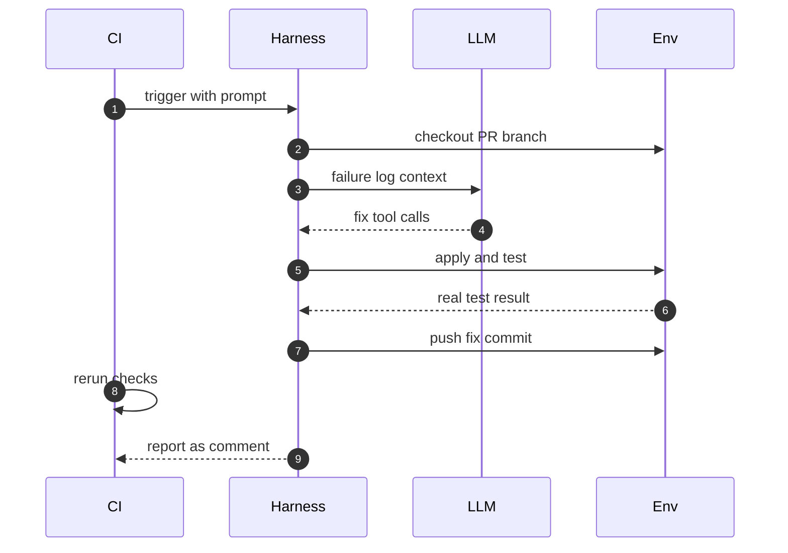

# Chapter 8 — Operating Coding Agents: Workflows

## Why this chapter

Chapter 7 opened the harness; this chapter operates it.
Here Trace 2 stops being something that happens to you and becomes a workflow you manage:
the human becomes the operator, and the loop becomes a process with gates.
The mental model: treat the agent as a capable contractor —
the spec is the contract, checkpoints sit where mistakes are still cheap, and the PR is the deliverable.
An operator who places the gates well gets leverage; one who only reads final diffs gets surprises.
Level emphasis: [L2]; no (L3) sections in this chapter.

## Concepts

### Spec-driven development

A spec is a short document that states what to build:
the intended behavior, the boundaries, and how to verify the result.
Spec-driven development writes it before any code,
and has the agent turn it into a plan — which files change, in what order, and what test proves each step.
The plan is the contract for the run.

Review the plan, not just the diff.
A diff shows what changed; only the plan shows what should have changed.
Rejecting a wrong plan costs one reading.
Rejecting a wrong diff costs the whole run, plus the review that found it.
Trace 21 walks a feature through this shape end to end.

### Plan-then-execute and decomposition

Decompose a task when it exceeds what one review can hold in mind,
or when its parts are independent enough to verify separately.
Split along review boundaries, not code boundaries:
each chunk should end at a reviewable checkpoint —
a passing test, a compiling module, a small PR.

A checkpoint is a state a human can verify cheaply and roll back to safely.
Small tasks do not earn decomposition;
the overhead of briefs and merges outweighs the review it saves.
The test: if the whole diff fits in one honest review, keep it whole.

### Subagent delegation

A subagent is a second agent the harness spawns to run its own Trace 2 loop.
In Claude Code it is defined in `.claude/agents/<name>.md`,
with frontmatter naming its tools, model, and permission mode.
It is invoked three ways: the model matches its description,
the user mentions it by name, or the model calls the harness's agent tool.

The defining property is isolated context.
The subagent starts fresh: it receives the task brief and its own instructions — nothing else.
It cannot see the parent conversation,
and the parent never sees its intermediate tool results, only the final report.
So the brief's quality decides the output's quality:
anything not written in the brief does not exist for the subagent.

Delegate work that is self-contained and context-heavy:
broad multi-file searches, mechanical batches, independent subtasks.
Keep work inline when it needs conversation context,
touches one file, or is faster to do than to specify.
Trace 22 walks one delegation.

### Parallel work in worktrees

A git worktree gives one branch its own working directory in the same repository.
That makes agents parallel-safe: one agent per worktree, always.
Two agents in one checkout overwrite each other's edits
and read each other's half-finished state as their own.

Parallelism moves the operator's job from watching one loop to merging several.
Merge discipline carries it:
small scoped commits, one logical change each,
rebase onto the mainline before merging,
and one integrator who owns the merge order.
Overlapping file ownership between parallel agents is a planning failure, not a merge problem.

### CI agents and review loops

An agent can also run with nobody at the keyboard.
The CI pattern: a trigger fires on an event —
a failing check, a review request, a label —
and a job starts the harness with a fixed prompt.
The run is trigger → checkout → diagnose → fix → push → report.
Least privilege rules the setup:
explicit allows for the calls the job needs, auto-deny for the rest (Q 7.10),
and credentials scoped to one repo and branch.

The review loop closes the workflow.
Agent output is a PR like any other:
same review bar, same CI, same ownership.
Bot review threads work both directions —
automated reviewers comment on agent PRs,
and an agent can consume those threads, fix each issue, and resolve them.
The human decision concentrates at one point: the merge.

### Steer vs let-run

Interactive operation means you watch the transcript and interrupt;
autonomous operation means you define the gates up front and read the report.
The dividing line is decision versus execution.
Steer while the agent is deciding — which approach, which files, which interface —
because a wrong direction compounds with every turn.
Let it run once the direction is fixed and only labor remains.

Interrupting early is the cheapest correction in the whole workflow;
letting a wrong direction run to completion wastes the run and your review.
Every step toward autonomy trades live attention for review burden at the end.
Pay that burden deliberately: more autonomy demands stronger verify steps and tighter gates.

### In other stacks

- **Claude Agent SDK:** the same harness as an in-process library — the natural vehicle for the CI automation in Trace 23.
- **OpenAI Agents SDK:** no coding harness ships; you assemble the operator loop yourself from `Runner.run()`, `max_turns`, and guardrails.
- **OpenAI Agents SDK:** handoffs make the delegation half of Trace 22 a first-class primitive between agents (Chapter 9).
- **LangGraph:** plan-then-execute becomes an explicit graph — the plan gate is a node, and conditional edges encode the review loop.
- **LangGraph:** checkpointers persist state at every superstep, so any step can serve as a reviewable, resumable checkpoint.
- The fan-out half of operating many agents — orchestrators, handoffs, shared artifacts — is Chapter 9.

## Traces

### Trace 21: What happens when a feature ships spec-first

You ask the agent to add rate limiting to an API; the session starts with a document, not a diff.

1. **User** states the goal and its constraints, not the implementation.
2. **LLM** explores the codebase read-only and drafts the spec and plan: behavior, files to touch, risks, and a test plan.
   - In Claude Code this is plan mode (Chapter 7): a read-only stance until the plan is approved.
3. **User** reviews the plan and corrects direction — the cheapest gate in the workflow.
4. **LLM** implements the approved plan step by step, in small commits.
5. **Harness** gates each write and command exactly as in Trace 18.
6. **LLM** runs the plan's verify step: tests, lints, a build.
7. **Harness** loops steps 4–6 until the verify step passes.
8. **User** reads the PR diff against the plan, not against memory.
9. **User** sends review comments; the loop resumes at step 4 with the comments in context.
10. **User** merges once the plan, the diff, and the checks agree.

*Figure 8.1 — two gates, not one: the plan review catches direction, the code review catches execution.*

**Where this can fail**

- **Symptom:** the implementation drifts from the approved plan. **Cause:** a long session compacted the plan out of context. **Where to look:** the token counts per turn, and whether the plan persists as a file the agent re-reads.
- **Symptom:** plan reviews approve everything, yet diffs keep coming back wrong. **Cause:** plans too vague to falsify — no file list, no test plan. **Where to look:** the plan text; a reviewable plan names files and proofs.
- **Symptom:** the agent declares done, then CI fails. **Cause:** the verify step was skipped or its failure never reached the context. **Where to look:** the transcript for the test command and its raw output.
- **Symptom:** one giant unreviewable PR. **Cause:** no decomposition; the whole feature shipped as one checkpoint. **Where to look:** the plan's step sizes against the final diff size.

### Trace 22: What happens when work is delegated to a subagent

Mid-task, the parent agent needs a broad search whose file dumps would flood its own context.

1. **LLM** identifies a self-contained subtask and decides to delegate it.
2. **LLM** assembles the brief: the goal, the constraints, and the shape of the report it wants back.
3. **Harness** resolves a subagent definition — matched by description, named by mention, or called via the agent tool.
4. **Harness** spawns the subagent with a fresh context: the brief plus the subagent's own instructions and tools.
   - Nothing from the parent conversation crosses over; the brief is the entire interface.
5. **Sub** runs its own Trace 2 loop: it reads, searches, and iterates inside its own window.
6. **Sub** finishes and emits one final report; its intermediate tool results stay behind in its own context.
7. **Harness** appends only the report to the parent context, as a tool result.
   - The economics: dozens of file reads cost the parent one report's worth of tokens.
8. **LLM** integrates the conclusion and continues the parent task.

*Figure 8.2 — the raw results stop at the Sub lane; the parent pays one report for a whole search.*

**Where this can fail**

- **Symptom:** the subagent returns confident but irrelevant work. **Cause:** a constraint lived only in the parent conversation and never entered the brief. **Where to look:** the brief text against the conversation that produced it.
- **Symptom:** the parent redoes the search itself after delegating. **Cause:** the brief never specified the report shape, so the answer came back unusable. **Where to look:** the brief's requested output format and the report against it.
- **Symptom:** no context savings appear. **Cause:** the subagent returned raw dumps instead of a conclusion. **Where to look:** the report's token count in the parent transcript.
- **Symptom:** the delegation costs more than doing the work inline. **Cause:** an open-ended brief and no turn cap on the subagent. **Where to look:** the subagent's transcript turn count and its `maxTurns` setting.

### Trace 23: What happens when a CI agent handles a pull request

A PR's tests fail overnight; a CI job starts an agent to fix them with nobody watching.

1. **CI** triggers on the failing check and starts the harness with a fixed prompt and the PR reference.
2. **Harness** starts non-interactive: every needed call has an explicit allow, and unmatched calls auto-deny (Q 7.10).
3. **Harness** checks out the PR branch in a clean runner with credentials scoped to this repo and branch.
4. **LLM** reads the failure: the CI log, the failing test, and the diff that introduced it.
5. **LLM** proposes a fix; the harness gates each call against the allowlist.
6. **LLM** runs the test suite and reads the real result, not a claim of success.
7. **Harness** pushes the fix commit to the PR branch — the one write the credential permits.
8. **CI** re-runs the checks on the new commit.
9. **Harness** reports as a PR comment: what it found, what it changed, what it could not fix.
10. **User** still owns the merge; the agent's push is a proposal, not a decision.

*Figure 8.3 — no human lane exists: the permission boundary and the report have to do the human's job.*

**Where this can fail**

- **Symptom:** the run hangs, then times out. **Cause:** an unmatched call waited for a prompt nobody can answer; the mode still allows asking. **Where to look:** the transcript's last pending call, and the session's permission mode.
- **Symptom:** CI goes green because the agent weakened the test. **Cause:** the prompt stated the goal as "make checks pass", not "preserve behavior". **Where to look:** the diff to test files, and the prompt's goal wording.
- **Symptom:** the agent and another bot ping-pong commits forever. **Cause:** the trigger fires on the agent's own pushes. **Where to look:** the trigger filters and the commit author on each run.
- **Symptom:** the job's token could have done far more than push. **Cause:** a broad credential where a branch-scoped one was needed. **Where to look:** the token's scopes and the runner's egress rules.

> **Lab 9 — Operate a coding agent.** `labs/lab09-operate-agent/` · [L2] · ~45 min · offline.
> You analyze real session transcripts and write the CLAUDE.md and permission rules that make their failures impossible.

## Questions

### Tier 1 — Explain

**Q 8.1 — What does "review the plan, not just the diff" mean, and why is it cheaper?**

**Answer.** The plan states which files change, in what order, and what test proves each step.
Reviewing it catches a wrong direction before any code exists, at the cost of one reading.
A diff review can only catch the wrong direction after the run spent it.
Both gates stay: the plan review checks direction, the code review checks execution.

*Strong answers also mention:* a plan is only reviewable if it is falsifiable — it must name files and proofs.

**Q 8.2 — What context does a subagent receive, and what does it never see?**

**Answer.** It receives the task brief plus its own definition: instructions, tools, model, permission mode.
It never sees the parent conversation, and the parent never sees its intermediate tool results.
Only the final report crosses back.
So the brief is the entire interface, and its quality decides the output's quality.

*Strong answers also mention:* this isolation is the point — it is what keeps the parent's context clean (Chapter 3).

**Q 8.3 — Why one agent per git worktree?**

**Answer.** A worktree gives each branch its own working directory in the same repository.
Two agents sharing one checkout overwrite each other's edits
and read each other's half-finished state as facts about the code.
Separate worktrees make each agent's world consistent; merging becomes an explicit, ordered step.

*Strong answers also mention:* parallel agents should also own disjoint file areas, or the merge inherits the conflict.

**Q 8.4 — Why must a CI agent's setup never rely on ask rules?**

**Answer.** An ask rule prompts a human, and in CI no human is there to answer.
The run hangs until it times out, and the failure looks like slowness, not policy.
Unattended runs need explicit allows for every required call and auto-denial for the rest.
Each denial should fail the run loudly with the transcript attached.

*Strong answers also mention:* Trace 18 shows why deny and ask still apply in every mode — CI just removes the answerer.

### Tier 2 — Reason

**Q 8.5 — When do you delegate a subtask to a subagent, and when do you keep it inline?**

**Answer.** Delegate when the subtask is self-contained and context-heavy:
broad searches, mechanical batches, work whose intermediate output would flood the parent window.
Keep it inline when it depends on conversation context, touches one file, or is faster to do than to specify.
The cost of delegating is writing a complete brief; the cost of inlining is context pollution.
Pick whichever cost is smaller for this subtask.

*Strong answers also mention:* if a correct brief takes longer to write than the task takes to do, delegation has negative value.

**Q 8.6 — A subagent did exactly what its brief said and the result is still wrong. Whose failure is that?**

**Answer.** The parent's.
The subagent's world is the brief; a constraint that never entered it was never given.
The fix is not a smarter subagent but a better brief:
goal, constraints, exclusions, and the exact report shape.
Treat briefs like tool schemas — reviewed artifacts, not throwaway prose.

*Strong answers also mention:* recurring brief omissions belong in the subagent's own instruction file, so every future brief inherits them.

**Q 8.7 — How do you decide between steering a session and letting it run?**

**Answer.** Split the task into decisions and execution.
Steer at decisions — approach, interfaces, file layout — because a wrong choice compounds every turn after it.
Let it run during execution, when the direction is fixed and only labor remains.
More autonomy is a trade: less live attention now, more verification and review burden at the end.

*Strong answers also mention:* an early interruption is the cheapest correction available; sunk-cost patience with a wrong direction is the expensive habit.

**Q 8.8 — Why should agent-written code go through the same PR review as human code?**

**Answer.** The review bar protects the codebase, and the codebase cannot tell who wrote a change.
A separate, softer path for agent PRs makes agent throughput a source of unreviewed risk.
The same bar also closes the loop:
review comments and bot threads are inputs the agent can consume, fix, and resolve.
The human decision then concentrates where it belongs — at the merge.

*Strong answers also mention:* higher agent volume argues for stronger automated review, not weaker human review.

### Tier 3 — Design & Debug

**Q 8.9 — Your team's spec-first workflow keeps producing correct plans and wrong code. Walk your diagnosis.**

**Answer.** First check whether the plan survives the run: in a long session, compaction can drop it from context.
Persist the plan as a file and instruct the agent to re-read it at each step.
Then check the verify step: does the transcript show the tests actually running, with real output, per step?
An unexecuted verify step turns the plan into fiction.
Then compare drift points: where the diff first departs from the plan is usually where context was lost or a step was too big.
Shrink steps until each ends at a checkpoint the tests can confirm.

*Strong answers also mention:* a hook (Trace 19) can enforce the verify step deterministically instead of trusting the model to run it.

**Q 8.10 — Design the permission and credential boundary for a CI agent that fixes failing PRs.**

**Answer.** Start from what the job must do: read the repo, run tests, edit files, push one branch, comment on the PR.
Allow exactly those calls; auto-deny everything else, and fail the run loudly on any denial.
Scope the credential to the single repo, with write access limited to the PR branch and comments — never the default branch.
Run in a disposable container with egress limited to the hosts the build needs.
Filter the trigger so the agent's own pushes never re-trigger it.
Keep the merge human: the agent proposes, the review decides.

*Strong answers also mention:* the prompt is part of the boundary — "preserve behavior" prevents the test-weakening fix that permissions cannot catch.

## Common mistakes & red flags

- **"The diff looked fine, so we shipped it."** A clean diff can execute a wrong plan perfectly. Review the plan for direction, the diff for execution.
- **"The subagent knows what we discussed."** It knows the brief and its own instructions; nothing else exists for it. Missing constraints are the parent's bug.
- **"Run all three agents in the same checkout."** They overwrite each other's edits and trust each other's half-done state. One worktree per agent.
- **"The CI agent can ask if it's unsure."** Nobody answers in CI. Explicit allows, auto-deny the rest, and loud failures on denial.
- **"It's agent code, so it needs a special review process."** It is a PR like any other: same bar, same checks, same ownership.
- **"Don't interrupt it, the run is almost done."** If the direction is wrong, finishing the run only makes the waste complete. Steer at decisions, early.
- **"Delegate everything, context is precious."** Delegation costs a full brief and loses conversation context. Small context-dependent edits are cheaper inline.
