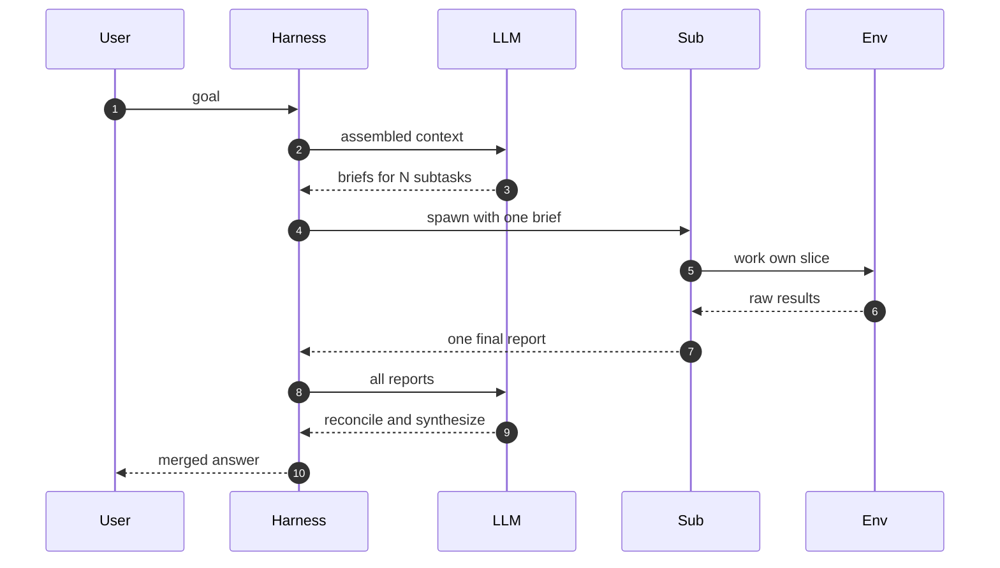
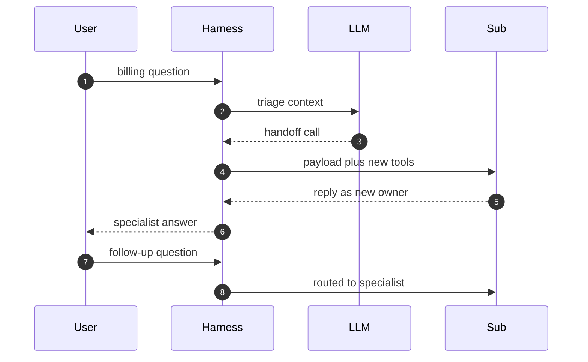
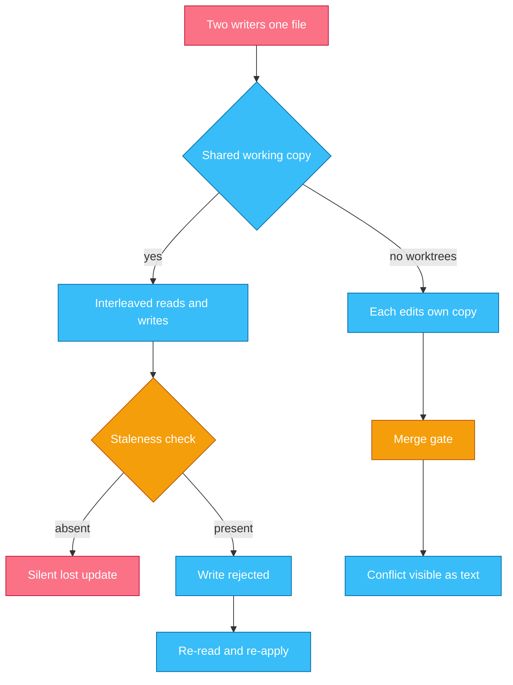

# Chapter 9 — Multi-Agent Orchestration

## Why this chapter

Chapter 8 delegated one subtask to one subagent; this chapter runs many Trace 2 loops at once — nothing new happens inside any one of them.
What is new is the coordination layer: who decomposes the work, what crosses each context boundary, and who merges the results.
The mental model: agents never share understanding, only artifacts — a brief in, a report or a file out.
Track what crosses each boundary and any topology is debuggable; imagine shared state and you ship silent conflicts.
Level emphasis: [L2]–[L3]; the (L3) sections carry the judgment calls.

## Concepts

### Orchestrator–worker

One agent — the orchestrator — owns the goal.
It decomposes the task into independent subtasks, writes a brief for each, and spawns N workers in parallel.
Each worker runs its own complete Trace 2 loop in its own context window;
the orchestrator collects the reports, reconciles them, and synthesizes the answer.

Trace 22 (Chapter 8) covered the single delegation: brief out, report back, contexts isolated.
Orchestration is that mechanism times N, plus two jobs delegation does not have:
decomposition before the fan-out, reconciliation after it.
Both live in the orchestrator's window — the scarce resource,
since it must hold the plan, N briefs, and N reports at once (Trace 24).

### Handoffs are not delegation

Two different primitives both get called "multi-agent", and confusing them causes design errors.

Delegation keeps ownership.
The parent spawns a worker, waits for its report, and keeps talking to the user; the worker never meets the user.

A handoff transfers ownership of the conversation.
The harness makes the target agent the active one:
its instructions, tools, and permissions now face the user.
The first agent is out of the loop — no report flows back, because nobody waits for one.

The engineering question in a handoff is what moves:
the full conversation, a filtered view, or a summary.
Whatever the harness drops at the boundary, the receiving agent never had — the user experiences the gap as amnesia (Trace 25).

### Topologies: star, pipeline, peer

A topology is the shape of who talks to whom.
Three recur.
**Star:** an orchestrator in the center; workers talk only to it.
**Pipeline:** each agent's output artifact is the next agent's input.
**Peer:** any agent messages any other.

Star dominates, for mechanical reasons.
One context holds the whole plan, so one agent can notice gaps and contradictions.
Every message has one reader, so cost grows linearly with N.
Debugging is one orchestrator transcript plus N leaf transcripts.

A pipeline earns its place when the task is genuinely staged — research, then draft, then edit — but it compounds errors:
each stage treats the previous artifact as ground truth, so a stage-one mistake arrives at the end amplified and confident.
Peer topologies rarely earn anything: messages multiply toward N², and no single context knows the goal state.

### Shared artifacts and conflict

Agents coordinate through artifacts, and the filesystem is the usual medium.
It is durable, inspectable, versioned under git, and every agent already has tools for it.
And an artifact outlives any context window — exactly what coordination needs.

But the filesystem has no locks the agents respect.
Two writers, one file: A reads, B reads, A writes, B writes — and B's write silently erases A's edit.
Both transcripts show success —
the lost update, the defining failure of shared artifacts (Trace 26).

The defenses, strongest first: disjoint ownership decided at planning time;
one worktree per agent with an explicit merge step (Chapter 8);
and a staleness check at write time — the harness rejects a write if the file changed since that agent last read it.

### Context isolation between agents

Every worker starts with a fresh window: its brief plus its own instructions, nothing else.
Chapter 3's "Sub-context isolation across subagents" (L3) section carries the full argument; here it scales to N.
A constraint omitted during decomposition is not one bug — it is copied into every worker's brief.

The isolation also cuts the audit trail.
The orchestrator cannot inspect reasoning it never saw; it can only judge reports.
So briefs must fix the report shape, and reports must carry evidence — file paths, test output, line numbers — not just conclusions.

### Agent-to-agent protocols

When agents belong to different teams or vendors, the brief-and-report boundary needs a wire format, and standards are emerging.
The recurring pattern has three parts: a discovery document stating what the remote agent can do, a task lifecycle (submitted, working, done, failed), and a message envelope carrying identity and task references.
Treat these as patterns — names and specs are still moving.
The constants are not: a remote agent is an external service (timeouts, retries, idempotency — Chapter 12), and its messages are untrusted input under Chapter 11's injection discipline.

### When one agent beats N (L3)

The default answer to "how many agents?" is one.
Multi-agent costs are structural, not tuning problems.
Every worker re-pays the system prompt and tool definitions.
Every coordination turn — decompose, brief, collect, reconcile — is overhead no single agent pays.
Every boundary loses information, because a brief is always smaller than the context that wrote it.

Fanning out pays only when at least one of three conditions holds:
the subtasks are context-heavy and independent, so isolation buys N clean windows;
wall-clock time matters and the subtasks can truly run in parallel;
or the workers need different privileges, tools, or models — a cheap searcher beside a sandboxed executor.
If none holds, one agent with good tools wins: one auditable context, no coordination tax.
The Chapter 1 red flag — "we need multi-agent for this" — is usually a missing-tool problem wearing an architecture costume.

### In other stacks

- **OpenAI Agents SDK:** handoffs are a first-class primitive — an agent declares its handoff targets, and the transfer is part of the loop.
- **LangGraph:** a multi-agent system is one graph — each agent is a node or a subgraph; the topology is edges you wired.
- **Claude Code:** subagents (Chapter 8) implement star-topology delegation; there is no user-facing handoff — the parent always answers.

## Traces

### Trace 24: What happens when an orchestrator fans work out

You ask one agent to audit a large codebase for uses of a deprecated API; it fans the work out.
The Sub lane below stands for all N workers — each runs the same steps in its own fresh context.

1. **User** sends the goal to the orchestrator.
2. **LLM** decomposes: it splits the codebase into disjoint areas, one subtask each.
3. **LLM** writes one brief per subtask: scope, constraints, and the exact report shape.
4. **Harness** spawns N workers in parallel, each with a fresh context holding one brief.
5. **Sub** runs its own Trace 2 loop against its slice of the environment.
6. **Sub** returns one final report; its intermediate reads stay in its own window.
7. **Harness** appends each report to the orchestrator's context as a tool result.
8. **LLM** reconciles: coverage against the plan, reports against each other.
   - A contradiction or a gap triggers a re-brief, never an average.
9. **LLM** re-briefs a worker for any gap and waits for the patch report.
10. **LLM** synthesizes the merged answer and returns it.

*Figure 9.1 — the orchestrator pays for decomposition and reconciliation; the workers' raw work never enters its window.*

**Where this can fail**

- **Symptom:** two workers audited the same files while a third area went untouched. **Cause:** the decomposition was neither disjoint nor exhaustive. **Where to look:** the briefs' scope lines against the plan.
- **Symptom:** reports arrive in incompatible formats and the merge becomes archaeology. **Cause:** the briefs never fixed a report shape. **Where to look:** the brief text.
- **Symptom:** cost is N times a single run but wall time is unchanged. **Cause:** the workers ran serially. **Where to look:** the spawn timestamps in the trace spans.
- **Symptom:** the final answer contradicts one worker's correct report. **Cause:** reconciliation compressed away a minority finding. **Where to look:** the orchestrator transcript at the merge turn, against each leaf report.

### Trace 25: What happens when one agent hands off to another

A support agent triages a billing question and hands the conversation to a billing specialist.
The Sub lane here is the specialist — a peer that takes over, not a subordinate reporting back.

1. **User** describes the problem to the triage agent.
2. **LLM** (triage) asks clarifying questions and gathers facts: account, symptom, urgency.
3. **LLM** decides the case needs the billing specialist and emits a handoff call.
4. **Harness** validates the target against the configured set of allowed handoffs.
5. **Harness** swaps the active agent: the specialist's instructions, tools, and permissions replace triage's.
6. **Harness** builds the specialist's context from the handoff payload — the full conversation, a filtered view, or a summary, whichever the design chose.
   - Whatever the payload drops — triage's tool results, its private reasoning — is gone; no agent holds it.
7. **Sub** (specialist) reads the payload and continues the conversation directly with the user.
8. **User** now talks to the specialist; triage is out of the loop, and no report is owed.
9. **Sub** resolves the case, or hands off again; ownership moves the same way.

*Figure 9.2 — after step 3 the LLM lane goes quiet: ownership moved, and nothing ever flows back to triage.*

**Where this can fail**

- **Symptom:** the specialist re-asks questions the user already answered. **Cause:** the payload was a summary that dropped those answers. **Where to look:** the handoff payload against the triage transcript.
- **Symptom:** the specialist performs actions triage was forbidden to take. **Cause:** the swap brought a broader toolset, ungated. **Where to look:** both agents' tool and permission configurations.
- **Symptom:** two agents ping-pong the conversation forever. **Cause:** each agent's instructions match the other's cases, with no handoff-count cap. **Where to look:** the transcript for repeated transfer calls.
- **Symptom:** the answer carries triage's persona with the specialist's content. **Cause:** the harness kept the old system prompt after the swap. **Where to look:** the specialist's first turn.

> **Lab 6 — Multi-agent handoffs.** `labs/lab06-handoffs/` · [L2] · ~60 min · offline.
> You build a triage agent that hands off to specialists through a mocked provider; the tests assert who owned each turn.

### Trace 26: What happens when two agents write the same artifact

Two parallel agents each fix a different bug; both fixes touch the same config file.

1. **Sub** (agent A) reads the file and plans its edit.
2. **Sub** (agent B) reads the same file seconds later; both now hold the same snapshot.
3. **Sub** (A) writes its edit; the file on disk changes.
4. **Sub** (B) writes its edit, computed from the now-stale snapshot.
5. **Env** stores B's version; A's edit is gone, and nothing failed.
   - This is the lost update: both agents report success; both transcripts look correct.
6. **Harness** with a staleness check instead rejects B's write, because the file changed after B's read.
7. **Sub** (B) re-reads, re-applies its edit, and writes again — both edits survive.
8. **Harness** with worktree isolation avoids the race: A and B write separate copies on separate branches.
9. **User** (or an integrator agent) merges the branches; the overlap surfaces as merge conflict text, not silent loss.

*Figure 9.3 — the lost update is the dangerous branch: every step succeeds and the artifact is still wrong.*

**Where this can fail**

- **Symptom:** the file matches only one agent's report of it. **Cause:** a lost update in a shared working copy. **Where to look:** write timestamps in both agents' tool logs.
- **Symptom:** an agent loops re-writing the same file. **Cause:** another agent writes continuously, so the staleness check keeps rejecting. **Where to look:** the rejection count and the other writer's cadence.
- **Symptom:** worktrees were used, yet the merge is unmanageable. **Cause:** the decomposition gave both agents the same file area — a planning failure surfacing late. **Where to look:** the plan's ownership map against the diff overlap.

## Questions

### Tier 1 — Explain

**Q 9.1 — What is the difference between delegating to a subagent and handing off to another agent?**

**Answer.** Delegation keeps ownership: the parent spawns a worker, waits, and receives a report; the user never meets the worker.
A handoff transfers ownership: the target agent's instructions and tools become active, it answers the user directly, and nothing flows back.
One is a function call, the other a transfer of control.

*Strong answers also mention:* the payload-design question (what moves, what is lost) exists only in handoffs; delegation's interface is the brief-and-report pair (Trace 22).

**Q 9.2 — What two jobs does an orchestrator do that its workers never see?**

**Answer.** Decomposition before the fan-out: splitting the goal into disjoint subtasks and writing a brief for each.
Reconciliation after it: checking coverage, resolving contradictions, synthesizing the reports.
Both live in the orchestrator's window — plan, N briefs, N reports — the system's scarce resource.

*Strong answers also mention:* budgeting report sizes in the briefs is what keeps the merge step inside that window.

**Q 9.3 — In a handoff, what determines what the receiving agent knows?**

**Answer.** The payload the harness passes at the swap: the full conversation, a filtered view, or a summary.
Whatever the payload drops is gone — the sender is out of the loop, so no one holds it anymore.
Users experience drops as amnesia: re-asked questions, forgotten preferences.

*Strong answers also mention:* facts that lived only in the sender's tool results never entered the conversation text, so even a full-history payload misses them.

### Tier 2 — Reason

**Q 9.4 — A fan-out to five workers cost six times a single run and finished no sooner. Was it a mistake?**

**Answer.** Not necessarily — the cost multiple is structural: each worker re-pays the system prompt and tool definitions, and coordination turns add more.
It was worth it if isolation carried the run: raw output that would have overflowed one window, or workers needing different privileges.
The unchanged wall time is the real lead: check spawn timestamps — serial spawning forfeits the parallelism you paid for.
If no condition held, one agent with good tools was the right design.

*Strong answers also mention:* re-run the task single-agent and compare — the fan-out must beat that baseline, not zero.

**Q 9.5 — Two workers return contradictory conclusions. What does the orchestrator do — and what must it not do?**

**Answer.** It must not average them or pick the more confident tone; confidence is free.
It reconciles against evidence: reports carry file paths and outputs, so it checks the specific claims, or re-briefs one worker to test the exact contradiction.
It also inspects the decomposition — contradictions often mean overlapping scopes or an ambiguous brief, upstream of both workers.

*Strong answers also mention:* this is why briefs fix a report shape with evidence fields; a conclusion-only report cannot be reconciled, only trusted.

**Q 9.6 — Why is the filesystem a good coordination medium between agents, and where does it stop being one?**

**Answer.** It is durable, inspectable, versioned under git, and every agent already has tools for it; artifacts outlive any context window.
It stops at concurrent writes: agents respect no locks, so two writers on one file produce a silent lost update (Trace 26).
The discipline: disjoint ownership, worktrees with an explicit merge, staleness checks at write time.

*Strong answers also mention:* the discipline covers scratch files and plans too — any shared artifact has the two-writer problem.

### Tier 3 — Design & Debug

**Q 9.7 — Design the orchestration that finds every use of a deprecated auth library in a two-million-line monorepo and plans the migration.**

**Answer.** Star topology, read-only workers.
Decompose by directory into disjoint slices sized to a worker's window; verify they cover the repo tree before spawning.
Each brief fixes the scope paths, the call patterns to find, and a report schema: file, line, call form, migration difficulty.
Workers only read, so no write conflicts exist; the plan is a single-writer artifact the orchestrator alone produces.
Reconcile mechanically: compare reported files against the repo listing, and re-brief for any gap.
Cap report sizes so N reports fit the merge window.

*Strong answers also mention:* verify coverage by counting — a worker that saw nothing and one that missed everything return the same empty report.

**Q 9.8 — A three-stage pipeline — research, draft, edit — produces confident, wrong output. Walk your diagnosis.**

**Answer.** Pipelines compound errors: each stage treats the previous artifact as ground truth, so the last transcript is the least informative.
Read the artifacts between stages, not the final output, and find the first one that is wrong — that stage owns the bug; the rest amplified it faithfully.
Then ask why it left the stage: usually the next stage had no gate to reject it.
Fix by adding a check at each boundary — a schema, an eval, a judge (Chapter 10) — so a wrong artifact stops the pipeline.

*Strong answers also mention:* an ungated stage boundary is the multi-agent version of a swallowed tool error (Trace 10).

## Common mistakes & red flags

- **"We need multi-agent for this."** Chapter 1 flagged it; here is the full argument. N agents multiply cost structurally, add pure-overhead coordination turns, and lose information at every boundary. Fan out only for independent context-heavy subtasks, real parallelism, or split privileges — otherwise it is a missing-tool problem wearing an architecture costume.
- **"The agents talk to each other."** They exchange text, not understanding. Every message is paid twice — written from one context, read into another — and each hop loses fidelity.
- **"The specialist knows what triage learned."** It knows only the handoff payload; a summary drops exactly the details users hate repeating.
- **"More workers means faster."** The merge is serial and reconciliation grows with N. The ceiling is the orchestrator's window, not the spawn count.
- **"Both agents edit the file; git will sort it out."** Inside one checkout there is no git boundary — the second write silently erases the first (Trace 26). Worktrees make conflicts visible; shared copies make them silent.
- **"Add a manager agent above the managers."** Each level re-briefs and re-summarizes; fidelity decays at every hop. Stay flat until one orchestrator's window genuinely cannot hold the plan.
