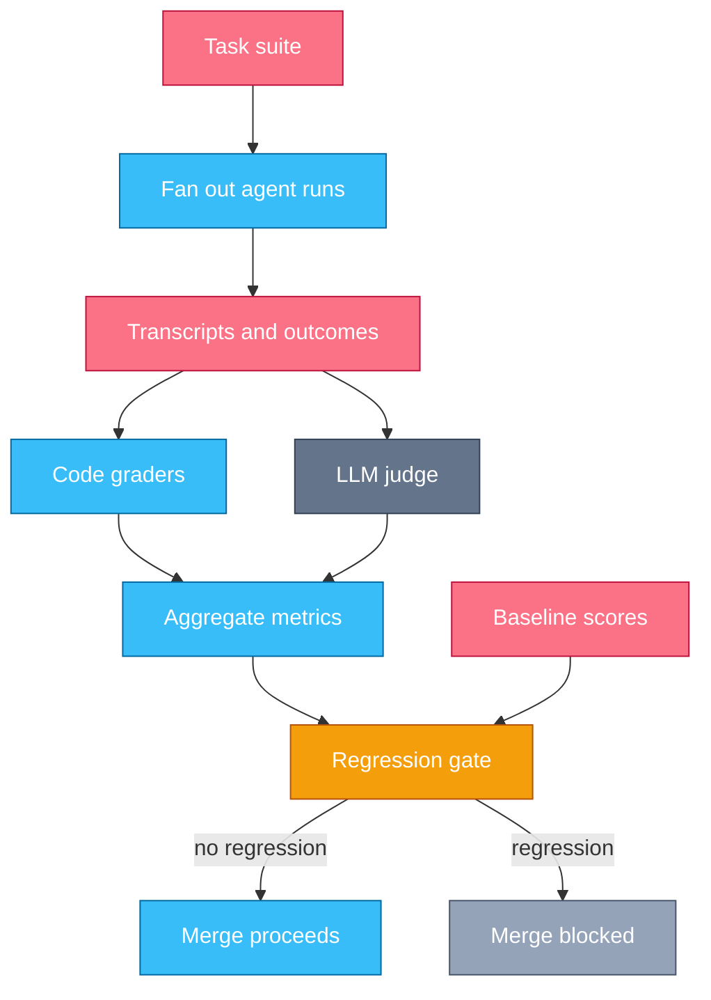
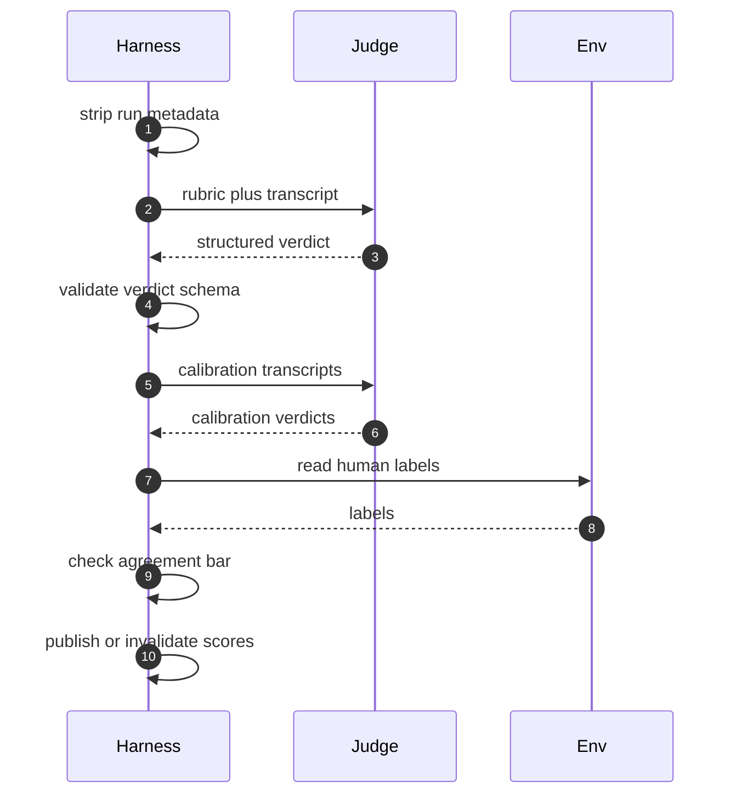

# Chapter 10 — Evals

## Why this chapter

You cannot improve an agent you cannot score.
This chapter measures Trace 2:
it turns "the agent seems better" into a number you can defend,
and every prompt, tool, and model decision in Chapters 2–9 into a testable change.
The mental model: the eval is the spec —
if you cannot write a check for a behavior, you have not defined it.
This chapter owns offline evaluation, runs you score before shipping;
online telemetry from live traffic is Chapter 12.
Level emphasis: [L2]–[L3]; the (L3) section is optional on first read.

## Concepts

### Eval-driven development

An eval is a scored, repeatable test of agent behavior:
a set of tasks, a way to run the agent on them, and graders that turn each run into a score.
Eval-driven development writes the eval before the prompt,
the way test-driven development writes the test before the code.
The loop: capture a failure as a task, watch it fail, change the system, re-run, keep or revert.

Writing the eval first forces the question every prompt tweak dodges:
what, exactly, does "better" mean here?
A change without an eval is a bet you cannot settle.
With one, every improvement is a diff in a scoreboard, and every regression has a name.

### Datasets and task suites

A task is an input, a fixture environment to run it in, and a grading spec.
A task suite is the versioned collection of them.
Start with twenty real failures pulled from your transcripts, not a thousand synthetic tasks.
Real failures encode the distribution you actually face;
synthetic tasks encode your imagination of it,
and models are better at passing imagined tests than real ones.
Grow the suite the same way: every production incident becomes a task before its fix merges.

Split the suite.
A dev set you run constantly and iterate against,
and a holdout you score rarely and never tune on.
Iterate on the holdout and it silently becomes a second dev set;
your scores rise while the agent does not improve.

Guard against contamination: task content leaking into what the agent reads.
A holdout task committed to the repo the agent searches is no longer held out.
Public benchmark tasks may sit in a model's training data,
which is one more reason your own failures beat borrowed suites.

### Graders: three kinds

A grader maps one run to a score. Three kinds, in order of preference.

**Code graders** are deterministic checks:
exact match on an answer, a functional test on produced code,
an assertion on the environment's final state.
Cheap, fast, unbiased — use them for every behavior that has a checkable outcome.

**LLM-as-judge** is a model scoring a run against a written rubric,
used where code cannot check: faithfulness of a summary, tone, whether reasoning holds.
A judge is itself a model call — pin its prompt and its model,
because a judge change is a metric change (Trace 28).

**Human graders** are slow and expensive, and they are the calibration anchor.
A small human-labeled set defines ground truth;
it is the only thing that tells you whether a judge can be trusted.
Code graders scale, judges cover the rest, humans keep the judges honest.

### Outcome-level and transcript-level metrics

Outcome-level metrics score the end state.
Pass rate is the share of tasks solved.
Pass@k is the chance that at least one of k attempts solves the task —
agents are sampled, so one attempt per task measures luck as much as ability.

Transcript-level metrics score how the run got there:
turn counts, tool-error rates, token cost per solve, wall-clock time.
Two runs can both pass while one takes 40 turns and ten times the tokens (Q 1.7).
Outcome metrics alone hide that, and transcript metrics warn early:
a rising tool-error rate usually precedes a falling pass rate.
Track both; gate on both.

### Judge calibration and bias

Judges carry systematic biases, and each has a cheap detector.
**Position bias:** in pairwise comparison, the judge favors one position;
run every comparison in both orders and treat disagreement as noise.
**Verbosity bias:** longer answers score higher regardless of content;
check the correlation between score and length across the suite.
**Self-preference:** a judge favors output that reads like its own model family's style;
strip model names and telltale formatting from what the judge sees.

Calibration is the discipline that makes a judge admissible:
before trusting it, score its agreement with human labels on a labeled subset,
and publish that agreement number next to every metric the judge produces.
A judge that agrees with humans 95% of the time is an instrument;
one you never checked is an opinion.
Structured verdicts with cited evidence raise agreement and make disagreements auditable.

### Regression gates

An eval suite that runs on demand measures; one that runs in CI protects.
The regression gate: every change to prompts, tools, or harness config triggers the suite,
scores are compared to a stored baseline,
and a regression beyond the noise threshold blocks the merge.
The same gate guards model upgrades —
a new model version is a change like any other,
and the suite runs against it before any traffic moves (Trace 33).

The noise threshold is what keeps the gate credible.
Agent runs are stochastic:
measure the run-to-run variance of an unchanged baseline first,
and gate only on deltas larger than that variance —
several runs per task, or a threshold with real headroom.
A gate that flaps on noise gets bypassed, and a bypassed gate protects nothing.

### Grading the process, not only the outcome (L3)

Outcome grading rewards lucky runs and cannot tell robust from brittle.
Trajectory grading scores the transcript against a process rubric:
did the agent bisect the failure instead of guessing?
Did it run the tests before declaring done?
Did it read the file before editing it?
A run that passes while skipping verification is a defect the outcome grader just certified —
the same blind spot that lets a CI agent pass by weakening a test (Trace 23).

Implement it with both grader kinds:
code checks over the transcript (does the verify command appear before the done claim; count redundant re-reads),
and judge rubric items over the trajectory for what patterns cannot catch.
One caution: grade for invariants, not tactics.
"Verified the claim before making it" is an invariant;
"used bisection" is one strategy,
and a rubric that mandates strategies ossifies the agent into them.

### In other stacks

- **Pytest-style runners:** each task is a test case and graders are assertions, so the eval suite runs under the team's existing test runner and CI wiring for free.
- **Declarative task suites:** tasks live in YAML or JSON — input, fixtures, grading spec — separate from runner code, so non-engineers can add tasks from real failures.
- **Hosted eval platforms:** dataset versioning, judge management, and baseline diffing as a service; the trade is gravity — your tasks and labels live inside the platform.
- **Trace-based evals:** graders run over the same telemetry spans Chapter 12's pipeline emits, so offline suites and online monitors share one grader library.
- **Framework hooks:** agent frameworks expose run traces and callback hooks, which is the seam an eval harness attaches to regardless of stack.

## Traces

### Trace 27: What happens when an eval suite runs

You changed the system prompt; before the merge, CI runs the agent eval suite against the change.

1. **CI** starts the eval run on the candidate change, with the model, judge, and config pinned.
2. **Harness** loads the task suite: each task carries an input, a fixture environment, and a grading spec.
3. **Harness** fans out one agent run per task, each in an isolated, freshly built environment.
   - Parallel runs must share nothing; a shared scratch directory lets one task's artifacts grade another's.
4. **LLM** works each task through its own Trace 2 loop until it stops.
5. **Harness** records a transcript and a final outcome artifact for every run.
6. **Harness** runs the code graders on each outcome: functional tests, exact matches, end-state assertions.
7. **Judge** scores the rubric items code cannot check, one transcript at a time (Trace 28 zooms in).
8. **Harness** aggregates per-task scores into suite metrics: pass rate, pass@k, turn counts, cost per solve.
9. **Harness** loads the baseline: the stored metrics of the last accepted run.
10. **CI** applies the regression gate: any tracked metric down by more than the noise threshold blocks the merge.
11. **CI** posts the verdict with per-task diffs, so a red gate names the tasks that flipped.

*Figure 10.1 — every path to the merge crosses the gate, and the baseline enters as data, not memory.*

**Where this can fail**

- **Symptom:** scores swing between runs of the same commit. **Cause:** sampling variance with too few attempts per task. **Where to look:** the run-to-run variance of an unchanged baseline, and the attempts-per-task setting.
- **Symptom:** the suite stays green while production regresses. **Cause:** dataset drift — the tasks no longer match real traffic. **Where to look:** the dates on suite tasks against the newest production failures.
- **Symptom:** a task passes alone but fails inside the suite. **Cause:** parallel runs sharing environment state. **Where to look:** the fixture paths in both transcripts.
- **Symptom:** the gate blocks a change everyone agrees is an improvement. **Cause:** a stale baseline or a threshold tighter than the suite's own noise. **Where to look:** which baseline run the gate compared against, and its variance.
- **Symptom:** the suite has passed at 100% for months. **Cause:** the tasks are too easy to gate anything. **Where to look:** the per-task score distribution — a healthy suite has headroom.

### Trace 28: What happens when an LLM judge grades a transcript

A code grader cannot decide whether a summary is faithful to its source; a judge model scores it against a rubric.

1. **Harness** selects the task's rubric: numbered criteria, each with anchors describing what a low and a high score look like.
2. **Harness** strips identifying metadata from the transcript: model name, variant label, run order.
   - Anything that hints which candidate produced the run invites self-preference.
3. **Harness** sends the judge prompt: the rubric, the transcript, and a required verdict schema.
4. **Judge** scores each criterion and cites the transcript span that justifies each score.
5. **Judge** returns a structured verdict: per-criterion scores, quoted evidence, one overall grade.
6. **Harness** validates the verdict against the schema; a malformed verdict retries once, then counts as a grading error — never as a zero for the agent.
7. **Harness** sends the judge the calibration subset: transcripts that carry stored human labels.
8. **Env** returns the human labels from the label store for comparison.
9. **Harness** computes judge–human agreement; below the bar, the judge is invalid and no agent scores publish from this run.
10. **Harness** aggregates the accepted verdicts into the suite metrics of Trace 27.

*Figure 10.2 — the judge is graded too: no agent score publishes until the judge clears the agreement bar.*

**Where this can fail**

- **Symptom:** the pairwise winner flips when you swap answer order. **Cause:** position bias. **Where to look:** run every comparison in both orders and measure the disagreement rate.
- **Symptom:** longer transcripts score higher on every criterion. **Cause:** verbosity bias. **Where to look:** the correlation between score and transcript length across the suite.
- **Symptom:** the judge consistently prefers one candidate's answers with no human agreement. **Cause:** self-preference — the candidate's style matches the judge's own family. **Where to look:** judge–human agreement split per candidate, and whether metadata reached the judge.
- **Symptom:** scores drift week to week with no system change. **Cause:** the judge prompt or judge model is unpinned. **Where to look:** the judge config diff between the two runs.
- **Symptom:** high scores backed by quotes that do not exist. **Cause:** the rubric lets the judge score without verified evidence. **Where to look:** the verdict's quoted spans checked against the transcript text.

> **Lab 8 — Write an eval.** `labs/lab08-write-eval/` · [L2] · ~60 min · offline.
> Your graders must score a good agent above 0.8 and a planted-bug variant below 0.5 on the same tasks.

## Questions

### Tier 1 — Explain

**Q 10.1 — Why write the eval before the prompt change?**

**Answer.** The eval defines what "better" means before you start chasing it.
Written after, it tends to measure whatever the change happens to improve.
Written first, it is a spec: the change either moves the score or it does not,
and a regression elsewhere in the suite shows up in the same run.
Without it, prompt work is a bet nobody can settle.

*Strong answers also mention:* the parallel to test-driven development, and capturing each real failure as a task before fixing it.

**Q 10.2 — Name the three grader kinds and when each applies.**

**Answer.** Code graders: deterministic checks on outcomes — exact match, functional tests, end-state assertions; use them wherever an outcome is checkable.
LLM-as-judge: a model scoring against a written rubric, for qualities code cannot check — faithfulness, tone, reasoning.
Human graders: slow and expensive, so they anchor rather than scale — a human-labeled set is the ground truth that calibrates the judge.
Prefer them in that order; fall back only when the cheaper kind cannot express the check.

*Strong answers also mention:* a judge is a pinned model call, so a judge change is a metric change.

**Q 10.3 — What is the difference between outcome-level and transcript-level metrics?**

**Answer.** Outcome-level metrics score the end state: pass rate, pass@k.
Transcript-level metrics score the path: turn counts, tool-error rates, token cost per solve.
Two runs can both pass while one costs ten times more, so outcomes alone hide efficiency and robustness.
Transcript metrics also lead: tool-error rates usually rise before pass rates fall.

*Strong answers also mention:* gating on both, and trajectory grading as the L3 extension of path metrics.

**Q 10.4 — What does pass@k measure, and why does k matter for agents?**

**Answer.** Pass@k is the probability that at least one of k independent attempts solves the task.
Agent runs are sampled, so a single attempt confounds ability with luck.
A wide gap between pass@1 and pass@8 means the agent can solve the task but not reliably —
a different problem than not solving it at all, with a different fix.

*Strong answers also mention:* pass@1 is what a user experiences; pass@k describes capability, not product quality.

### Tier 2 — Reason

**Q 10.5 — Why do twenty real failures beat a thousand synthetic tasks as a starting dataset?**

**Answer.** Real failures come from the distribution the agent actually faces;
synthetic tasks come from your model of that distribution, and the two diverge exactly where you are blind.
Twenty real tasks each carry a documented, reproduced defect — every one that flips green is a real fix.
A thousand synthetic tasks mostly measure the same imagined difficulty a thousand times,
and public or generated tasks risk sitting in the model's training data.

*Strong answers also mention:* the suite grows by converting each production incident into a task before its fix merges.

**Q 10.6 — When can you trust an LLM judge's scores?**

**Answer.** When its agreement with human labels is measured and above your bar — not before.
Calibration is empirical: run the judge on a human-labeled subset, compute agreement, publish the number with the metric.
A judge that self-reports confidence, or agrees with itself across reruns, proves only consistency, not correctness.
Then keep it trustworthy: pin the judge prompt and model, strip candidate metadata, and require evidence citations.
Re-calibrate whenever the judge, rubric, or task mix changes.

*Strong answers also mention:* checking bias detectors — order swaps for position bias, length correlation for verbosity.

**Q 10.7 — Why must a model upgrade pass the same regression gate as a prompt change?**

**Answer.** Because the suite scores the system, and the model is the largest single component of it.
An upgrade shifts behavior across every task at once — usually up on average, down somewhere specific.
The gate finds the specific: which tasks flipped, which transcript metrics moved (Trace 33).
Aggregate benchmark gains from the provider say nothing about your twenty real failures.

*Strong answers also mention:* running the full suite, not a smoke subset, since upgrade regressions cluster in the tails.

### Tier 3 — Design & Debug

**Q 10.8 — Your suite's pass rate is flat, but production complaints are rising. Walk your diagnosis.**

**Answer.** The suite and reality have diverged; find where.
First, dataset drift: sample the newest production failures and check whether any resemble a suite task — if not, the suite tests last year's traffic.
Second, metric blind spots: complaints may be about cost, latency, or tone, which a pass-rate-only suite never sees; check transcript-level metrics and whether any judge rubric covers the complaint category.
Third, contamination: a suite the agent can read, or tasks the model saw in training, holds scores up artificially.
Fix by converting the current complaints into tasks, watching them fail, and adding the missing metric to the gate.

*Strong answers also mention:* an incident-to-task pipeline as standing process, and comparing online telemetry (Chapter 12) against suite predictions to catch drift early.

**Q 10.9 — Design the regression gate for a team shipping agent changes daily.**

**Answer.** Start by measuring noise: run the unchanged baseline several times and record per-metric variance; gates fire only beyond it.
Structure two rings: a fast dev-set run on every PR (minutes, code graders and cached judges), and the full suite with holdout and calibration on merge to main and on any model or judge change.
Gate on pass rate, tool-error rate, and cost per solve; block on regression, warn on stagnation.
Update the baseline only when a gated run is accepted — never by hand.
Score the holdout on a schedule, not per-change, so nobody tunes against it.
Post per-task diffs on every red gate, because a gate that only says "worse" gets bypassed.

*Strong answers also mention:* an explicit bypass path with named approval and an auto-filed follow-up task — teams that cannot bypass in an emergency delete the gate instead.

## Common mistakes & red flags

- **"We eval on vibes — we can tell when it's better."** You can tell when the case in front of you is better. The suite exists to see the nineteen cases you are not looking at.
- **"The judge is a frontier model, so its scores are reliable."** Reliability is agreement with human labels, measured on your tasks. An uncalibrated judge is an opinion with a dashboard.
- **"The judge grades its own model's style."** Self-preference: judge and candidate from the same family, metadata unstripped. Blind the judge and calibrate per candidate.
- **"100% pass rate — the agent is ready."** A saturated suite gates nothing. Healthy suites keep headroom; add harder real failures until the score can move.
- **"We ran the holdout a few times while tuning."** Then it is a dev set now. Holdouts earn their name by being scored on a schedule, not per-iteration.
- **"One run per task keeps the suite cheap."** One sample per stochastic process measures luck. Cheap certainty is exactly what a flapping gate destroys later.
- **"The task passed, so the behavior is fine."** The outcome grader cannot see the skipped verification or the weakened test. Grade the trajectory for invariants too.
