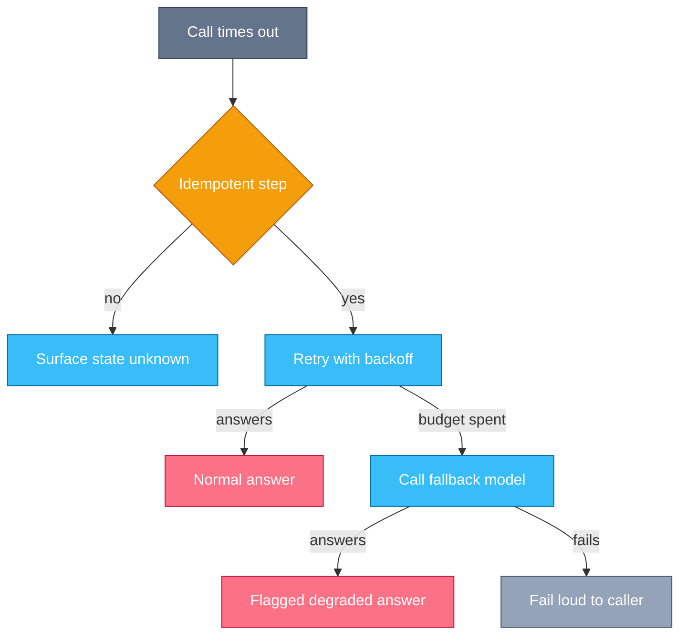
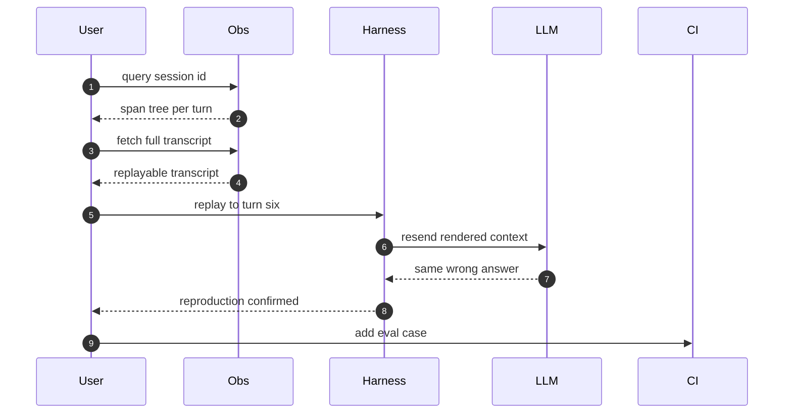
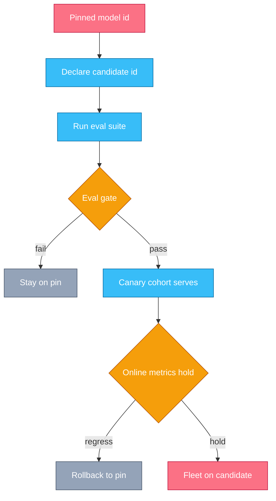

# Chapter 12 — Production Ops, Cost & Latency

## Why this chapter

Chapter 10 measured Trace 2 offline; this chapter watches it online.
Production is a fleet of Trace 2 loops running against real users, real outages, and a real bill.
The mental model: the replayable transcript is the unit of debugging, and the solve is the unit of cost —
every operational question rolls up to one of those two.
An operator who can trace one bad session and price one good one can run the fleet.
Level emphasis: [L2]–[L3]; the (L3) section is optional on first read.

## Concepts

### Deployment shapes

Three shapes cover most production agents, and each has its own latency, cost, and risk envelope.

An **interactive copilot** has a human waiting.
Latency is the product: the first token must feel immediate, so streaming (Trace 5) is mandatory.
Risk is contained by the human reading each answer; cost is paid per session, in the foreground.

A **background job** has nobody waiting.
Latency below hours is irrelevant, so its volume routes through the Batch API at 0.5× (Chapter 2).
Risk is contained by verify steps, because nobody reads intermediate output.

A **CI agent** runs unattended on a trigger (Trace 23).
Its latency budget is the pipeline's.
Its risk envelope is the widest, because no human sits in the loop —
so it carries the tightest permissions and the hardest budgets.

Name the shape before tuning anything:
a copilot optimization applied to a batch job buys latency nobody feels.

### Observability: spans and transcripts

A trace, in the telemetry sense, is a tree of spans — timed, attributed records of work.
For an agent the natural tree is one root span per session, one child span per turn, and grandchildren per tool call.
Each span carries facts the loop already knows: model id, input and output tokens, cache reads and writes, stop reason, latency, prompt version.

Metrics aggregate spans; they tell you *that* something regressed.
Only the replayable transcript — the exact rendered requests and responses — tells you *why*.
The transcript is the unit of debugging (Trace 32).
Store full transcripts for a sample of traffic, sampled as whole sessions, never as isolated spans;
a turn without its session is unreadable.
Always keep the flagged ones: errors, failovers, complaints.

### Failure handling

Every hop gets a timeout: the model call, each tool, the session itself.
When one fires, the harness classifies before it acts, on two axes: transient or permanent, and idempotent or not (Chapter 4).
A model call that has executed no tool is idempotent — a retry re-runs sampling only.
A turn whose tool already ran is not; a retry there is the duplicate-invoice bug from Trace 10, and the only honest move is to surface "state unknown".

Retries that pass the gate still need discipline: backoff with jitter, a per-session retry budget, and a circuit breaker —
a provider outage must not become a retry storm that amplifies it.
When the budget is spent, route the call to a fallback model: a cheaper or older tier, tested in advance against the same prompt and tools.
The last resort is graceful degradation: a reduced answer that says it is reduced, instead of an error page.
Every degraded or failed-over response is flagged in telemetry, so quality metrics can segment on the flag (Trace 31).

### Cost engineering

Agent spend is dominated by input tokens, and input grows quadratically with turns:
the API is stateless, so every turn resends the whole history (Chapter 2), and turn *n* pays for the *n−1* turns before it.
Prompt caching is the counterweight: the stable prefix and prior history are re-read at ~0.1× the input price, and only the new suffix is processed in full (Trace 6).
Cache writes cost 1.25×–2×, so the win depends on the hit rate — watch it as a first-class production metric.

The other levers, in order of leverage:

- **Fewer turns.** Turn count drives the quadratic term; the diagnosis in Q 1.7 is a cost tool.
- **Model tiering per step.** Route mechanical steps to a cheap tier, judgment to a capable one (Chapter 2).
- **Batch for offline work.** Anything nobody waits for is half price at 0.5×.
- **Budgets per session.** A token and turn budget per session is a circuit breaker that kills doomed sessions before they thrash to the cap.

### Latency anatomy

A session's latency is a sum over turns:
time-to-first-token, plus generation time (output tokens divided by tokens per second), plus tool execution time.
TTFT grows with uncached input length; a cached prefix cuts it, so caching is a latency lever too.
Tokens per second is roughly fixed per model tier.
Turn count multiplies everything: each extra loop iteration pays a full TTFT plus a full generation.

So the ranking is stable: fewer turns first, shorter context second, model choice third.
The fastest token is the one never generated.
Streaming improves perceived latency only; the total is unchanged.

### Prompts and configs are deploy artifacts

A production agent's behavior is decided by its prompt text, tool list, model id, and budgets as much as by its code.
Treat that bundle as one versioned config artifact: review changes, stamp the version on every span, and roll back like code.
Expect a side effect on every prompt deploy: the cache prefix changes, so hit rate dips and cost blips until the new prefix warms (Trace 6).

### Staged model upgrades

Never float on a provider alias; pin the exact model id, or the provider deploys to your fleet without asking.
An upgrade is then a staged rollout:
run the eval suite against the candidate (Trace 27), pass the gate, serve a canary cohort, watch the online metrics, and only then roll the fleet — with the pin kept deployable for rollback.
Prompts are tuned to a model, so an upgrade is also a prompt re-evaluation (Trace 33).

### The cost model of an agent fleet (L3)

The fleet's KPI is **cost per solve**: cost per session divided by solve rate.
The division is the point.
A quality regression raises cost per solve with no change in spend, because failed sessions burn full budgets and solve nothing.
Quality is a cost lever, and the cheapest sessions to eliminate are the doomed ones.

The numerator has two dominant levers, both already in this chapter:
cache hit rate, which scales the quadratic input term by up to ~0.1×, and turn count, which is the quadratic term.
Tier mix and batch share follow.
Rank task classes by total spend, not per-session cost — a cheap task at huge volume outweighs an expensive rarity — and re-measure cost per solve after each change.

### In other stacks

- **OTel-style tracing:** map LLM work onto standard trace semantics — a span per model call and per tool call, with model, token-usage, and latency attributes — so agent traces join the traces your services already emit.
- **Gateways and routers:** a proxy layer in front of providers that owns routing, fallback, API keys, rate limits, and budgets — one enforcement point for the Trace 31 policies org-wide.
- **Hosted eval-and-monitor platforms:** transcript capture, online scoring, and dataset building from flagged sessions as a product — the Trace 32 loop, managed.
- **All stacks:** whatever the vendor, the pattern is the same three artifacts — a span tree to locate, a replayable transcript to explain, and a per-solve cost to decide.

## Traces

### Trace 31: What happens when a production request fails over

A copilot turn is in flight when the primary model call goes silent.

1. **Harness** sends the turn's model call with a deadline; no stream event arrives in time.
2. **Harness** fires the timeout and cancels the request; nothing usable came back.
3. **Harness** classifies the failure: transient, and — the deciding question — is the step idempotent (Chapter 4)?
   - This call executed no tool, so a retry re-runs sampling only; a turn whose tool already ran must surface "state unknown" instead (Trace 10).
4. **Harness** retries the primary with backoff and jitter, inside a per-session retry budget.
5. **LLM** times out again; the budget is spent, and the circuit for the primary opens.
6. **Harness** routes the call to the fallback model — a cheaper tier tested in advance against the same prompt and tools.
7. **LLM** answers within the deadline on the fallback tier.
8. **Harness** returns the answer marked degraded; the user sees a caveat, not an error page.
9. **Obs** records the failover on the turn span: timeout, retry count, fallback model id, degraded flag.
10. **Obs** segments quality dashboards by the flag, so fallback answers never blend into baseline quality.

*Figure 12.1 — two gates before the fallback: idempotency decides whether a retry is legal, the retry budget decides when to stop.*

**Where this can fail**

- **Symptom:** a side effect ran twice. **Cause:** the harness retried a turn whose tool had already executed. **Where to look:** the executor logs — two tool executions against one model call.
- **Symptom:** a provider outage gets worse as you retry. **Cause:** no jitter and no circuit breaker; every client retries in lockstep. **Where to look:** your request rate against the provider error rate in the spans.
- **Symptom:** quality drops for days and nobody notices. **Cause:** fallback answers carry no flag, so they blend into baseline metrics. **Where to look:** the share of traffic per model id in telemetry.
- **Symptom:** the fallback path fails the first time it fires. **Cause:** it was never exercised; the prompt or tool schema is incompatible with the fallback tier. **Where to look:** failover drill results, and error logs on fallback calls.

### Trace 32: What happens when a bad session is traced

A user reports yesterday's answer as wrong; the ticket carries a session id.

1. **User** (here, the operator) opens the ticket, which carries the session id the client stamps on every response.
2. **Obs** returns the session's span tree: one root span, a span per turn, a span per tool call.
3. **User** scans span attributes — token counts, stop reasons, latency — and finds the anomaly: the answer goes wrong at turn 7.
4. **Obs** serves the sampled full transcript: the exact rendered requests and responses, byte for byte.
5. **User** reads backward from turn 7 and finds the poison in turn 6: a tool result carrying an error page formatted like data.
6. **Harness** replays the stored transcript up to turn 6 against the pinned model.
7. **LLM** reproduces the wrong answer from the poisoned context; the failure is now a repeatable artifact, not an anecdote.
8. **User** classifies it in the failure taxonomy — "tool error surfaced as success" — so the fix lands in the tool executor, not in this one prompt.
9. **User** adds the transcript as an eval case, so the class stays fixed (Chapter 10).
10. **CI** runs the new case in every future eval gate, including the upgrade gate of Trace 33.

*Figure 12.2 — the metrics locate the turn; only the replayable transcript can name the poison.*

**Where this can fail**

- **Symptom:** the session cannot be found. **Cause:** the session id was never propagated to the client, or spans are not keyed by it. **Where to look:** the response metadata and the span attributes.
- **Symptom:** spans exist but the transcript is gone. **Cause:** metrics-only telemetry, or sampling that dropped the session. **Where to look:** the sampling policy — sample whole sessions, and always keep flagged ones.
- **Symptom:** the replay produces a different answer. **Cause:** the store kept parsed messages instead of the rendered request, or the model id floated since. **Where to look:** the stored request bytes against the model id on the span.
- **Symptom:** the same failure returns next month. **Cause:** the fix patched this session's prompt instead of the failure class. **Where to look:** the taxonomy entry and whether an eval case guards the class.

> **Lab 10 — Tracing and failure taxonomy.** `labs/lab10-tracing/` · [L3] · ~60 min · offline.
> You classify twenty production transcripts into a failure taxonomy and compute per-solve cost from their usage records.

### Trace 33: What happens when the underlying model is upgraded

The provider ships a new model generation; your fleet serves a pinned id.

1. **Harness** serves every session from an exact pinned model id; provider aliases never decide what runs.
2. **User** declares the candidate id in config beside the pin; nothing serves it yet.
3. **CI** runs the eval suite against the candidate: the same tasks and graders that scored the pinned baseline (Trace 27).
4. **CI** issues the gate verdict by comparing candidate scores to the baseline, not to an absolute bar.
   - Prompts are tuned to a model; a regression here often means the prompt needs re-tuning for the candidate, not that the candidate is worse.
5. **Harness** routes a canary cohort — a small share of sessions — to the candidate id.
6. **Obs** watches the online metrics per cohort: solve rate, turns per session, per-solve cost, degraded flags.
7. **User** waits for enough sessions to separate signal from noise, then compares cohorts.
8. **Harness** rolls the fleet to the candidate — or rolls the canary back to the pin; either direction is one config change.
9. **User** keeps the old pin deployable until the candidate survives a full traffic cycle, because some regressions only show weekly.

*Figure 12.3 — two gates again: the offline eval earns the canary, the online metrics earn the fleet.*

**Where this can fail**

- **Symptom:** the fleet's behavior shifts overnight with no deploy. **Cause:** an alias, not a pin — the provider upgraded for you. **Where to look:** the model id attribute on spans, plotted by day.
- **Symptom:** the gate passed but the canary regresses. **Cause:** the eval suite drifted from the production task distribution. **Where to look:** flagged canary sessions against the suite's task coverage (Chapter 10).
- **Symptom:** quality held, but the bill grew after rollout. **Cause:** the gate scored correctness only; the candidate takes more turns per solve. **Where to look:** per-solve cost per cohort during the canary.
- **Symptom:** the rollback itself fails. **Cause:** prompts or configs already migrated to candidate-only behavior. **Where to look:** the config diff between the pin path and the candidate path.

## Questions

### Tier 1 — Explain

**Q 12.1 — Why does an agent session's input cost grow roughly with the square of its turn count?**

**Answer.** The API is stateless, so every turn resends the entire history (Chapter 2).
Turn *n* therefore pays input for all *n−1* turns before it, and summing over a session gives a total that grows with the square of the turn count.
Prompt caching flattens the curve: the stable prefix and prior history are re-read at ~0.1×, and only each turn's new suffix is processed in full (Trace 6).
That makes cache hit rate and turn count the two dominant cost levers.

*Strong answers also mention:* cache writes cost 1.25×–2×, so a changing prefix makes caching a net loss.

**Q 12.2 — What telemetry does a production agent emit, and what is the unit of debugging?**

**Answer.** A span tree per session — root span, a span per turn, a span per tool call — with attributes the loop already knows: model id, token counts, cache reads and writes, stop reason, latency, prompt version.
Plus sampled full transcripts: the exact rendered requests and responses.
Metrics locate a regression; only the replayable transcript explains it, so the transcript is the unit of debugging.
Sample whole sessions, never isolated spans, and always keep flagged ones.

*Strong answers also mention:* stamping prompt version and model id on every span, so any regression is attributable to a deploy.

**Q 12.3 — Which quantities compose an agent's latency, and which usually dominates?**

**Answer.** Per turn: time-to-first-token, generation time (output tokens over tokens per second), and tool execution time.
Per session: the sum of those across loop iterations.
Turn count usually dominates, because each extra turn pays a full TTFT plus a full generation.
Hence the ranking: fewer turns, then shorter context (a cached prefix cuts TTFT), then a faster model.
The fastest token is the one never generated.

*Strong answers also mention:* streaming improves perceived latency only; the total is unchanged.

**Q 12.4 — Why treat prompts as deploy artifacts?**

**Answer.** The prompt text, tool list, model id, and budgets decide behavior as much as code does.
An unversioned prompt edit is an unattributable regression: nothing links the quality change to the change that caused it.
So version the bundle, review changes, stamp the version on every span, and roll back like code.
Every prompt deploy also changes the cache prefix, so expect a hit-rate dip and a cost blip until it warms (Trace 6).

*Strong answers also mention:* prompt changes go through the same eval gate as model changes (Chapter 10).

### Tier 2 — Reason

**Q 12.5 — When may the harness auto-retry a failed production step, and what must surround the retry?**

**Answer.** Only when the failure is transient and the step is idempotent (Chapter 4).
A model call that executed no tool is idempotent — a retry re-runs sampling.
A turn whose tool already ran is not: a timeout proves nothing about server state, so the harness surfaces "state unknown" instead of retrying.
Around the legal retries: backoff with jitter, a per-session retry budget, and a circuit breaker, so an outage does not become a retry storm.

*Strong answers also mention:* idempotency keys make side-effecting steps safely retryable at the server (Trace 10).

**Q 12.6 — Why watch tail latency per shape instead of average latency?**

**Answer.** A session's latency is a sum over many turns, so the distribution is heavy-tailed: one slow turn holds the whole session hostage.
Averages hide that tail, and the tail is where users actually live — the p99 copilot session is the one that gets the complaint.
Watch p95/p99 per deployment shape: a copilot p99 of a minute is a product bug; the same number in a batch job is nothing.
Tails also set timeouts: a deadline below the legitimate tail manufactures failovers (Trace 31).

*Strong answers also mention:* per-turn tails compound multiplicatively with turn count, so turn reduction improves tails faster than averages.

**Q 12.7 — After a deploy, cache hit rate falls and cost jumps, yet nothing about caching changed. What happened?**

**Answer.** The deploy changed the rendered prefix.
The cache is a byte-exact prefix match (Trace 6), so a new prompt version, a reordered tool list, or dynamic content injected early invalidates every stored entry.
Every session then pays cache writes at 1.25×–2× with no reads until the new prefix warms.
Distinguish the two cases by watching the curve: a clean prompt deploy dips and recovers; a new per-request invalidator never recovers.
Diff two rendered requests byte by byte to find it (Q 2.9).

*Strong answers also mention:* stamping prompt version on spans makes the dip attributable to the exact deploy within minutes.

### Tier 3 — Design & Debug

**Q 12.8 — Per-solve cost doubled while traffic stayed flat. Walk your diagnosis.**

**Answer.** Decompose the KPI first: cost per solve = cost per session ÷ solve rate.
Check the denominator before the bill: a quality regression halves the solve rate and doubles cost per solve with zero change in spend.
If solve rate held, split cost per session by task class and deployment shape to find where the money moved.
Then split the guilty class into its factors: turns per session, tokens per turn, cache read ratio, model tier mix.
Match the break point to a deploy: prompt versions and model ids stamped on spans date it exactly.
Fix the largest factor — commonly a cache invalidator (Q 12.7) or a turn-count regression — and re-measure the same classes.

*Strong answers also mention:* session budgets that kill doomed runs early, and checking whether a floating alias silently changed the model (Trace 33).

**Q 12.9 — Design the rollout of a new model generation across a copilot, a batch fleet, and a CI agent.**

**Answer.** Pin all three fleets to exact ids; the provider's alias never decides.
Gate once per fleet, not once overall: each shape has its own eval suite and its own bar (Trace 27), and prompts may need re-tuning per shape before the gate is a fair test.
Canary in risk order: the batch fleet first, because verify steps contain bad output and nobody is waiting; the copilot next, with the degraded-flag dashboards watching solve rate and turn count per cohort; the CI agent last, because nobody supervises it.
Hold each canary for a full traffic cycle, and gate on per-solve cost as well as correctness — a "better" model that takes more turns is a regression.
Keep the old pin deployable everywhere until the last fleet survives.

*Strong answers also mention:* adding recent flagged transcripts (Trace 32) to the suite before gating, so the gate reflects today's traffic, not last quarter's.

## Common mistakes & red flags

- **"We retry everything; retries are free."** A timeout on a step whose tool already ran proves nothing about state; retrying it duplicates the side effect (Chapter 4). Retry only transient failures of idempotent steps.
- **"Average latency looks fine."** Users live in the tail, and agent sessions sum many turns, so tails compound. Watch p95/p99 per deployment shape.
- **"We track cost per request."** The KPI is cost per solve. Failed sessions make per-request cost look flat while the bill climbs; the denominator is where quality becomes money.
- **"We log errors, so we can debug."** An error line without its session explains nothing. The unit of debugging is the replayable transcript, sampled as whole sessions.
- **"We always run the provider's latest model."** A floating alias is an ungated fleet-wide deploy you did not schedule. Pin, eval, canary, then roll (Trace 33).
- **"The prompt is just text; edit it in place."** A prompt edit is a deploy: version it, stamp spans with it, and expect the cache-miss blip (Trace 6). Unversioned edits make regressions unattributable.
- **"The fallback will work when we need it."** An unexercised failover path fails exactly when it fires. Drill it: test the fallback tier against the real prompt and tools before the outage does.
