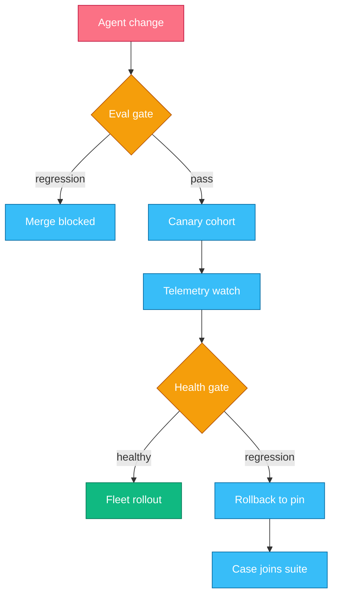
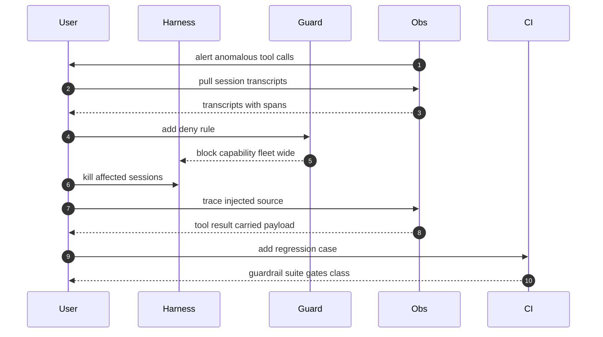

# Chapter 13 — Architecture Judgment & Org Adoption

## Why this chapter

Chapters 1–12 taught the mechanisms; this chapter decides with them, at org scale.
The questions change shape: not "how does the loop work" but "which loop do forty teams run,
who may change it, and how do we know a change helped?"
The mental model: every org-scale question reduces to two tests —
where does your differentiation live, and what does an exit cost?
Answers built on feature lists and adoption dashboards fail both.
This chapter runs above Trace 2: it decides how many such loops an org runs, and under what gates.
Level emphasis: [L3]; Chapters 1–12 are the prerequisite.

## Concepts

### Build vs buy: where differentiation lives

The harness (the runtime that owns the loop, context assembly, and gating) is a commodity.
Vendors and open-source projects improve it monthly,
and nothing in your loop, retry logic, or compaction policy makes your product better than a competitor's.
A bespoke harness buys a compounding maintenance burden instead.

Your differentiation lives in three places:
your domain tools (the actions only your systems can take),
your eval suite (the encoding of what "good" means for your tasks — Chapter 10),
and your data.
Nobody sells an eval suite for your business; nobody else has your definition of done.

The rule: build what encodes your judgment; buy what encodes everyone's.
Harness — buy.
Observability — buy the pipes (tracing is standardized),
build the agent-specific views: transcripts, per-solve cost, turn counts.
Evals — build, always.
An org that inverts this has outsourced its judgment and insourced its plumbing.

### Framework selection: lock-in surface, not feature lists

Framework comparisons arrive as feature matrices.
The matrix is the wrong instrument: features converge within quarters,
and the feature you chose will be matched before your rollout finishes.

The real question is the lock-in surface: the count of long-lived artifacts
written in the framework's private terms —
prompts, tool schemas, eval datasets, transcripts, state, telemetry.
Each one in a proprietary format raises the escape cost:
the work needed to leave when the framework stalls, changes license, or loses.

The defense is a neutral spine.
Keep the artifacts that outlive any framework in neutral formats:
tool definitions as plain JSON Schema, transcripts in a standard telemetry shape,
eval tasks as data files any runner can load.
Frameworks become thin, replaceable adapters at the edges.
The measurable test: could you re-run last month's eval suite on a different stack in a week?
If not, you did not choose a framework; the framework chose you.

### Agents vs workflows: a per-decision choice

Chapter 1 fixed the definitions:
an agent is a model that calls tools in a loop, choosing its next step;
a workflow is a fixed pipeline where code chooses.
At org scale the mistake is treating this as a system-level identity — "we build agents now" —
when it is a per-decision choice.

For each step in a pipeline, write a short decision record:
who chooses the next step (model or code),
what variance costs at this step,
and what evidence supports the choice.
Where the path depends on what earlier steps discover, the model chooses — that is what you pay it for.
Where the steps are known and variance is expensive — billing, deletion, anything irreversible — code chooses.
The record keeps the choice reviewable and reversible;
"agents are the future" is neither.

### Eval-gated rollout

Trace 33 showed one team surviving a model upgrade by re-running its suite.
The org-scale version is a standing rule:
no agent change ships without the suite — and "change" means any change.
A prompt edit, a new tool, a model pin bump, a harness upgrade:
each changes behavior, so each is a release.

The pipeline is the one Trace 34 walks:
the suite gates the merge, a canary cohort takes the change first,
telemetry compares the cohort to baseline,
and only a healthy canary earns the fleet.
The gate is the org's control point because it is mechanical:
it scales to forty teams without forty review boards.

### Incident response for agentic systems

Agentic incidents differ from service incidents in one decisive way:
the transcript is the flight recorder.
Every decision, every tool result read, every gate passed
is already recorded, in order, with token counts and spans (Chapter 12).
An org that cannot pull a transcript in minutes cannot triage at all.

Prompt-injection incidents (Trace 29) are the canonical case.
Containment is capability revocation, not prompt repair:
you cannot patch the model's gullibility mid-incident,
but you can revoke what the attacker needs — the tool, the egress, the write path (Trace 30).
Root cause names the surface that carried untrusted text into context,
and the incident closes only when the reproducing case joins the guardrail regression suite.
Trace 35 walks the full sequence.

### Skilling a team

The levels this book uses are a growth path, not a hiring filter.
Builders (L1) can narrate the loop and build a working agent;
operators (L2) can debug transcripts, run evals, and productionize;
architects (L3) can commit to the positions this chapter practices.
Grow operators by making transcript-reading a habit:
one real transcript per engineer per week beats any slide deck —
the transcript is where every mechanism from Chapters 1–12 becomes visible.

Teams also need operating rules — the discipline this book models:
delegate self-contained work with a complete brief,
review the plan before the diff (Chapter 8),
never let an unverified "done" close a task.
Write the rules where the harness loads them, not in a wiki nobody reads.

### Measuring ROI

The honest unit is per-solve cost against the engineer-hour it saved.
Define the task classes, measure solve rate on them (Chapter 10),
divide spend by solves, and compare with the human-time cost of the same outcomes.
Track rework: a "solve" a human redoes is spend, not value.

Adoption metrics lie fluently.
Sessions started measures curiosity.
Tokens consumed measures spend and rewards waste.
Active users measures habit.
None of them separates an agent that saves an hour from one that costs one.
The tie-breaker: would the team pay for it from their own budget?

One boundary note: agent product and UI design is out of scope for this book.

## Traces

### Trace 34: What happens when an agent change ships across an organization

A team edits the system prompt of a support agent that forty teams share.

1. **User** lands the change behind a version pin; prompts, tools, and model pins all count as releases.
2. **CI** runs the full eval suite against the pinned change (Trace 27).
3. **CI** blocks the merge if any gated metric regresses; the change never reaches a customer.
   - The gate is mechanical: no reviewer judgment, no exceptions path.
4. **CI** publishes a passing change to a canary cohort — a small share of live sessions.
5. **Obs** compares canary telemetry to baseline: solve rate, turns per task, cost per solve, guardrail hits.
6. **Obs** alerts on any canary regression the offline suite missed.
7. **CI** rolls a healthy change forward cohort by cohort, or rolls back to the prior pin in one step.
8. **User** adds any case the canary caught to the suite, so the gate catches its class next time.

*Figure 13.1 — two gates stand between a change and the fleet; both are mechanical, and rollback feeds the suite.*

**Where this can fail**

- **Symptom:** a regression ships despite the gate. **Cause:** the change class is not in the suite — prompt edits gated, tool edits not. **Where to look:** the CI config for which paths trigger the suite.
- **Symptom:** canary healthy, fleet degrades. **Cause:** the cohort is not representative — one team's traffic, one task class. **Where to look:** the cohort definition against fleet task mix.
- **Symptom:** every change passes, quality still drifts. **Cause:** the suite is stale; nobody feeds failures back. **Where to look:** the suite's last-added case date versus recent incidents.
- **Symptom:** teams bypass the gate under deadline. **Cause:** the gate is slow or flaky, so exceptions became routine. **Where to look:** the suite runtime and the exception log.

### Trace 35: What happens when a prompt-injection incident is triaged

An alert fires: a documentation agent posts outbound requests it never made before.

1. **Obs** raises the alert on an anomalous tool-call pattern — a guardrail hit or an egress spike (Trace 29).
2. **User** (the on-call engineer) pulls the affected transcripts from Obs — the flight recorder.
3. **User** finds the injected instruction inside a fetched page in a tool result — not typed by any person.
4. **User** contains first: adds a deny rule revoking the egress capability, fleet-wide.
   - Containment revokes capability (Trace 30); it does not edit prompts mid-incident.
5. **Guard** enforces the rule on every live session; the exfiltration path is closed.
6. **User** kills the affected sessions so no poisoned context keeps running.
7. **User** traces root cause through Obs: which tool surfaced untrusted text, and why the gate let the send through.
8. **User** writes the reproducing case into the guardrail regression suite.
9. **CI** runs the suite; the case fails on the old config, passes on the fix — the class is gated from now on.

*Figure 13.2 — containment (steps 4–6) comes before root cause (7–8); the incident closes only when CI gates its class.*

**Where this can fail**

- **Symptom:** nobody can find the injected text. **Cause:** transcripts are truncated or tool results were not logged. **Where to look:** the telemetry config for tool-result retention.
- **Symptom:** the same injection recurs a month later. **Cause:** the fix was a prompt patch; no regression case was added. **Where to look:** the guardrail suite for the incident's case.
- **Symptom:** the alert never fired; a customer reported it. **Cause:** no anomaly baseline for tool-call patterns. **Where to look:** what Obs alerts on versus what it records.

## Scenario: The platform team's grand harness

A central platform team proposes a two-year program:
a bespoke harness, a custom eval store,
and a mandate that all forty product teams adopt one framework, chosen this quarter from a feature matrix.
Release gates are deferred to phase three, "once teams are onboarded".
Success will be reported monthly as sessions started per team.
The team argues that central control now prevents fragmentation later.

**Critique.**
The build-vs-buy is inverted.
The harness and the eval store are commodities — the org's judgment lives in eval content, which the plan never mentions.
Two years of bespoke harness work buys maintenance, not differentiation.
The framework mandate optimizes a feature matrix that will be obsolete before onboarding ends;
the durable decision is the neutral spine — transcript, tool-schema, and eval formats — and the plan standardizes none of them.
Gates in phase three means two years of ungated changes: the riskiest window is the least protected.
Sessions started is adoption theater; it counts curiosity and rewards waste.
What is right: central ownership of shared plumbing, and fragmentation is a real problem — but the spine solves it cheaper than a mandate.
Ask next: what artifact formats must every team share for evals and transcripts to be portable?
What is the escape cost when the chosen framework loses?
And which change classes does the gate cover in phase one, not three?

> **Lab 12 — Capstone: eval-gated release.** `labs/lab12-capstone/` · [L3] · ~90 min · offline.
> You wire the lab 3 agent and your lab 8 eval into a release gate that blocks a regressing change.

## Questions

### Tier 2 — Reason

**Q 13.1 — Why is the eval gate a better org-level control point than mandatory human review of agent changes?**

**Answer.** The gate is mechanical: the same bar for every change, across forty teams.
Human review of a prompt diff cannot predict behavior — a one-line edit can shift tool choice across thousands of sessions.
The suite runs the change against real task classes and measures the shift (Trace 27).
Review still matters for intent and design; the gate owns behavior.

*Strong answers also mention:* the gate is only as good as suite freshness — Trace 34's failure mode where every change passes while quality drifts.

**Q 13.2 — Leadership reports agent adoption as "sessions started, up 40%". What does this measure, and what do you report instead?**

**Answer.** It measures curiosity and habit, not value.
A session counts the same whether the agent saved an hour or wasted one,
and a team fighting a bad tool generates more sessions, not fewer.
Report per-solve cost against engineer-hours saved on defined task classes:
solve rate, human-minutes per solve, rework rate.
Those separate outcomes from activity.

*Strong answers also mention:* the willing-to-pay test — a metric that needs a mandate to look good is theater.

**Q 13.3 — What is a framework's lock-in surface, and why does it matter more than its feature list?**

**Answer.** The lock-in surface is the set of your long-lived artifacts written in the framework's private terms:
prompts, tool schemas, eval data, transcripts, telemetry.
Features converge within quarters,
but every artifact in a proprietary format raises the escape cost, and that compounds.
The concrete test: can you re-run last month's eval suite on a different stack in a week?
A neutral spine keeps the answer yes.

*Strong answers also mention:* frameworks as thin adapters at the edge, owned by one team, so a swap touches adapters, not artifacts.

### Tier 3 — Design & Debug

**Q 13.4 — Org agent spend doubled in a quarter while total solves stayed flat. Walk your diagnosis.**

**Answer.** Read the telemetry before theorizing; spend per solve doubled, so find where the extra tokens go.
Segment by team and task class first: one team's runaway use case looks like org-wide drift in aggregates.
Then bisect the cost anatomy: input tokens per turn point at context bloat or a broken cache prefix (Trace 6);
turns per task point at retry storms from swallowed tool errors (Trace 10);
sessions per solve point at humans re-running failed tasks — a quality problem in cost clothing.
Check the release record: whatever shipped near the inflection is the prime suspect.
Fix the largest class, then re-measure per-solve cost on the same task classes.

*Strong answers also mention:* adding per-solve cost to the canary health gate, so the next regression is caught in cohort, not in the quarterly bill.

**Q 13.5 — Design the rollout when the provider retires the model your forty teams pin. You have eight weeks.**

**Answer.** This is Trace 33 fleet-wide, so run it as forty gated releases, not one big-bang switch.
Week one: freeze the baseline — every suite runs against the old pin, recording solve rate, turns, and cost per solve.
Then run every suite against the new model with no other change;
triage teams into green (ships now), yellow (prompt or tool adjustments), red (behavior shifts needing redesign).
Green teams canary immediately per Trace 34; their telemetry hardens the playbook for the rest.
Yellow teams fix against their suite — the suite defines done, not vibes.
Red teams get platform-team attention and, if needed, a temporary shim.
Hold both pins live until the last fleet is healthy; rollback stays one step cheap throughout.

*Strong answers also mention:* teams without a suite cannot even be triaged; the migration is the forcing function to build one.

### Tier 4 — Judge

**Q 13.6 — Your platform team wants to build a bespoke harness "tuned to our stack". Build or buy? Commit.**

**Answer.** Buy the harness; spend the freed headcount on evals and domain tools.
Assumptions: commodity harnesses cover the loop, gating, and context management your teams need,
and your differentiation lives in tools, evals, and data.
Kill-criteria: a hard requirement no existing harness meets after a genuine spike — a regulatory isolation model, say —
or vendor terms that make escape cost worse than build cost.
Strongest counter-position: a bespoke harness builds deep competence, and integration with internal systems has real value.
Honest, but it proves too much: adapters and evals on a commodity loop build the same competence cheaper,
and "deep integration" is what tools and MCP servers are for (Chapter 4).
Decision: buy; revisit only if a kill-criterion fires; measure the platform team on suite coverage, not harness features.

*Strong answers also mention:* Appendix C's Tier-4 bar — the decision is owned, the counter steelmanned, the exit condition named up front.

**Q 13.7 — Mandate one agent framework for all forty teams, or let every team choose? Commit.**

**Answer.** Neither; mandate the spine, free the framework.
Standardize the tool-schema, transcript, and eval formats; let teams pick any framework that emits them.
Assumptions: the artifacts, not the framework, are what the org must share,
and framework churn makes any single bet age badly.
Kill-criteria: spine compliance costing a team over a quarter of its integration effort means the spine is too thick;
three-plus frameworks fragmenting hiring and on-call means narrow to a shortlist of two.
Strongest counter-position: a mandate concentrates expertise and transfers one team's fixes for free — real economies.
But it buys them by maximizing the lock-in surface while the framework market is least settled,
and the spine captures most of the sharing benefit at a fraction of the escape cost.
Decision: spine now, shortlist if fragmentation bites, full mandate never without a kill-criterion firing.

*Strong answers also mention:* the spine is testable — CI can verify artifacts parse, making compliance a gate, not a memo.

**Q 13.8 — After the Trace 35 incident, security proposes a human approval on every tool call fleet-wide. Accept, reject, or counter? Commit.**

**Answer.** Reject the blanket rule; counter with capability-tiered gating.
Blanket approval destroys the economics, and approval fatigue turns the gate into a rubber stamp — worse than no gate, because it looks like one.
Counter with blast-radius tiers (Chapter 11):
reads auto-approved, reversible writes gated by rules and hooks, irreversible or egress-bearing actions gated by a human, always.
Assumptions: the incident's lesson is that egress needed a gate, not that all calls did,
and the regression suite now covers the incident's class (Trace 35).
Kill-criteria: a second injection-class incident slipping the tiers means tighten them;
approval volume beyond what on-call can review means the tiering is wrong, not the reviewers.
Strongest counter-position: after a real incident the risk budget is spent, and over-gating buys trust to relax later — politically true.
But theater trains humans to click approve, and that cost is permanent.
Decision: tiered gating, measured by guardrail-hit and approval-fatigue metrics, reviewed quarterly.

*Strong answers also mention:* the approval-fatigue rate is itself a gated metric — a human gate that approves 99% of requests is evidence of mis-tiering.

## Common mistakes & red flags

- **"We're building our own harness so we control the stack."** You control a maintenance burden; differentiation lives in tools, evals, and data.
- **"We compared frameworks on features and picked the winner."** Features converge; escape cost compounds. The durable question is the lock-in surface; the durable answer is a neutral spine.
- **"Adoption is up 40%."** Sessions, tokens, and active users measure activity and spend, not value. A metric that cannot separate a saved hour from a wasted one is theater.
- **"Prompt edits don't need the release process."** A one-line prompt change shifts fleet behavior like a code deploy. Every behavior-changing artifact ships through the Trace 34 gate.
- **"We handled the injection incident — we fixed the prompt."** Prompt repair is not containment. Contain by revoking capability; a prompt patch without a gated regression test is the same incident on a delay.
- **"The eval gate slows teams down, so we allow exceptions."** A gate with a routine exceptions path is not a gate. Fix the suite's speed and flakiness instead.
